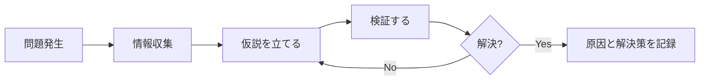

# トラブル対応の考え方

プログラムが動かない、エラーが出る、想定通りに動かない。1年目はトラブルの連続です。このドキュメントでは、環境や言語に依存しない「トラブル対応の考え方」を解説します。

---

## トラブル対応の基本姿勢

### 1. 慌てない、焦らない

トラブルに遭遇すると焦りますが、焦ると判断を誤ります。

```
❌ 焦ってやりがちなこと
- 原因が分からないまま、あちこち変更する
- 変更した内容を記録しない
- 30分悩んでから相談する（遅い）

✅ 落ち着いてやること
- まず深呼吸する
- 現状を正確に把握する
- 変更する前に状態を記録する
```

### 2. 「動いていたこと」を信じる

「さっきまで動いていた」なら、その間に**何かが変わった**はずです。

```
自分が変えたもの：
□ コード（どこを変えた？）
□ 設定ファイル（何を変えた？）
□ 環境（何かインストールした？再起動した？）

自分以外が変えたもの：
□ 他の人がコードを更新した（git pull した？）
□ 外部サービスが落ちている
□ サーバー側で何か起きた
```

### 3. 仮説を立ててから動く

「とりあえず色々試す」のは非効率です。**仮説→検証→結果**のサイクルを回します。



**仮説の立て方**：
- 「〇〇が原因ではないか？」と具体的に考える
- 一度に1つの仮説だけを検証する
- 検証結果を記録する

---

## 問題の切り分け方

トラブル対応で最も重要なのは「どこで問題が起きているか」を特定することです。

### 切り分けの基本：二分法

問題を半分に分けて、どちら側に原因があるかを特定します。

```
例：Webアプリで画面にデータが表示されない

全体システム
├── フロントエンド側の問題？
│   ├── データは受け取れている？
│   ├── 表示処理でエラーが出ている？
│   └── そもそもAPIを呼んでいる？
└── バックエンド側の問題？
    ├── APIは正しく動いている？
    ├── データベースにデータはある？
    └── 認証/権限の問題？
```

### 切り分けの質問リスト

以下の質問に答えていくと、問題の場所が絞り込めます。

**1. 再現するか？**

| 答え | 次のアクション |
|------|---------------|
| 毎回再現する | 再現手順を確定し、原因調査へ |
| たまに再現する | 再現条件を探る（タイミング、データ、順序） |
| 1回だけ | 環境の一時的な問題かも。様子を見る |

**2. いつから起きているか？**

| 答え | 考えられる原因 |
|------|---------------|
| 最初から動かない | 実装ミス、設定ミス |
| さっきまで動いていた | 直近の変更が原因 |
| 特定の操作後から | その操作に関連する処理が原因 |
| ある日突然 | 外部要因（サーバー、ライブラリ更新等） |

**3. 自分の環境だけか？**

| 答え | 考えられる原因 |
|------|---------------|
| 自分だけ | ローカル設定、キャッシュ、環境変数 |
| 全員 | コード、共通設定、外部サービス |
| 特定の人だけ | その人の環境、権限、データ |

**4. どこまで動いているか？**

処理の流れを追って、「どこまで動いて、どこで止まるか」を特定します。

```
入力 → 処理A → 処理B → 処理C → 出力
         ↑
      ここまでは動いている（ログで確認）
                  ↑
              ここで止まっている
```

### 切り分けのテクニック

**1. 変更を元に戻す**

直近の変更が原因かを確認する最も確実な方法です。

```
1. 直近の変更を一時的に元に戻す
2. 動作確認
   → 動く = 直近の変更が原因
   → 動かない = それ以前の問題
3. 変更を戻す
```

**2. 最小構成で試す**

問題が起きる範囲を狭めていきます。

```
問題が起きるコード全体で試す
↓ 動かない
関係なさそうな部分を削除して試す
↓ まだ動かない
さらに削除して最小構成にする
↓ 動いた！
→ 最後に削除した部分が原因
```

**3. 別の方法で試す**

同じことを別の方法で試して、問題の切り分けをします。

```
例：APIが動かない場合
□ ブラウザから直接アクセス → 動く？
□ 別のツールで呼び出し → 動く？
□ 別のデータで試す → 動く？
→ 動くなら、元の方法に問題がある
```

---

## 情報収集の方法

問題を解決するには、正確な情報が必要です。

### 何を見るか

**1. エラーメッセージ**

最も重要な情報源です。**全文を読む**こと。

```
エラーメッセージの構造（例）：
┌─────────────────────────────────────────┐
│ Error: Cannot read property 'name' of undefined  ← 何が起きたか
│     at getUserName (user.js:42)         ← どこで起きたか
│     at handleClick (app.js:15)          ← 呼び出し元
└─────────────────────────────────────────┘
```

**読み方のポイント**：
- 最初の行 = 何が起きたか（エラーの種類）
- 2行目以降 = どこで起きたか（ファイル名と行番号）
- **自分のコードで最初に出てくる行**が調査開始地点

**2. ログ**

処理の流れと、どこまで動いたかが分かります。

```
確認すべきログ：
□ アプリケーションが出力するログ
□ フレームワークやサーバーのログ
□ ブラウザの開発者ツール（Console, Network）
```

**3. 実際の値**

「こうなっているはず」ではなく、「実際はどうか」を確認します。

```
確認方法：
□ 変数の中身を出力してみる
□ 処理の途中経過を出力してみる
□ 入力と出力を確認する
```

### 何を記録するか

問題を報告したり、後で振り返るために記録を残します。

```
記録すべきこと：
□ 何をしたら問題が起きたか（再現手順）
□ どんなエラーが出たか（エラーメッセージ全文）
□ いつから起きているか
□ どの環境で起きているか
□ 試したこととその結果
```

**記録の例**：

```markdown
## 問題
ログインできない

## 再現手順
1. ログイン画面を開く
2. 正しいメールアドレスとパスワードを入力
3. ログインボタンをクリック
4. → 「認証に失敗しました」と表示される

## エラーメッセージ
POST /api/login 401 Unauthorized

## 試したこと
- 別のアカウントで試す → 同じエラー
- パスワードリセット → リセット後も同じエラー
- 開発者ツールで確認 → トークンが null になっている

## 分かったこと
認証トークンの発行処理に問題がありそう
```

---

## 調べ方のコツ

### エラーメッセージの読み方

**1. キーワードを抽出する**

```
Error: ENOENT: no such file or directory, open '/path/to/file.txt'
       ~~~~~~                            ~~~~~~~~~~~~~~~~~~~~~~~~~
       エラーコード                        具体的な情報

検索キーワード：「ENOENT no such file or directory」
```

**2. 固有の情報を除いて検索する**

```
❌ そのまま検索：
   "Cannot find module '/Users/yamada/project/src/helper.js'"

✅ 固有部分を除いて検索：
   "Cannot find module" エラー
```

**3. エラーコードがあれば活用する**

```
HTTP 500、ORA-12154、SQLSTATE[42000] など
→ エラーコードで検索すると、公式情報が見つかりやすい
```

### 検索のコツ

**効果的な検索キーワード**

| 状況 | 検索キーワード例 |
|------|-----------------|
| エラー解決 | `[エラーメッセージの要点] [使っている技術]` |
| やり方を調べる | `[やりたいこと] [技術名] 方法` |
| 公式情報を探す | `[技術名] documentation` |

**検索結果の優先順位**

```
1. 公式ドキュメント → 最も信頼できる
2. GitHub Issues → 同じ問題を踏んだ人がいる
3. Stack Overflow → 解決策が見つかりやすい
4. 技術ブログ → 解説が詳しい（ただし古い情報に注意）
5. AI → 素早く概要を掴める（検証は必要）
```

**古い情報に注意**

```
確認すること：
□ 記事の投稿日・更新日
□ 対象のバージョン
□ 現在のバージョンとの差
```

---

## 助けを求めるタイミングと方法

### いつ助けを求めるか

**15分ルール**

```
1. 問題発生
2. 15分間、自分で調査・試行
3. 15分経っても解決しない → 助けを求める

※ 本番障害など緊急時は即座に報告
```

**こんな時はすぐ相談**

```
□ 本番環境に影響がある
□ 他の人の作業をブロックしている
□ 全く見当がつかない（調べ方も分からない）
□ 同じエラーで30分以上悩んでいる
```

### どう助けを求めるか

相談は「相手の時間をもらう」ことです。準備をしてから相談しましょう。

**相談前の準備**

```
□ 何をしようとしているか（ゴール）
□ どんな問題が起きているか（現象）
□ 試したこと（最低3つ）
□ エラーメッセージ（全文）
□ 再現手順
```

**相談の例**

```
❌ 悪い例
「エラーが出て動きません。どうすればいいですか？」
→ 情報が足りず、相手は何も判断できない

✅ 良い例
「ログイン機能を実装しています。
ログインボタンを押すと401エラーが返ります。

試したこと：
1. 入力値を確認 → 正しい
2. APIを直接呼び出し → 同じエラー
3. 認証処理にログを追加 → トークンがnull

トークン生成の部分を見てほしいのですが、
お時間いただけますか？」
→ 状況が明確で、何を見てほしいかも分かる
```

### 相談後の行動

```
□ 教えてもらった内容をメモする
□ 解決したら結果を報告する
□ 同じ問題が起きないようメモを残す
□ お礼を言う（具体的に何が助かったか）
```

---

## トラブル対応のチェックリスト

問題が起きたら、このチェックリストを上から確認してください。

```
【初動】
□ 慌てない。深呼吸する
□ エラーメッセージを全文読む
□ 「いつから」「何をしたら」起きたか確認

【情報収集】
□ エラーメッセージをコピーしてメモ
□ 再現手順を確認（毎回起きる？）
□ ログを確認

【切り分け】
□ 自分の環境だけ？全員？
□ どこまで動いている？どこで止まる？
□ 最後に変更した箇所は？

【調査】
□ エラーメッセージで検索
□ 公式ドキュメントを確認
□ 15分経っても解決しなければ相談

【相談】
□ 状況を整理（何をしようとしているか）
□ 試したことをまとめる
□ 具体的に何を聞きたいか明確にする

【解決後】
□ 原因と解決策をメモ
□ 同じ問題が起きないよう対策
□ 相談した人に結果を報告
```

---

## まとめ

トラブル対応の考え方のポイント：

1. **慌てない** - 焦ると判断を誤る
2. **仮説を立てる** - 「とりあえず試す」は非効率
3. **切り分ける** - 「どこで問題が起きているか」を特定
4. **記録する** - エラーメッセージ、試したこと、結果
5. **15分で相談** - 一人で悩みすぎない

トラブル対応力は経験で伸びます。**解決したら記録を残す**習慣をつけましょう。

---

## 関連ドキュメント

- [[203_デバッグの基本]] - デバッガの使い方（ツールの操作）
- [[404_不具合対応の進め方]] - 不具合調査のプロセス（業務の流れ）
- [[206_調べ方の基本]] - 効果的な検索方法
- [[102_困ったときの対処法]] - 困ったときの相談方法
