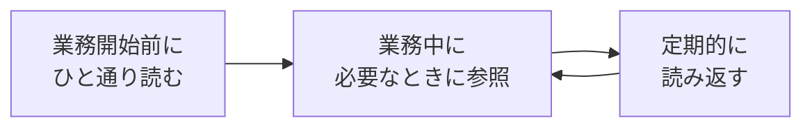

# 第1部：心構え

エンジニアとして働く上での基本的なマインドセットを学びます。

技術的な内容ではありませんが、1年目を乗り越えるために重要な内容です。

---

## この部の活用の仕方

### 読み方のコツ

1. **最初は全体を流し読み**：各章の「まとめ」だけでも目を通す
2. **困ったときに該当箇所を読む**：全部覚えなくていい
3. **定期的に振り返る**：月1回くらい読み返すと新しい発見がある

> [!tip] 暗記する必要はありません
> この部は「心構え」なので、考え方を理解することが大切です。困ったときに「そういえば書いてあったな」と思い出せれば十分です。

---

## この部の構成

### 第1章：はじめに

この教科書の目的と使い方を説明します。

- [[第1章_はじめに/000_はじめに|はじめに]]

### 第2章：1年目の基本

1年目のエンジニアに求められることと、基本的な心構えを学びます。

- [[第2章_1年目の基本/000_1年目に求められること|1年目に求められること]]
- [[第2章_1年目の基本/001_1年目の心構え|1年目の心構え]]

### 第3章：学習と仕事の違い

プログラミングを「学ぶ」ことと「仕事で使う」ことの違いを理解し、スムーズに業務に入るための考え方を学びます。

- [[第3章_学習と仕事の違い/000_学習と仕事の違い|学習と仕事の違い]]
- [[第3章_学習と仕事の違い/001_学習への取り組み方|学習への取り組み方]]

### 第4章：困ったときの対処法

困ったとき、詰まったときにどう対処すべきかを学びます。

- [[第4章_困ったときの対処法/000_困ったときの対処法|困ったときの対処法]]

---

## 理解度チェック

- [[099_理解度チェック|この部の理解度をチェックする]]
