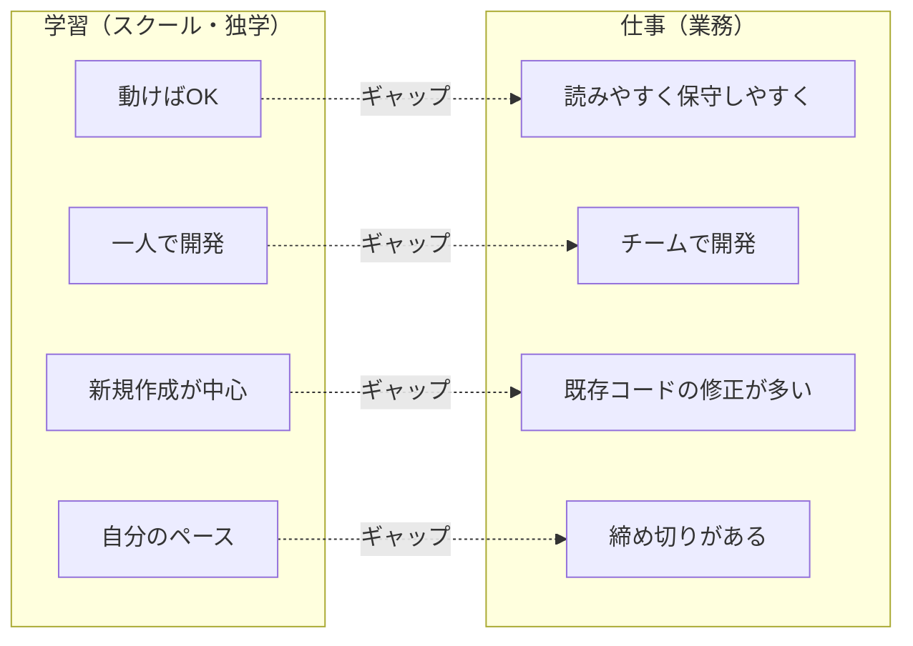
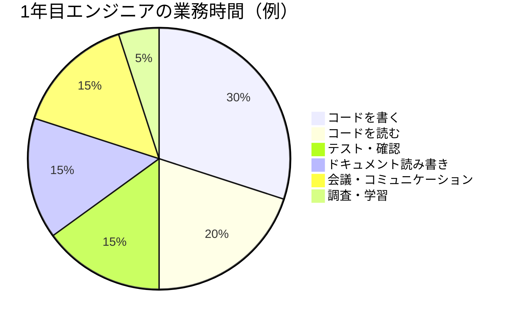
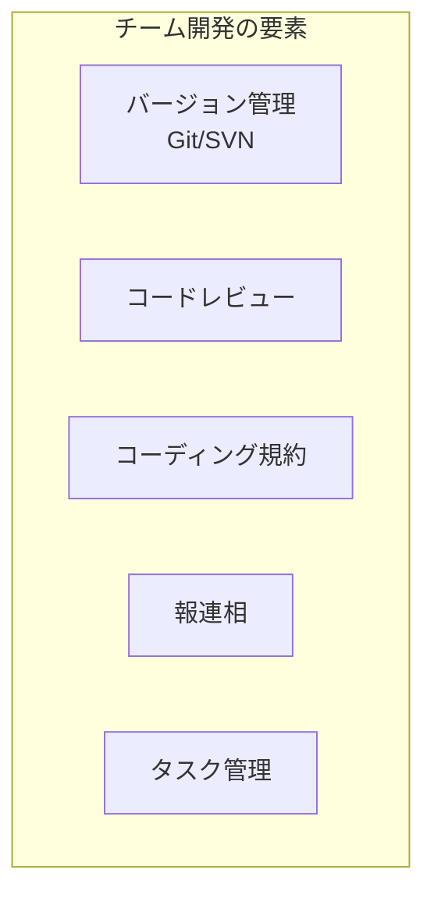

# 学習と仕事の違い

プログラミングを学んできたあなたが、実際に仕事を始めると「思っていたのと違う」と感じることがたくさんあります。

この章では、**学習と仕事のギャップ**を理解し、スムーズに仕事に移行するための考え方を学びます。

## なぜギャップが生まれるのか

学習と仕事で求められることが違うからです。



これらのギャップを事前に理解しておくことで、業務に入ったときのショックを軽減できます。

---

## 1. 「動く」だけでは足りない

### 学習での経験

学習中は、プログラムが**動くこと**がゴールになりがちです。

- 課題が通ればOK
- エラーなく実行できればOK
- 期待通りの出力が出ればOK

これは学習の段階では正しいアプローチです。まずは「動かす」経験を積むことが大切だからです。

### 仕事で求められること

しかし仕事では、**動くことは大前提**です。その上で、以下が求められます。

| 観点 | 学習 | 仕事 |
|------|------|------|
| 目的 | 動くこと | 動く + 読みやすい + 保守しやすい |
| コードを読む人 | 自分だけ | チームメンバー、将来の担当者 |
| 寿命 | 課題提出まで | 数年〜十数年 |
| 変更頻度 | ほぼなし | 頻繁に修正・機能追加 |

### なぜ「読みやすく、保守しやすく」が重要なのか

仕事で書くコードは、**あなた以外の人が読み、修正する**ことになります。

- 半年後にバグ修正する人があなたとは限らない
- 1年後に機能追加する人は新人かもしれない
- コードを読んで仕様を理解しなければならない場面がある

「動けばいい」コードは、後で触る人を苦しめます。

```
❌ 学習の発想
「とりあえず動いたからOK」

⭕ 仕事の発想
「他の人が見ても理解できるか？」
「半年後の自分が見ても分かるか？」
```

### 具体例：変数名

```python
# 学習でよくある書き方（動く）
a = 10
b = 5
c = a * b

# 仕事で求められる書き方（読みやすい）
price = 10
quantity = 5
total = price * quantity
```

どちらも同じ動作ですが、後者の方が**何をしているか一目で分かります**。

> [!tip] 意識すべきこと
> 「今の自分」ではなく「コードを読む誰か」のために書く習慣をつけましょう。学習中から意識しておくと、仕事に入ったときにスムーズです。

---

## 2. プログラミング以外も重要

### 学習での経験

学習では、プログラミング（コードを書くこと）が中心です。

- 文法を覚える
- アルゴリズムを理解する
- フレームワークの使い方を学ぶ

### 仕事で必要なスキル

しかし仕事では、プログラミングは業務の一部に過ぎません。



### プログラミング以外で必要なこと

| スキル | 内容 |
|--------|------|
| **コードを読む** | 既存のコードを理解する。新規作成より修正の方が多い |
| **テスト** | 自分が書いたコードが正しく動くか確認する |
| **ドキュメントを読む** | 設計書、仕様書、技術ドキュメントを読んで理解する |
| **ドキュメントを書く** | 報告書、手順書、コメントを書く |
| **コミュニケーション** | 質問する、報告する、相談する、レビューを受ける |

> [!important] 覚えておくべきこと
> 「プログラミングができる」だけでは、仕事はできません。コミュニケーション、ドキュメント、テストなど、プログラミング以外のスキルも同じくらい重要です。

### 学習中にできること

- コメントを書く習慣をつける
- 自分のコードにテストを書いてみる
- 技術ドキュメントを読む練習をする
- 勉強会やコミュニティで発表・質問してみる

---

## 3. 個人開発とチーム開発の違い

### 個人開発（学習中）

学習中は、基本的に**一人で開発**します。

- 自分のペースで進められる
- 自分だけが理解していればいい
- 好きなように書ける
- 誰にも迷惑をかけない

### チーム開発（仕事）

仕事では、**チームで開発**します。これには独特のルールや作法があります。



### チーム開発で必要になること

| 要素 | 説明 |
|------|------|
| **バージョン管理** | Gitでブランチを切り、プルリクエストを出す |
| **コードレビュー** | 他の人にコードを見てもらい、指摘を受ける |
| **コーディング規約** | チームで決めたルールに従って書く |
| **報連相** | 進捗を報告し、問題があれば相談する |
| **タスク管理** | チケットやIssueでタスクを管理する |

### 個人開発では気づかないこと

- **自分のコードが「分かりにくい」こと**：自分だけが読むなら問題にならない
- **ブランチの切り方**：一人なら考える必要がない
- **コンフリクトの解消**：複数人で同じファイルを触らないと起きない
- **レビューを受けること**：指摘を受けて改善する経験

> [!tip] 学習中にできること
> - 個人開発でもGitを使い、ブランチを切る練習をする
> - コードレビューを受ける機会（勉強会、OSS貢献など）を探す
> - 自分のコードを数日後に読み返して「分かりにくい」と感じる部分を見つける

---

## 4. どの言語を学べばいいのか

### よくある悩み

「業務で使う言語と、学んだ言語が違う」という悩みはよくあります。

- スクールでPythonを学んだが、現場はJava
- 独学でJavaScriptを学んだが、現場はC#
- Rubyを勉強したのに、現場はPHP

### 言語が違っても大丈夫

結論から言うと、**言語が違っても、学んだことは無駄になりません**。

なぜなら、プログラミングの**考え方は言語を超えて共通**だからです。

| 共通する考え方 | 例 |
|----------------|-----|
| 制御構文 | if文、for文、while文 |
| データ構造 | 配列、リスト、辞書（マップ） |
| 関数・メソッド | 処理をまとめて再利用する |
| オブジェクト指向 | クラス、継承、カプセル化 |
| デバッグの考え方 | 問題の切り分け、ログ出力 |
| アルゴリズム | ソート、検索、再帰 |

### 言語ごとに違うこと

一方で、以下は言語ごとに異なります。これらは**新しい言語を使う際に学び直す必要**があります。

- 文法（書き方）
- 標準ライブラリ
- フレームワーク
- エコシステム（パッケージ管理など）
- 慣習（命名規則など）

### 新しい言語を学ぶときのコツ

1. **違いに注目する**：「Pythonではこう書いていたけど、Javaではこう書くのか」
2. **共通点に気づく**：「考え方は同じだな」
3. **その言語らしい書き方を学ぶ**：「Javaではこう書くのが一般的なんだ」

> [!important] 覚えておくべきこと
> 言語は「道具」です。大事なのは**プログラミングの考え方**を身につけること。考え方が身についていれば、新しい言語を学ぶスピードはどんどん速くなります。

---

## 5. 業務に入る前に何をしておくべきか

### 最低限やっておきたいこと

業務に入る前に、以下のことを経験しておくと安心です。

| 項目 | 内容 | 優先度 |
|------|------|--------|
| **Gitの基本操作** | clone、add、commit、push、pull、ブランチ作成 | 高 |
| **エディタ/IDEの操作** | 基本的な操作、ショートカット | 高 |
| **コマンドライン** | ディレクトリ移動、ファイル操作、コマンド実行 | 高 |
| **エラーの読み方** | エラーメッセージから原因を推測する | 中 |
| **検索力** | 分からないことを効率よく調べる | 中 |
| **タイピング** | ブラインドタッチでスムーズに打てる | 中 |

### やっておくと差がつくこと

| 項目 | 内容 |
|------|------|
| **小さなアプリを完成させる** | 最初から最後まで自分で作り切る経験 |
| **チーム開発の経験** | 勉強会やハッカソンでの共同開発 |
| **コードレビューの経験** | 他の人にコードを見てもらう/見る経験 |
| **技術ドキュメントを読む** | 公式ドキュメントを読んで実装する経験 |

### 完璧を目指さなくていい

> [!important] 覚えておくべきこと
> 業務に入る前に「完璧に準備する」必要はありません。**基礎が固まっていれば、あとは業務の中で学んでいけます**。
>
> 大事なのは：
> - 分からないことを「分からない」と認識できること
> - 分からないことを調べたり、質問したりできること
> - 新しいことを学ぶ姿勢があること

---

## まとめ

学習と仕事には大きなギャップがあります。事前に理解しておくことで、ショックを軽減できます。

### 学習と仕事の違い

| 観点 | 学習 | 仕事 |
|------|------|------|
| コードの品質 | 動けばOK | 読みやすく、保守しやすく |
| 必要なスキル | プログラミング中心 | プログラミング + テスト + ドキュメント + コミュニケーション |
| 開発スタイル | 個人開発 | チーム開発（Git、レビュー、規約） |
| 言語 | 1つの言語を深く | 現場に合わせて柔軟に |
| ゴール | 課題をクリア | 価値を届ける |

### 心構え

1. **「動く」はスタート地点**：読みやすく、保守しやすいコードを目指す
2. **プログラミング以外も大事**：テスト、ドキュメント、コミュニケーション
3. **言語は道具**：考え方は共通、新しい言語も学べる
4. **完璧を目指さない**：基礎があれば、業務の中で成長できる

これらを理解した上で業務に入れば、「思っていたのと違う」というショックを和らげ、スムーズにスタートを切れます。

> [!tip] 次のステップ
> ギャップを理解した上で、**どのように学習に取り組めばいいか**については [[第1部_心構え/第3章_学習と仕事の違い/001_学習への取り組み方|学習への取り組み方]] で解説しています。
