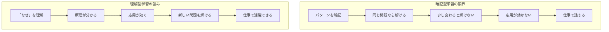
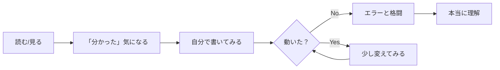

# 学習への取り組み方

[[第1部_心構え/第3章_学習と仕事の違い/000_学習と仕事の違い|学習と仕事の違い]] で見たように、学習と仕事には大きなギャップがあります。

このギャップを埋めるために、**どのようにプログラミング学習に取り組めばいいのか**を解説します。

---

## カリキュラム通りやっても不安

### よくある悩み

「カリキュラム通りに進めたけど、本当に理解できているか分からない」という不安を抱える人は多いです。

- 写経（コードを見て打つ）しただけで身についている気がしない
- 動画を見て「分かった気」になるが、自分で書こうとすると書けない
- 課題は通ったが、応用できる気がしない

### なぜ不安になるのか

これは「**学んだ**」と「**できる**」が違うからです。


カリキュラムを終えた段階では、多くの人は「理解した」〜「やってみた」の段階にいます。「できる」になるには、**自分で考えて作る経験**が必要です。

### 理解度を確認する方法

以下のことができれば、「できる」段階に近づいています。

| 確認項目 | できるか？ |
|----------|-----------|
| **サンプルなしで書ける** | 見本を見ずに、同じものを書けるか？ |
| **エラーを自分で直せる** | エラーメッセージを読んで、原因を特定して修正できるか？ |
| **応用できる** | 学んだ内容を別の問題に適用できるか？ |
| **説明できる** | なぜそう書くのか、他の人に説明できるか？ |

### 不安を解消するためにできること

1. **サンプルを見ずに書いてみる**
   - カリキュラムで作ったものを、何も見ずにもう一度作ってみる
   - 詰まったところが「分かっていなかった部分」

2. **自分のアプリを作る**
   - カリキュラム外で、自分で考えた小さなアプリを作る
   - 「何を作るか」から自分で決める経験が重要

3. **他の人に説明してみる**
   - 学んだことをブログに書く、勉強会で発表する
   - 説明しようとすると、理解が曖昧な部分に気づく

4. **コードを読む練習**
   - 他の人が書いたコード（GitHub、OSS）を読んでみる
   - 「なぜこう書いているのか」を考える

---

## 暗記ではなく「理解」が大事

プログラミング学習でよくある失敗パターンがあります。

```
❌ よくある失敗パターン
「この書き方を覚えよう」
「このコードをそのまま覚えよう」
「なぜかは分からないけど、こう書けば動く」
```

このアプローチには大きな問題があります。



### なぜ暗記では仕事で通用しないのか

仕事では、学習で見たことのない問題に毎日ぶつかります。

| 場面 | 暗記型 | 理解型 |
|------|--------|--------|
| 見たことのあるコード | 書ける | 書ける |
| 少し違う要件 | 書けない | 応用して書ける |
| エラーが出た | 対処法を検索 | 原因を推測して対処 |
| 他人のコードを読む | 「何これ？」 | 「なるほど、こういう意図か」 |
| 新しい技術を学ぶ | 一から暗記し直し | 既存の理解を応用 |

> [!important] 暗記の限界
> 暗記で対応できるのは「見たことのある問題」だけです。仕事では「見たことのない問題」が次々に来るため、**原理を理解して応用する力**が必要です。

---

## 「理解する」とは何か

「理解する」とは、以下の問いに答えられることです。

| 問い | 例 |
|------|-----|
| **なぜそう書くのか？** | 「なぜfor文を使うのか？」→「繰り返し処理をするため」 |
| **他の書き方との違いは？** | 「for文とwhile文の違いは？」→「回数が決まっているかどうか」 |
| **どういうときに使うのか？** | 「配列とリストはいつ使い分ける？」→「固定長か可変長か」 |
| **何が起きているのか？** | 「このエラーは何を意味する？」→「変数が定義されていない」 |

---

## 理解しながら学ぶための具体的な方法

### 1. 「なぜ？」を常に問う

コードを書くとき、常に「なぜ？」を自分に問いかけます。

```python
# ただ書くのではなく...
for i in range(10):
    print(i)

# 「なぜ？」を考える
# - なぜfor文を使う？ → 10回繰り返したいから
# - なぜrange(10)？ → 0から9まで生成してくれるから
# - なぜiという変数名？ → indexの略、慣例的に使われる
```

### 2. 自分の言葉で説明してみる

学んだことを、誰かに説明するつもりで言葉にしてみます。

```
❌ 説明できない状態
「for文は...えーと、繰り返すやつ」

⭕ 説明できる状態
「for文は、決まった回数だけ処理を繰り返したいときに使います。
例えば、リストの要素を1つずつ処理したいときや、
1から10まで順番に足し算したいときに使います」
```

> [!tip] ラバーダック・デバッギング
> プログラマーの間で「ラバーダック・デバッギング」という手法があります。ゴム製のアヒルに向かって問題を説明すると、説明しているうちに自分で解決策に気づくというものです。**説明しようとすることで、理解が深まります**。

### 3. 手を動かしながら試す

読んだだけ、見ただけでは理解できません。**必ず手を動かして試します**。



「分かった気」と「本当に分かった」の間には大きな差があります。

| 段階 | 状態 |
|------|------|
| **読んだ** | 「なるほど、こう書くのか」 |
| **写経した** | 「動いた！（でも理解は曖昧）」 |
| **自分で書いた** | 「あれ、どう書くんだっけ？」 |
| **エラーを直した** | 「そういうことか！」 |
| **応用した** | 「これ、こういう使い方もできるのか」 |

### 4. 「動いた」で終わらせない

コードが動いたら、そこで終わりにせず、さらに深掘りします。

```
動いた！

↓ ここで終わらない

- 別の書き方はないか？
- もっとシンプルに書けないか？
- エラーになるケースはないか？
- 他の人が読んで分かるか？
```

### 5. エラーは学びのチャンス

エラーが出ると嫌になりますが、**エラーは最高の学習機会**です。

```
❌ エラーへの悪い対応
「動かない、もう嫌だ」
「エラーメッセージは意味不明」
「とりあえず検索してコピペ」

⭕ エラーへの良い対応
「何がダメだったのか？」
「エラーメッセージは何と言っている？」
「なぜこの修正で直ったのか？」
```

エラーを理解して直す経験を積むと、同じエラーに二度とハマらなくなります。

---

## 学習の効率を上げるコツ

| コツ | 説明 |
|------|------|
| **小さく始める** | 大きなアプリより、小さなコードで理解を積み上げる |
| **繰り返す** | 1回で理解しようとせず、何度も触れる |
| **関連づける** | 新しい知識を既存の知識と結びつける |
| **アウトプットする** | ブログ、メモ、誰かに説明する |
| **休憩を取る** | 詰め込みすぎず、脳に定着させる時間を作る |

---

## 理解型学習のチェックリスト

学習を終えたあと、以下をチェックしてみましょう。

- [ ] **なぜそう書くのか、説明できるか？**
- [ ] **サンプルを見ずに、同じものを書けるか？**
- [ ] **少し違う問題に応用できるか？**
- [ ] **エラーが出たとき、自分で原因を推測できるか？**
- [ ] **他の人に教えられるか？**

すべてにチェックが入れば、「理解できている」と言えます。1つでもチェックできなければ、その部分を復習しましょう。

---

## まとめ

### 学習で陥りやすい罠

| 罠 | 問題点 | 解決策 |
|-----|--------|--------|
| カリキュラム通り進めて満足 | 「やった」と「できる」は違う | サンプルなしで書いてみる |
| 暗記で乗り切ろうとする | 応用が効かない | 「なぜ？」を常に問う |
| 動いたら終わり | 理解が浅いまま | 深掘りする習慣をつける |
| エラーを避ける | 成長の機会を逃す | エラーから学ぶ姿勢を持つ |

### 心構え

1. **暗記より理解**：「なぜ？」を問い続け、応用力を身につける
2. **手を動かす**：読んだだけでは分からない、実際に書いて試す
3. **エラーを歓迎する**：エラーは最高の学習機会
4. **説明できるか確認**：理解度の最良のチェック方法

この取り組み方を意識して学習を進めれば、仕事に入ってからも**応用力のある**エンジニアとして活躍できます。
