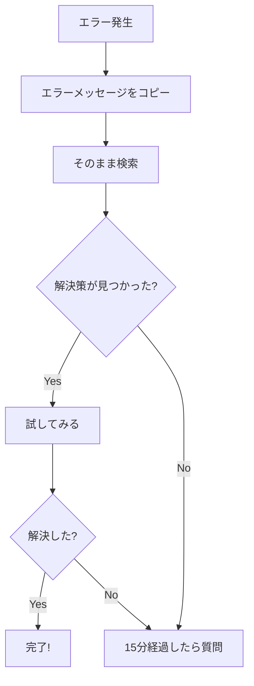

# 困ったときの対処法

仕事をしていると、必ず「困った」という場面に遭遇します。そのときにどう対処するかで、成長のスピードが変わります。

## 困ったときの基本姿勢

### 1. 一人で抱え込まない

困ったときに最もやってはいけないのは、**一人で抱え込んで時間だけが過ぎること**です。

- 15〜30分調べても分からなければ、誰かに相談する
- 「迷惑をかけたくない」と思っても、放置する方が迷惑
- 早めに相談すれば、早めに解決できる

### 2. 問題を整理する

困っているときは、まず**何に困っているのか**を整理しましょう。

- 何をしようとしているのか
- 何が起きているのか
- 何が分からないのか

整理することで、自分で解決できることもあります。

### 3. 報告・相談を恐れない

悪い報告ほど早くしましょう。

- 問題が小さいうちに報告すれば、対処も簡単
- 隠していて大きくなると、取り返しがつかなくなる
- 「報告してくれてありがとう」と言われることの方が多い

## 具体的な対処法

### 技術的に分からないとき

**Step 1：自分で調べる（5〜15分）**
1. エラーメッセージをそのまま検索する
2. 公式ドキュメントを確認する
3. 関連するコードを読んでみる

詳しい調べ方は [[第2部_基礎知識/第6章_調べ方/000_調べ方の基本|調べ方の基本]] を参照してください。

**Step 2：質問する準備をする**
1. 何をしようとしているか
2. 何を試したか
3. どこで詰まっているか

**Step 3：質問する**
- 「〇〇をしようとしているのですが、△△で詰まっています。□□まで試したのですが、ここから分かりません」

### 作業が予定通り進まないとき

**すぐに報告する**
- 「予定より遅れそうです」と早めに伝える
- 遅れそうな理由と、いつ頃終わりそうか
- 「遅れてから報告」ではなく「遅れそうなときに報告」

**相談する**
- 「このやり方で進めていいですか？」
- 「もっと良いやり方はありますか？」
- 先輩や上司は、あなたより多くの経験を持っている

### ミスをしてしまったとき

**Step 1：報告する**
- 何が起きたか、事実を正確に伝える
- 言い訳はしない

**Step 2：対処する**
- 指示を仰ぎ、できることをする
- 勝手に判断して動かない

**Step 3：振り返る**
- なぜミスが起きたかを考える
- 再発防止策を考える

### 人間関係で困ったとき

**一人で悩まない**
- 上司や人事に相談する
- 同期や信頼できる先輩に話を聞いてもらう
- 社外の相談窓口を利用する

## 実際の「困った」シナリオと解決例

よくある「困った」場面とその対処法を見てみましょう。

### ケース1：エラーが出て先に進めない

**状況**：
コードを書いて実行したらエラーが出た。エラーメッセージを見ても意味が分からない。

**悪い対処**：
- 何もせず1時間悩み続ける
- 「動きません」とだけ先輩に言う

**良い対処**：


**質問例**：
```
ユーザー登録機能を実装中です。
保存ボタンを押すと「NullPointerException」が出ます。

試したこと：
1. userオブジェクトがnullでないか確認 → nullではない
2. デバッガで26行目まで確認 → ここまでは正常

エラー箇所：UserService.java の 30行目
エラーメッセージ：「Cannot invoke method save() on null object」

何を確認すべきでしょうか？
```

---

### ケース2：仕様が曖昧で実装できない

**状況**：
設計書を読んだが、「エラー時は適切に処理する」としか書いていない。何をすればいいか分からない。

**悪い対処**：
- 自分で勝手に決めて実装する
- 分からないまま放置する

**良い対処**：
1. まず**自分なりの解釈**を整理する
2. その解釈で合っているか**確認する**

**質問例**：
```
チケット#123 のエラー処理について確認させてください。

設計書には「エラー時は適切に処理する」とありますが、
具体的に以下の理解で合っていますか？

私の解釈：
- DBエラー時 → エラーメッセージを表示して、入力画面に戻る
- バリデーションエラー時 → 該当項目を赤くハイライト

別の処理が必要でしたら教えてください。
```

---

### ケース3：作業が予定より遅れそう

**状況**：
金曜日が期限だが、水曜日の時点で半分も終わっていない。

**悪い対処**：
- 金曜日になってから「間に合いませんでした」と報告
- 残業して無理やり終わらせようとする（品質が下がる）

**良い対処**：
1. **遅れそうと分かった時点で**すぐ報告
2. **現状と見込み**を伝える
3. **どうしたいか・どうしてほしいか**を伝える

**報告例**：
```
〇〇機能の実装について報告です。

【現状】
- 全5タスク中、2タスク完了
- 残り3タスク（実装2つ、テスト1つ）

【遅れの理由】
- 既存コードの理解に想定より時間がかかった
- △△の仕様確認待ちで1日止まっていた

【見込み】
- 現在のペースだと、完了は来週火曜日になりそうです

【相談】
- 期限を延ばすか、スコープを縮小するか、ご判断いただけますか？
- 優先度が高い部分があれば、そこから着手します
```

---

### ケース4：ミスをしてしまった

**状況**：
テスト環境だと思って削除クエリを実行したら、本番環境だった。

**悪い対処**：
- パニックになって何もできない
- 「バレないかも」と隠そうとする

**良い対処**：
1. **すぐに報告**する（1秒でも早く）
2. **何が起きたか**を正確に伝える
3. **指示を仰ぐ**

**報告例**：
```
緊急の報告です。

【何が起きたか】
本番環境で誤って users テーブルの一部レコードを削除してしまいました。

【影響範囲】
削除されたレコード：約100件（2024年1月以降の登録ユーザー）

【発生時刻】
14:30頃

【今の状態】
これ以上の操作は行っていません。
どう対応すればよいか指示をお願いします。
```

> **ポイント**：ミスを隠そうとすると、発覚したときのダメージが何倍にもなります。すぐに報告すれば、リカバリーの選択肢が増えます。

---

### ケース5：何を聞けばいいか分からない

**状況**：
タスクを任されたが、何から始めればいいか分からない。でも「分かりません」とも言いづらい。

**良い対処**：
「分かっていること」と「分からないこと」を整理して質問

**質問例**：
```
チケット#456 について確認させてください。

【分かっていること】
- 〇〇画面に△△機能を追加する
- 期限は来週金曜日

【分からないこと】
- どのファイルを修正すればいいか
- 参考になる既存の実装はあるか
- 完了条件（どこまでやればOKか）

まずどこから着手すればよいでしょうか？
```

---

## 質問する前のチェックリスト

質問する前に、以下を確認しましょう。

- [ ] **自分で調べたか**：検索、公式ドキュメント、既存コードを確認
- [ ] **何をしようとしているか**：目的を説明できる
- [ ] **何を試したか**：試したこととその結果を説明できる
- [ ] **何が分からないか**：具体的に説明できる
- [ ] **エラーメッセージ**：コピーして貼り付けられる状態か

## 質問の仕方

### 良い質問の例

```
〇〇の実装をしています。
△△のエラーが出ているのですが、解決方法が分かりません。

試したこと：
1. □□を確認 → 問題なし
2. ××を修正 → 変わらず

エラーメッセージは「〜〜〜」です。
何か確認すべき点はありますか？
```

### 避けたい質問の例

- 「分かりません」（何が？）
- 「動きません」（何を試した？）
- 「教えてください」（何を？）

**ポイント**
- 状況を具体的に伝える
- 自分で試したことを伝える
- 相手が答えやすい形で質問する

## チャットでの質問テンプレート

すぐに使えるテンプレートを用意しました。

### 技術的な質問

```
【質問】〇〇について

実装中の機能：△△
発生している問題：□□

試したこと：
1.
2.

エラーメッセージ：
```

### 仕様確認

```
【確認】チケット#XXX について

設計書の記載：「〇〇」

私の解釈：
- △△の場合は□□する
- ◇◇の場合は××する

この理解で合っていますか？
```

### 進捗報告・相談

```
【相談】〇〇の進捗について

現状：全Xタスク中、Y完了
見込み：このペースだと〇日頃完了

課題：△△で想定より時間がかかっている

相談したいこと：
```

## まとめ

困ったときは、以下を思い出してください。

1. **一人で抱え込まない**
2. **問題を整理する**
3. **早めに報告・相談する**
4. **質問するときは具体的に**

困ることは悪いことではありません。困ったときにどう対処するかで、あなたの評価が決まります。
