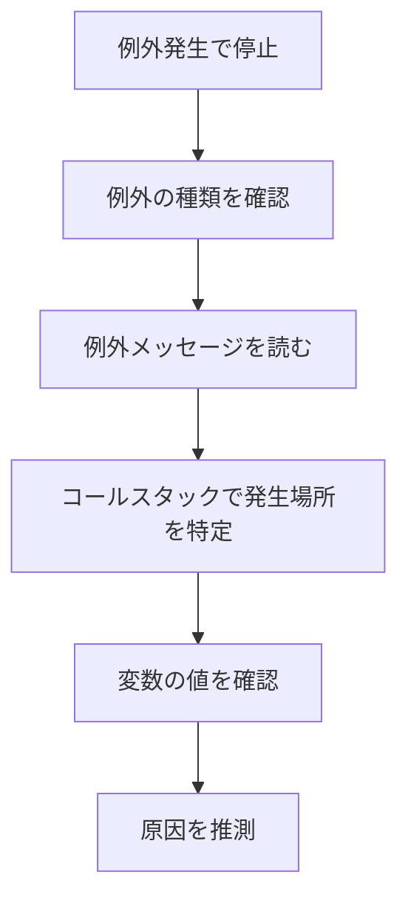
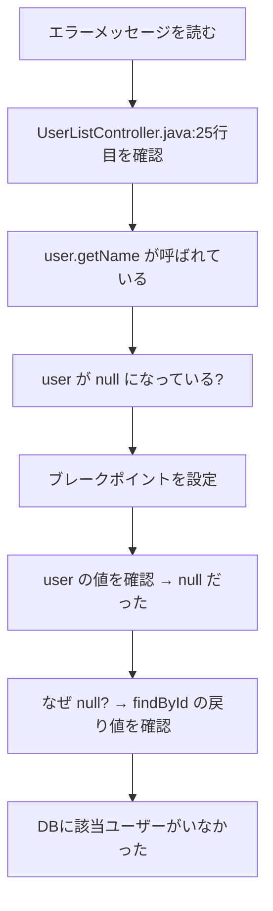

# デバッグの基本

プログラムの問題を見つけて修正する「デバッグ」で使う基本的なツールと技術を学びます。

## デバッグとは

デバッグとは、プログラムのバグ（不具合）を見つけて修正することです。

エンジニアの仕事の大部分は、実はデバッグに費やされます。デバッグスキルは非常に重要です。

> **補足**：実際の不具合対応の進め方（調査手順や報告など）については、[[44_不具合対応の進め方|不具合対応の進め方]] を参照してください。

## デバッガの使い方

デバッガは、プログラムの動きを1行ずつ確認できるツールです。問題の原因を見つける最も強力な方法です。

### デバッガの基本機能


| 機能 | 説明 | 使う場面 |
|------|------|----------|
| ブレークポイント | 指定した行で処理を一時停止 | 「ここの時点での値を見たい」とき |
| ステップ実行 | 1行ずつ処理を進める | 「どこで値がおかしくなるか」を追いたいとき |
| 変数の確認 | 現在の変数の値を確認 | 「この変数に何が入っているか」を見たいとき |
| コールスタック | どの関数から呼ばれたかを確認 | 「どういう経路でここに来たか」を知りたいとき |
| ウォッチ式 | 特定の変数や式の値を監視 | 「この値が変わるタイミングを知りたい」とき |

### ブレークポイントの使い方

1. **問題がありそうな行にブレークポイントを設定**
   - IDEで行番号の横をクリック
   - 赤い丸が表示される

2. **プログラムをデバッグ実行**
   - 通常の実行ではなく「デバッグ実行」を選ぶ
   - F5キーや「Debug」ボタン

3. **ブレークポイントで停止したら変数の値を確認**
   - 変数にマウスを乗せると値が表示される
   - 「変数」ウィンドウで一覧を確認

4. **ステップ実行で処理を進めながら確認**
   - 1行ずつ進めて、値の変化を追う

### ステップ実行の種類

| 種類 | 動作 | 使い分け |
|------|------|----------|
| ステップイン | 関数の中に入って1行ずつ実行 | 関数の中身を詳しく見たいとき |
| ステップオーバー | 関数は実行するが、中には入らない | 関数の結果だけ見ればいいとき |
| ステップアウト | 現在の関数を抜けるまで実行 | 今の関数は問題なさそうなとき |

> **ポイント**：ステップインばかり使うと関係ない関数まで追ってしまいます。「この関数は問題なさそう」と思ったらステップオーバーで飛ばしましょう。

### 条件付きブレークポイント

特定の条件のときだけ停止させることもできます。

```
例：userIdが100のときだけ停止
条件：userId == 100
```

ループの中で特定の条件のときだけ止めたい場合に便利です。

### ウォッチ式（Watch）の使い方

ウォッチ式は、**特定の変数や式の値を常に監視する機能**です。


**ウォッチの設定方法**：
1. デバッグ中に「ウォッチ」ウィンドウを表示
2. 「+」ボタンまたは右クリックで「ウォッチに追加」
3. 監視したい変数名や式を入力

**ウォッチに登録できるもの**：

| 種類 | 例 | 説明 |
|------|-----|------|
| 単純な変数 | `userId` | 変数の値を監視 |
| オブジェクトのプロパティ | `user.name` | オブジェクトの中身を監視 |
| 配列の要素 | `items[0]` | 配列の特定要素を監視 |
| 計算式 | `items.length` | 式の結果を監視 |
| 比較式 | `userId == 100` | 条件が true/false かを監視 |

**ウォッチが便利な場面**：
- ループの中で変数がどう変化するか追いたい
- 複数の変数を同時に監視したい
- オブジェクトの特定のプロパティだけ見たい

> **ポイント**：変数にマウスを乗せても値は見られますが、毎回乗せるのは面倒です。よく確認する変数はウォッチに登録しておくと効率的です。

### コールスタックの見方

コールスタックは、**現在の処理がどのような経路で呼び出されたか**を示します。

```
コールスタックの例：
─────────────────────────────────
getUser (UserService.java:25)      ← 現在地（一番上）
findById (UserRepository.java:42)
show (OrderController.java:15)
main (Main.java:10)                ← 最初の呼び出し元（一番下）
─────────────────────────────────
```

**読み方**：
- **一番上**：現在停止している場所
- **下に行くほど**：呼び出し元をたどっていく
- **一番下**：最初の呼び出し元（main関数など）

**コールスタックでできること**：

| 操作 | 効果 |
|------|------|
| スタックの行をクリック | その時点のコードと変数を確認できる |
| 呼び出し元に戻る | 「ここにどんな値で呼ばれたか」を確認 |

**コールスタックが役立つ場面**：
- 「どこからこの関数が呼ばれたのか」を知りたいとき
- 「引数にどんな値が渡されたか」を確認したいとき
- 「想定と違う経路で呼ばれている」を発見したいとき

```
例：getUser(null) が呼ばれて NullPointerException
↓ コールスタックを見ると
show() で user = null のまま getUser() を呼んでいた
↓ さらにたどると
findById() が null を返していたことが分かった
```

### 例外発生時のデバッグ

例外（Exception）が発生したとき、デバッガで詳しい情報を確認できます。

**例外ブレークポイントの設定**：

多くのIDEでは「例外が発生したら自動で止まる」設定ができます。

| IDE | 設定方法 |
|-----|----------|
| Visual Studio | デバッグ → 例外設定 |
| IntelliJ / Android Studio | 実行 → ブレークポイントの表示 → 「+」→ Java例外ブレークポイント |
| VS Code (Java) | 「BREAKPOINTS」パネル → 歯車アイコン → Caught/Uncaught Exceptions |
| Eclipse | ウィンドウ → パースペクティブ → デバッグ → 例外ブレークポイント |

**例外発生時に確認すべきこと**：



1. **例外の種類**
   - `NullPointerException`：何かが null
   - `ArrayIndexOutOfBoundsException`：配列の範囲外
   - `IllegalArgumentException`：引数が不正

2. **例外メッセージ**
   - 例外オブジェクトの `message` プロパティを確認
   - 「何が問題か」のヒントが書いてある

3. **コールスタック**
   - どこで例外が発生したか
   - どのような経路で呼ばれたか

4. **変数の値**
   - 例外発生時点での各変数の値
   - null になっている変数はないか
   - 配列のインデックスとサイズ

**例外の詳細を見る（IDE別）**：

| IDE | 確認方法 |
|-----|----------|
| IntelliJ | 変数ウィンドウで例外オブジェクトを展開 |
| Eclipse | 変数ビューで例外オブジェクトを展開 |
| VS Code | デバッグコンソールで例外オブジェクトを確認 |
| Visual Studio | ローカルウィンドウまたは例外ヘルパー |

> **ポイント**：例外ブレークポイントを設定しておくと、try-catch で握りつぶされた例外も発見できます。「エラーは出ないのに動作がおかしい」というときに有効です。

## エラーメッセージの読み方

エラーメッセージには、問題解決に必要な情報が含まれています。慣れないうちは読み飛ばしがちですが、しっかり読むことが大切です。

### エラーメッセージの構成

```
NullPointerException: Cannot invoke method on null object
    at com.example.MyClass.myMethod(MyClass.java:42)
    at com.example.Main.main(Main.java:10)
```

| 部分 | 読み方 | 内容 |
|------|--------|------|
| 1行目前半 | エラーの種類 | NullPointerException（何のエラーか） |
| 1行目後半 | エラーの説明 | Cannot invoke method on null object（どうしてエラーか） |
| 2行目 | 発生場所 | MyClass.java の 42行目（どこでエラーか） |
| 3行目以降 | 呼び出し元 | Main.java の 10行目から呼ばれた（どう呼ばれたか） |

### スタックトレースの読み方

スタックトレースは**上から順に読む**のが基本です。

```
java.lang.NullPointerException
    at com.example.UserService.getUser(UserService.java:25)  ← ここでエラー発生
    at com.example.OrderController.show(OrderController.java:42)
    at sun.reflect.NativeMethodAccessorImpl.invoke0(Native Method)
    ...
```

- **一番上**がエラーが発生した場所
- **自分が書いたコード**（com.example.〜）の中で一番上の行を確認
- フレームワークやライブラリの行（sun.〜、org.springframework.〜）は読み飛ばしてよい

### よくあるエラーと原因

| エラー | よくある原因 | 確認ポイント |
|--------|-------------|-------------|
| NullPointerException | null のオブジェクトを使おうとした | どの変数が null か確認 |
| ArrayIndexOutOfBoundsException | 配列の範囲外にアクセス | 配列のサイズとインデックスを確認 |
| FileNotFoundException | ファイルが存在しない、パスが間違っている | パスが正しいか、ファイルが存在するか確認 |
| ClassNotFoundException | クラスが見つからない | クラスパス設定、依存関係を確認 |
| SyntaxError | コードの文法ミス | エラー行の周辺の括弧、セミコロンを確認 |
| TypeError | 型が合っていない | 変数の型と期待される型を確認 |

### エラーメッセージが英語で分からないとき

1. **エラーの種類（Exception名など）をそのまま検索**
   - 「NullPointerException」で検索すると解説が見つかる

2. **エラーメッセージ全体を検索**
   - 同じエラーで困った人の解決策が見つかることが多い

3. **翻訳ツールを使う**
   - 大まかな意味は分かる

## ログの活用

デバッガが使えない環境（本番環境など）では、ログが頼りになります。

### ログを出力する

```java
// 簡易的なログ（デバッグ用、本番では使わない）
System.out.println("処理開始: userId=" + userId);

// 本格的なロギングフレームワーク
logger.debug("処理開始: userId={}", userId);
logger.info("ユーザー作成成功: userId={}", userId);
logger.warn("リトライ発生: count={}", retryCount);
logger.error("エラー発生", exception);
```

### ログレベル

| レベル | 用途 | 例 |
|--------|------|-----|
| DEBUG | 開発時の詳細情報 | 変数の値、処理の途中経過 |
| INFO | 正常な動作の記録 | 処理開始・終了、重要なイベント |
| WARN | 注意が必要な状況 | リトライ発生、非推奨機能の使用 |
| ERROR | エラー発生 | 例外発生、処理失敗 |

### ログを確認する

1. **ログファイルの場所を確認**
   - 設定ファイルに書いてあることが多い
   - 分からなければ先輩に聞く

2. **時刻で問題発生時のログを探す**
   - 「〇時〇分頃に発生」を手がかりに探す

3. **エラーレベルでフィルタリング**
   - まず ERROR、WARN を探す
   - 必要に応じて INFO、DEBUG も確認

### ログ確認のコマンド例

```bash
# 最新のログを表示（Linux/Mac）
tail -f /var/log/application.log

# ERRORを含む行を検索
grep "ERROR" /var/log/application.log

# 特定の時刻のログを検索
grep "2024-01-15 10:3" /var/log/application.log
```

## print文デバッグ

デバッガが使えない場合や、簡単に確認したい場合は print文（console.log など）も有効です。

### 基本的な使い方

```java
// Java
System.out.println("=== DEBUG: userId=" + userId + " ===");

// JavaScript
console.log("=== DEBUG: userId=", userId, "===");

// Python
print(f"=== DEBUG: userId={userId} ===")
```

### 効果的な print文のコツ

1. **目立つ目印をつける**
   - `===` や `###` で囲むと見つけやすい
   - 「DEBUG:」などのプレフィックスをつける

2. **どこで出力したか分かるようにする**
   - 「メソッド名: 〇〇」と書く
   - 「処理A通過」「処理B通過」と書く

3. **変数名と値の両方を出力する**
   - `userId=100` のように変数名も出す
   - ただ `100` だけだと何の値か分からない

4. **確認が終わったら消す**
   - コミット前に必ず削除
   - 残っていると本番に混入してしまう

## デバッグで解決した実例

実際によくあるケースを例に、デバッグの流れを見てみましょう。

### ケース1：NullPointerException の解決

**現象**：ユーザー一覧画面を開くとエラーになる

**エラーメッセージ**：
```
NullPointerException: Cannot invoke method getName() on null object
    at UserListController.show(UserListController.java:25)
```

**調査の流れ**：



1. **25行目を確認**：`user.getName()` を呼んでいる
2. **ブレークポイントを設定**：25行目の手前で停止
3. **変数を確認**：`user` が `null` だった
4. **コールスタックをたどる**：`findById()` が `null` を返していた
5. **原因特定**：存在しないユーザーIDでアクセスしていた

**修正**：`user` が `null` の場合のチェックを追加

---

### ケース2：ループが終わらない

**現象**：処理が終わらず、画面が固まる

**調査の流れ**：

1. **デバッグ実行**で処理を開始
2. **一時停止**（Pause）ボタンで停止
3. **コールスタックを確認**：同じメソッドが繰り返し呼ばれている
4. **ウォッチに `i` を登録**：ループ変数を監視
5. **ステップ実行**で確認：`i` が増えていない

**原因**：ループ内で `i++` を書き忘れていた

---

### ケース3：条件分岐が想定通りに動かない

**現象**：20歳以上なのに「未成年」と表示される

**調査の流れ**：

```java
if (age > 20) {  // ← ここにブレークポイント
    return "成人";
} else {
    return "未成年";
}
```

1. **条件式にブレークポイント**を設定
2. **変数を確認**：`age = 20`
3. **条件を確認**：`age > 20` は `false`（20は20より大きくない）
4. **原因特定**：`>` ではなく `>=` にすべきだった

**修正**：`if (age >= 20)` に変更

---

### デバッグのコツまとめ

| 状況 | やること |
|------|----------|
| エラーが出る | エラーメッセージの行番号を確認、その手前にブレークポイント |
| 値がおかしい | 値が変わる箇所を二分探索で特定 |
| 処理が止まる | 一時停止してコールスタックを確認 |
| 条件分岐が変 | 条件式の直前で変数の値を確認 |

## まとめ

デバッグの基本ツールと技術：

| ツール | 用途 | 特徴 |
|--------|------|------|
| **デバッガ** | 処理を止めて変数を確認 | 最も強力、IDE上で使用 |
| **エラーメッセージ** | エラーの種類と発生場所を把握 | 必ず読むこと |
| **ログ** | 処理の流れと状態を確認 | デバッガが使えない環境で有効 |
| **print文** | 簡単に値を確認 | 手軽だが、消し忘れに注意 |

> **次のステップ**：実際の不具合対応の進め方（調査の手順、仮説の立て方、修正・報告など）については、[[44_不具合対応の進め方|不具合対応の進め方]] を参照してください。
