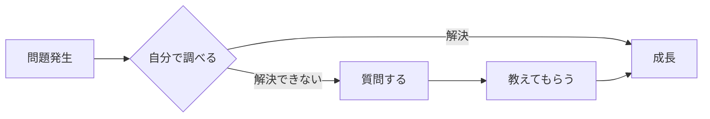
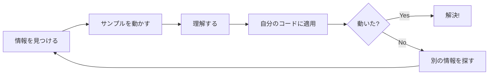

# 調べ方の基本

エンジニアの仕事は「調べること」が大半です。効率的な調べ方を身につけることで、成長スピードが大きく変わります。

## なぜ「調べ方」が重要か

### 誰も全てを知らない

- 先輩も毎日調べている
- 技術は日々更新される
- 覚えるより「調べられる」方が大切

### 調べる力 = 自走力



自分で調べて解決できると、記憶に残りやすく、応用も効きます。

## 基本の調べ方

### Step 1：エラーメッセージをそのまま検索

エラーが出たら、**メッセージをそのままコピペ**して検索します。

```
NullPointerException at com.example.UserService.getUser
```

**検索のコツ**：
- 日本語より英語で検索した方がヒットしやすい
- 自分のプロジェクト固有の部分（パス名など）は削除
- 引用符で囲むと完全一致検索

```
# 良い検索
"NullPointerException" "getUser"

# 避けたい検索
エラーが出ました
動きません
```

### Step 2：公式ドキュメントを見る

**公式ドキュメントは最も信頼できる情報源**です。

| 情報源 | 信頼度 | 特徴 |
|--------|--------|------|
| 公式ドキュメント | 最高 | 正確だが難しいことも |
| Stack Overflow | 高 | 実践的な回答が多い |
| 技術ブログ | 中 | 分かりやすいが古いことも |
| AI（ChatGPT等） | 中 | 速いが間違うことも |

**公式ドキュメントの読み方**：
1. Getting Started（始め方）から読む
2. 目次で該当箇所を探す
3. 例（Example）を見る
4. 英語でも怖がらず、翻訳ツールを使う

### Step 3：Stack Overflowを活用

世界中のエンジニアが質問・回答するサイトです。

**読み方のコツ**：
- 票（投票数）が多い回答を優先
- 「Accepted（採用）」マークがある回答を確認
- 回答の日付を確認（古い情報に注意）
- コメント欄に追加情報があることも

**検索のコツ**：
```
site:stackoverflow.com React useEffect cleanup
```

### Step 4：実際に試す

調べた内容は、**実際に動かして確認**します。

- サンプルコードをそのまま動かしてみる
- 少し変えて、理解を確認する
- 自分のコードに適用してみる



## 情報の信頼度を見極める

### 信頼できる情報の特徴

- 公式ドキュメント or 公式ブログ
- 更新日が新しい（1〜2年以内）
- 具体的なコード例がある
- 複数の情報源で同じことが書いてある

### 注意が必要な情報

- 更新日が古い（3年以上前）
- 「〜だと思います」「たぶん〜」という曖昧な表現
- バージョンが明記されていない
- コードがなく、文章だけ

### バージョンに注意

技術情報は**バージョンによって変わる**ことがあります。

```
# 確認すべきこと
- 自分が使っているバージョン
- 記事で説明されているバージョン
- 互換性の有無
```

**例**：React 17とReact 18では書き方が違う部分がある

## AI（ChatGPT等）の活用

### AIが得意なこと

- コードの説明
- エラーの原因推測
- サンプルコードの生成
- 概念の説明

### AIの注意点

- **間違うことがある**（必ず検証する）
- 最新情報に弱い（学習時点までの情報）
- 存在しないライブラリを提案することも
- コードをそのままコピペせず、理解する

### 効果的な使い方

```
# 良い使い方
「このエラーの原因として考えられることを教えて」
「このコードが何をしているか説明して」
「〇〇を実現するサンプルコードを書いて」

# 得た回答を必ず検証
→ 公式ドキュメントで確認
→ 実際に動かして確認
```

## 効率的な調べ方のコツ

### 時間を決める

「15分調べて分からなければ質問」など、時間を区切りましょう。

- 長時間調べ続けても解決しないことがある
- 質問することで新しい視点が得られる
- 調べた内容は質問時に役立つ

### 調べたことをメモする

同じことを何度も調べないように、メモを残しましょう。

```markdown
## 2024-01-15
### NullPointerExceptionの対処
- 原因：nullチェックをしていなかった
- 対策：Optional.ofNullable()を使う
- 参考：https://docs.oracle.com/...
```

### 検索キーワードのストック

よく使う検索パターンを覚えておきましょう。

```
# 特定サイト内検索
site:stackoverflow.com キーワード

# 完全一致検索
"エラーメッセージ"

# 除外検索
キーワード -除外したい単語

# 期間指定（Google）
キーワード after:2023-01-01
```

## よくある失敗と対策

| 失敗 | 対策 |
|------|------|
| 日本語だけで検索 | 英語でも検索してみる |
| 古い情報を信じる | 更新日とバージョンを確認 |
| コピペで終わる | 理解してから使う |
| 調べ続けて時間が溶ける | 時間を区切って質問する |
| 公式を避ける | まず公式を見る習慣をつける |

## まとめ

調べ方の基本：

1. **エラーメッセージをそのまま検索**
2. **公式ドキュメントを優先**
3. **情報の信頼度を見極める**
4. **実際に動かして確認**
5. **時間を決めて、分からなければ質問**

「調べる力」は一生使えるスキルです。最初は時間がかかっても、続けることで必ず上達します。
