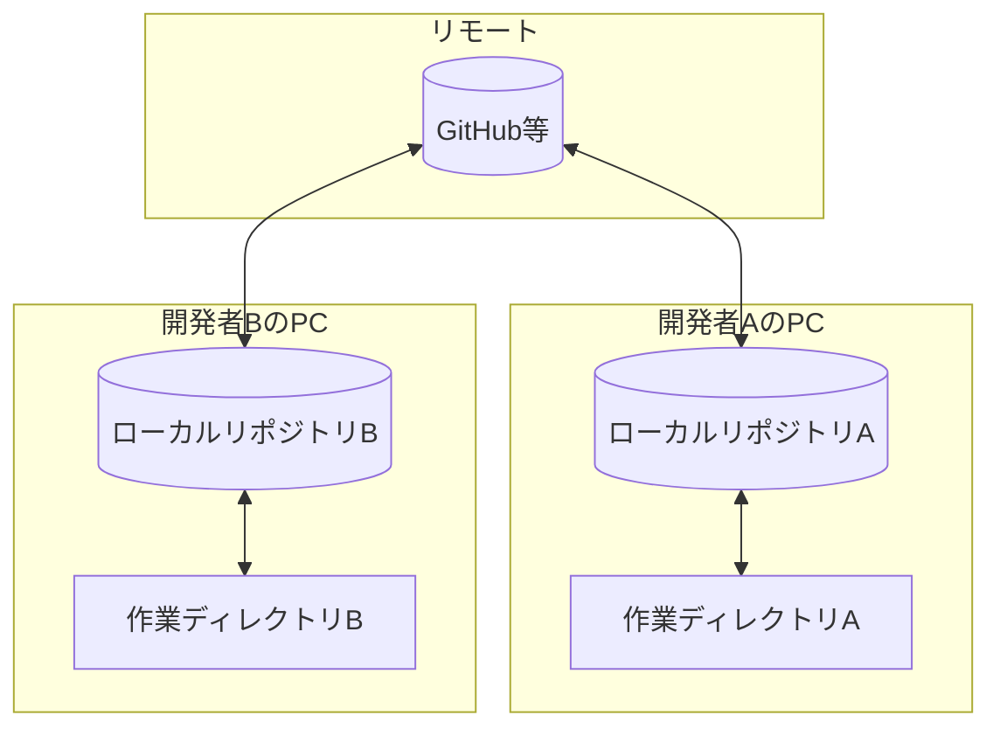
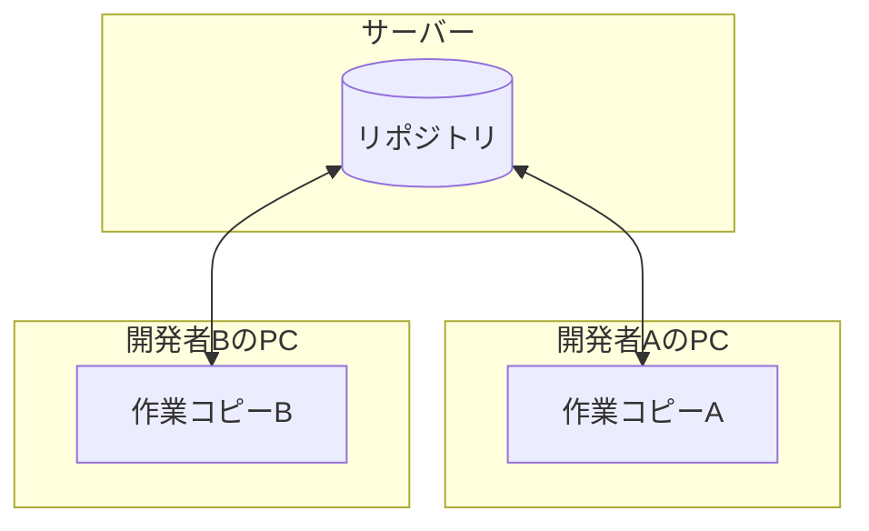

# GitとSVNの比較

GitとSVN（Subversion）は、どちらもバージョン管理システムですが、設計思想が大きく異なります。両方の現場で戸惑わないよう、違いを理解しておきましょう。

## 根本的な違い：分散型 vs 集中型

### Gitは分散型

- 各開発者のPCに**完全なリポジトリ（履歴を含む）**がある
- オフラインでもコミット、履歴確認が可能
- サーバーがなくても動作する

### SVNは集中型

- リポジトリは**サーバーに1つだけ**
- 開発者のPCには「作業コピー」のみ（履歴なし）
- サーバーに接続しないとコミットできない

## 操作の違い

### コミットの意味

| 操作 | Git | SVN |
|------|-----|-----|
| ローカルに保存 | `git commit` | - |
| サーバーに送信 | `git push` | `svn commit` |

**Gitのコミット**
- ローカルリポジトリに保存される
- サーバーには反映されない（pushが必要）
- やり直しが比較的簡単

**SVNのコミット**
- 直接サーバーに送信される
- 全員に即座に公開される
- やり直しが難しい

### 履歴の確認

| 操作 | Git | SVN |
|------|-----|-----|
| 履歴確認 | `git log`（ローカルで完結） | `svn log`（サーバーに問い合わせ） |
| オフライン時 | 確認可能 | 確認不可 |

### ブランチの扱い

| 観点 | Git | SVN |
|------|-----|-----|
| ブランチの実体 | ポインタ（軽量） | ディレクトリのコピー（重い） |
| 作成コスト | 非常に軽い | 比較的重い |
| ブランチ切り替え | 一瞬 | 時間がかかることも |
| 文化 | 頻繁にブランチを作る | trunk直接が多い |

## ワークフローの違い

### Gitの一般的なフロー

1. `git pull` で最新を取得
2. `git checkout -b feature/xxx` でブランチ作成
3. 作業して `git commit`（ローカル）
4. `git push` でサーバーに送信
5. プルリクエストでレビュー依頼
6. レビュー後にマージ

### SVNの一般的なフロー

1. `svn update` で最新を取得
2. 作業する
3. `svn update` で再度最新を取得（衝突確認）
4. `svn commit` で直接サーバーにコミット

## 同じ操作の対応表

| やりたいこと | Git | SVN |
|-------------|-----|-----|
| リポジトリを取得 | `git clone` | `svn checkout` |
| 最新を取得 | `git pull` | `svn update` |
| 変更を保存 | `git commit` (ローカル) | - |
| サーバーに送信 | `git push` | `svn commit` |
| 状態確認 | `git status` | `svn status` |
| 差分確認 | `git diff` | `svn diff` |
| 履歴確認 | `git log` | `svn log` |
| 変更を取り消す | `git checkout -- file` | `svn revert file` |
| ブランチ作成 | `git checkout -b xxx` | `svn copy trunk branches/xxx` |
| ブランチ切り替え | `git checkout xxx` | `svn switch URL` |

## 現場によって違うこと

### Git主流の現場

- Web系、スタートアップに多い
- GitHub / GitLab / Bitbucket を使用
- プルリクエスト文化が根付いている
- 頻繁にブランチを作る
- CI/CDと連携していることが多い

### SVN主流の現場

- 大企業、SIer、レガシーシステムに多い
- 社内サーバーにリポジトリ
- trunk直接作業が多いことも
- レビューはコミット前に対面で行うことも
- 長年の運用で安定している

## 両方使う場合のメンタルモデル

### GitからSVNに移行する場合

**注意点**：
- `commit` = 即座に公開される（慎重に）
- ブランチは気軽に作らない（現場の慣習に従う）
- オフラインでは作業が制限される
- `update` を頻繁に行う

### SVNからGitに移行する場合

**注意点**：
- `commit` はローカルのみ（`push` が必要）
- ブランチは気軽に作ってOK
- プルリクエストの文化に慣れる
- ローカルで自由に試行錯誤できる

## どちらが良いか？

### Gitが向いている場面

- 複数人での並行開発
- オープンソース開発
- 頻繁な機能開発とリリース
- リモートワーク

### SVNが向いている場面

- シンプルな運用
- 線形的な開発（1つずつ順番に）
- バイナリファイルが多い（ロック機能）
- 既存システムの保守

### 結論

「どちらが良い」ではなく、**現場で使われているものに適応すること**が重要です。

- Git の現場では Git の流儀で
- SVN の現場では SVN の流儀で

両方の基本を知っておけば、どちらの現場でも戸惑いません。

## まとめ

| 観点 | Git | SVN |
|------|-----|-----|
| 方式 | 分散型 | 集中型 |
| コミット先 | ローカル → push でリモート | 直接サーバー |
| ブランチ | 軽量、頻繁に作る | 重い、控えめに |
| オフライン | 作業可能 | 制限あり |
| やり直し | 比較的簡単 | 難しい |

詳細は以下を参照してください：
- [[25_Gitの基礎|Gitの基礎]]
- [[27_SVNの基礎|SVNの基礎]]
