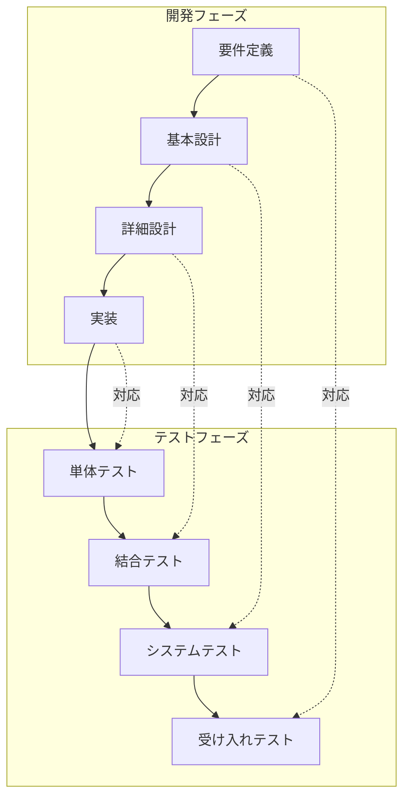

# ウォーターフォール開発

ウォーターフォール開発は、**工程を順番に進める**開発手法です。多くの日本企業、特にSIerや大規模プロジェクトで採用されています。

## ウォーターフォールとは

「滝（ウォーターフォール）」のように、**上から下へ一方向に流れる**イメージです。

```
要件定義
    ↓
  設計
    ↓
  実装
    ↓
 テスト
    ↓
リリース
    ↓
  保守
```

前の工程が終わってから、次の工程に進みます。基本的に**後戻りしない**ことを前提としています。

---

## 特徴

| 項目 | 内容 |
|------|------|
| 計画性 | 最初に全体計画を立てる |
| ドキュメント | 各工程でしっかり文書を作る |
| 変更への対応 | 途中での仕様変更は難しい |
| 品質管理 | 工程ごとにレビュー・承認を行う |
| 進捗管理 | 工程の完了が分かりやすい |

---

## V字モデル

ウォーターフォールの工程を表す代表的なモデルに「**V字モデル**」があります。



### V字モデルのポイント

**左側（開発フェーズ）と右側（テストフェーズ）が対応**しています。

| 開発工程 | 対応するテスト | 確認すること |
|---------|---------------|-------------|
| 要件定義 | 受け入れテスト | お客様の要望どおりか |
| 基本設計 | システムテスト | システム全体が設計どおりか |
| 詳細設計 | 結合テスト | 機能の連携が設計どおりか |
| 実装 | 単体テスト | 個々の機能が正しく動くか |

### なぜV字モデルが重要か

- **テストで何を確認すべきかが明確**になる
- **問題が見つかったとき、どこに原因があるか**が分かりやすい
- **設計とテストがセットで考えられる**

例えば、システムテストで問題が見つかったら、基本設計に問題がある可能性が高いと分かります。

---

## 各工程の詳細

### 要件定義

**プロジェクト全体で実現することを最初に決めます。**

- お客様との打ち合わせを重ねて要望を聞き取る
- 「要件定義書」として文書にまとめる
- お客様の承認を得て、次の工程に進む

この工程で決めたことが、プロジェクト全体の「ゴール」になります。

### 設計

**要件をどうやって実現するかを決めます。**

- **基本設計**：画面や機能を設計する
- **詳細設計**：プログラムの内部構造を設計する

設計書は「実装の指示書」になります。設計書を見れば、何を作ればいいか分かる状態にします。

### 実装

**設計書に基づいてコードを書きます。**

- 設計書どおりに作ることが求められる
- 疑問があれば設計者に確認する
- コードレビューで品質を確保する

### テスト

**V字モデルに従って、段階的にテストを行います。**

単体テスト → 結合テスト → システムテスト → 受け入れテスト

各テストで問題が見つかれば、修正してから次に進みます。

### リリース・保守

**完成したシステムを本番環境に導入し、運用を開始します。**

リリース後は保守フェーズに入り、バグ修正や機能追加を行います。

---

## メリット

- **計画が立てやすい**：最初に全体像が決まるので、スケジュールや予算の見積もりがしやすい
- **役割分担が明確**：各工程の担当が決まっている
- **ドキュメントが残る**：後から見返したり、引き継いだりしやすい
- **品質管理しやすい**：各工程でチェックを入れられる
- **進捗が見えやすい**：「今どの工程か」が明確

---

## デメリット

- **変更に弱い**：途中で「やっぱりこうしたい」が起きると、大きな手戻りになる
- **動くものが見えるのが遅い**：テスト工程まで、実際に動くものを確認できない
- **お客様の認識ずれが発覚しにくい**：完成間近で「思っていたのと違う」が起きることも
- **手戻りのコストが大きい**：後の工程で問題が見つかると、修正に大きな工数がかかる

---

## よく使われる現場

| 種類 | 理由 |
|------|------|
| **大規模な業務システム**（銀行、保険、製造業など） | 要件が明確で、品質要件が厳しい |
| **官公庁のシステム** | 契約上、仕様書が必要。変更が少ない |
| **医療・金融など規制がある分野** | ドキュメントによる証跡が必要 |
| **受託開発（SIer）** | 契約で納品物が決まっている |
| **パッケージソフトのカスタマイズ** | 既存機能をベースに、追加開発する |

---

## 1年目エンジニアの日常

ウォーターフォールの現場では、以下のような仕事が多いです。

### 設計工程

- **設計書を読んで理解する**
- 分からないところは設計者に質問する
- 設計レビューに参加することも

### 実装工程

- **設計書に基づいてコードを書く**
- コーディング規約に従う
- コードレビューを受けて、指摘があれば修正

### テスト工程

- **テスト仕様書に沿ってテストを実行する**
- テスト結果を記録する
- 不具合が見つかったら報告する

### 保守工程

- **不具合の報告を受けて、原因を調査する**
- コードを修正する
- テストして確認する

---

## ウォーターフォールで大切なこと

### 設計書をしっかり読む

設計書は「実装の指示書」です。設計書に書いてあることを正しく理解してから実装しましょう。

- 分からない用語は調べる
- 曖昧な記述は設計者に確認する
- 「たぶんこうだろう」で進めない

### 手順どおりに進める

各工程には意味があります。「早く作りたい」からといって、設計を飛ばしてコードを書き始めると、後で大きな問題になります。

### 変更は上に相談する

要件や設計を変更する場合は、勝手に変えずに上司や設計者に相談しましょう。変更の影響範囲を確認してから進める必要があります。

---

## まとめ

- ウォーターフォールは**工程を順番に進める**開発手法
- **V字モデル**で設計とテストの対応関係を理解する
- **計画性が高く、大規模・高品質なシステム開発に向いている**
- 1年目は「設計書を読む」「設計どおりに作る」「テストを実行する」が主な仕事
- **設計書をしっかり読み、手順どおりに進める**ことが大切

他の開発手法については [[202_アジャイル開発|アジャイル開発]] を参照してください。
