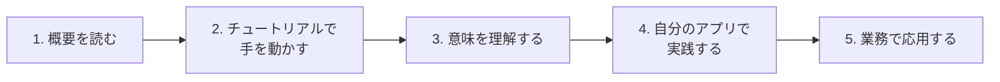

# 第2部：基礎知識

開発工程、開発環境、コーディング、デバッグなど、どの現場でも必要となる基礎知識を学びます。

これらは特定の言語やフレームワークに依存しない、**どの現場でも通用する普遍的なスキル**です。

## この部の活用の仕方

### まずは「どんな知識が必要か」を知る

この部を読む目的は、**すべてを暗記すること**ではありません。

最初に大事なのは、「エンジニアとして働く上でどんな基礎知識が必要か」を**ざっくり把握すること**です。全体像を知っておくことで、実際の業務で「Gitでブランチ切っておいて」「SQLでデータ確認して」と言われたときに、「ああ、あれのことか」とスムーズに対応できます。

### 必要になったときに該当ページを読めばよい

各トピックの詳細は、**実際にその知識が必要になったときに該当ページを見ればOK**です。

```
❌ 全ページを最初から最後まで暗記しようとする
⭕ 必要になったときにリファレンスとして参照する
```

> [!tip] なぜ最初から全部覚えなくていいのか？
> 開発現場や担当する業務によって、よく使う知識は異なります。また、これらのスキルは実際に手を動かしながら覚えるのが最も効率的です。まずは「こういうものがあるんだな」という認識を持っておくことが大切です。

### 読むだけでなく、実際に手を動かす

この部で扱う内容は、**「知っている」だけでは不十分**です。実際に自分で試して触ったことがあるかどうかで、理解度に大きな差が生まれます。

```
❌ 読んで「わかった気になる」だけ
❌ チュートリアルを手順通りにやるだけ
⭕ なぜその手順なのか、意味を理解しながら進める
⭕ 自分で簡単なアプリを作り、その中で実際に使ってみる
```

#### おすすめの学習ステップ



1. **概要を読む** - この教科書や書籍で「何ができるか」を把握
2. **チュートリアルで手を動かす** - 書籍やサイト、YouTube動画などを参考に実際に試す
3. **意味を理解する** - 「なぜこの手順なのか」「この操作は何をしているのか」を考える
4. **自分のアプリで実践する** - 簡単なアプリを作り、その中で実際に使ってみる
5. **業務で応用する** - 業務の文脈に当てはめて活用する

> [!important] 「理解」していないと業務で使えない
> 実際の業務では、チュートリアルとは違う形で使うことが求められます。
>
> 例えば、Gitの基本操作を手順通りにできても、「この機能追加はどのブランチで作業すべきか？」「コンフリクトが起きたらどう解決するか？」といった判断は、**Gitの仕組みを理解していないとできません**。
>
> 手順を覚えるのではなく、「なぜそうするのか」を理解することで、どんな状況でも応用できるようになります。

### 各章の概要

| 章 | トピック | 概要 |
|---|---|---|
| 第1章 | 開発の全体像 | 開発工程の流れ、ウォーターフォールとアジャイルの違い |
| 第2章 | 開発環境 | 開発に必要なツール、ビルド、パッケージ管理 |
| 第3章 | コーディング | コードの読み方・書き方、デバッグの基本 |
| 第4章 | バージョン管理 | Git/SVNの基礎、チーム開発での管理方法 |
| 第5章 | データベース | RDBの基礎、SQLの書き方 |
| 第6章 | 調べ方 | エラー解決、情報収集のコツ |

### よくある疑問

> [!question] Q. プログラミング言語の勉強が先では？
> **A. 言語の習得と並行して学ぶのがベストです。**
>
> プログラミング言語の文法だけ覚えても、開発環境の構築やバージョン管理ができなければ実務では戦力になれません。この部で扱う内容は、どの言語を使う場合でも必要になる**土台となるスキル**です。

> [!question] Q. 会社によって使うツールが違うのでは？
> **A. 違います。ただし基本的な考え方は共通です。**
>
> 例えば、バージョン管理はGitの会社もあればSVNの会社もあります。しかし「なぜバージョン管理が必要か」「ブランチとは何か」という概念は共通です。ツールが変わっても応用できる**考え方**を身につけることを重視しています。

> [!question] Q. どの章から読めばいいの？
> **A. 今の業務で必要なところから読んでください。**
>
> - **開発環境を構築している** → 第2章：開発環境
> - **コードを書き始める** → 第3章：コーディング
> - **チームでソース管理を始める** → 第4章：バージョン管理
> - **データベースを操作する** → 第5章：データベース
> - **エラーが解決できない** → 第6章：調べ方
>
> 迷ったら第1章から順に読むのも良いですが、**必要に駆られたときが一番身につきます**。

---

## 第1章：開発の全体像

ソフトウェア開発がどのような工程で進むのか、全体像を理解します。

- [[第1章_開発の全体像/200_開発工程の基本|開発工程の基本]]
- [[第1章_開発の全体像/201_ウォーターフォール開発|ウォーターフォール開発]]
- [[第1章_開発の全体像/202_アジャイル開発|アジャイル開発]]

## 第2章：開発環境

開発に必要なツールや環境について学びます。

- [[第2章_開発環境/201_開発環境の基礎|開発環境の基礎]]
- [[第2章_開発環境/202_ビルドの基礎|ビルドの基礎]]
- [[第2章_開発環境/203_パッケージ管理と依存関係|パッケージ管理と依存関係]]

## 第3章：コーディング

コードを読む・書くための基礎スキルを身につけます。

- [[第3章_コーディング/202_コードを読む基礎|コードを読む基礎]]
- [[第3章_コーディング/203_コードを書く基礎|コードを書く基礎]]
- [[第3章_コーディング/204_デバッグの基本|デバッグの基本]]

## 第4章：バージョン管理

チーム開発で必須のバージョン管理について学びます。

- [[第4章_バージョン管理/204_バージョン管理の基礎|バージョン管理の基礎]]
- [[第4章_バージョン管理/205_Gitの基礎|Gitの基礎]]
- [[第4章_バージョン管理/206_SVNの基礎|SVNの基礎]]
- [[第4章_バージョン管理/207_GitとSVNの比較|GitとSVNの比較]]

## 第5章：データベース

データの保存・管理の基礎を学びます。

- [[第5章_データベース/204_データベースの基礎|データベースの基礎]]
- [[第5章_データベース/205_SQLの基礎|SQLの基礎]]

## 第6章：調べ方

問題解決に必要な「調べる力」を身につけます。

- [[第6章_調べ方/206_調べ方の基本|調べ方の基本]]

## 理解度チェック

- [[299_理解度チェック|この部の理解度をチェックする]]
