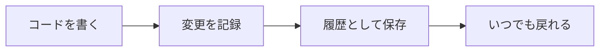
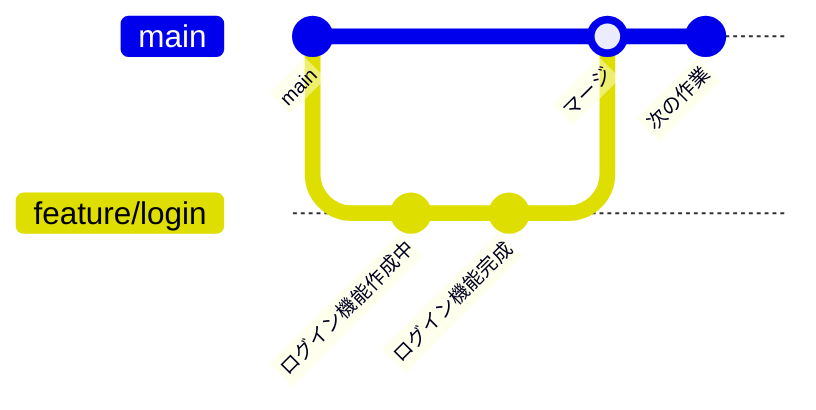
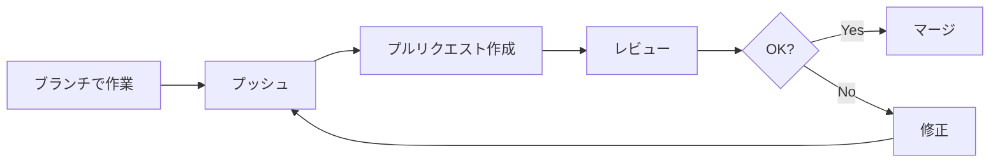

# Gitの基礎

Gitは現代のソフトウェア開発で必須のバージョン管理システムです。詳しい使い方は解説サイトやYouTube動画が豊富にありますので、ここでは**理解しておくべきポイント**に絞って解説します。

## なぜGitを理解する必要があるか

### Gitは「タイムマシン」

Gitはコードの変更履歴を記録するツールです。

- **いつ、誰が、何を変更したか**が全て記録される
- 過去の状態に戻せる
- 複数人が同時に作業できる



### チーム開発の生命線

Gitがないと、チーム開発はこうなります。

- 「最新版.zip」「最新版_final.zip」「最新版_final_v2.zip」...
- 誰かの変更を誰かが上書き
- 「誰がこのコード書いたの？」が分からない

## 最低限理解すべき概念

### リポジトリ（Repository）

コードの保管場所です。

| 種類 | 場所 | 説明 |
|------|------|------|
| ローカルリポジトリ | 自分のPC | 自分だけの作業場所 |
| リモートリポジトリ | GitHub等 | チームで共有する場所 |

### ブランチ（Branch）

作業を分岐させる仕組みです。



**ポイント**：
- mainブランチ（本番用）は直接いじらない
- 作業用のブランチを作って、そこで作業する
- 完成したらmainにマージ（統合）する

### コミット（Commit）

変更を記録することです。

**ポイント**：
- 「セーブポイント」を作るイメージ
- こまめにコミットする（1つの作業ごと）
- コミットメッセージは「何をしたか」を簡潔に

```
# 良いコミットメッセージ
[add] ログイン機能を追加
[fix] メールアドレスのバリデーションを修正
[update] ユーザー一覧の表示を改善

# 避けたいコミットメッセージ
修正
変更
作業中
```

### プルリクエスト（Pull Request）

ブランチをマージする前のレビュー依頼です。



**ポイント**：
- 他の人にコードを見てもらう機会
- 「何をしたか」「確認してほしいポイント」を書く
- 指摘されたら素直に修正

## 1年目でよくある失敗

### 失敗1：mainブランチで直接作業

**何が問題？**
- 自分の作業中に他の人の変更が入ると混乱
- 失敗しても戻しにくい

**対策**：
- 必ずブランチを作ってから作業

### 失敗2：コンフリクト（衝突）でパニック

同じファイルを複数人が編集すると、Gitが「どっちを採用すればいい？」と聞いてきます。これがコンフリクトです。

```
<<<<<<< HEAD
自分の変更
=======
他の人の変更
>>>>>>> feature/other
```

**対策**：
- 落ち着いて、両方の変更を確認
- どちらを残すか（または両方残すか）を判断
- 分からなければ先輩に相談
- **絶対に勝手に片方を消さない**

### 失敗3：git pushを恐れる

「間違ったものをpushしたらどうしよう」

**対策**：
- プルリクエストがあるので、即座にmainに反映されるわけではない
- 間違っても、大抵は修正できる
- 本当に怖いのは「pushしない」こと（自分のPCが壊れたら全て消える）

### 失敗4：コミットメッセージが雑

「修正」「変更」「作業中」だと、後から何をしたか分からなくなります。

**対策**：
- 「何をしたか」を簡潔に書く
- プレフィックスをつける（[add]、[fix]、[update]など）

## 現場でよく使う操作パターン

### パターン1：新しいタスクを始める

```bash
git pull                           # 最新を取得
git checkout -b feature/xxx        # ブランチ作成
# 作業する
git add .                          # 変更をステージング
git commit -m "[add] 機能を追加"   # コミット
git push -u origin feature/xxx     # プッシュ
# プルリクエストを作成（GitHub等のWeb画面で）
```

### パターン2：作業中に最新を取り込む

```bash
git stash                 # 自分の変更を一時退避
git pull                  # 最新を取得
git stash pop             # 自分の変更を復元
```

### パターン3：間違えたコミットを取り消す

```bash
# 直前のコミットを取り消す（変更は残る）
git reset --soft HEAD^

# 変更も含めて取り消す（注意！）
git reset --hard HEAD^
```

**注意**：pushした後の取り消しは慎重に。分からなければ先輩に相談。

## GUIツールを活用しよう

実際の現場では、**コマンドラインよりGUIツールを使うことが多い**です。コマンドを覚える必要はありませんが、**何が起きているかを理解する**ことは重要です。

### 主要なGUIツール

| ツール | 特徴 | おすすめ度 |
|--------|------|----------|
| **SourceTree** | 無料、日本語対応、視覚的に分かりやすい | ★★★★★ |
| **TortoiseGit** | Windowsのエクスプローラーと統合、右クリックで操作 | ★★★★★ |
| VS Code内蔵 | エディタと統合、差分が見やすい | ★★★★☆ |
| GitHub Desktop | シンプル、GitHub連携が楽 | ★★★☆☆ |

### SourceTree

Atlassian社が提供する無料のGitクライアントです。

- **視覚的なブランチ表示**：履歴が図で見える
- **日本語対応**：メニューが日本語
- **初心者向け**：ボタン操作で基本操作ができる
- Windows / Mac両対応

詳しい使い方は「SourceTree 使い方」で検索すると解説サイトが多数あります。

### TortoiseGit

Windowsのエクスプローラーに統合されるツールです。

- **右クリックメニュー**で操作できる
- ファイルの状態が**アイコンで表示**される
- TortoiseSVNと操作感が似ている
- Windows専用

詳しい使い方は「TortoiseGit 使い方」で検索してください。

### どちらを選ぶか

- **チームで統一されている場合**：チームと同じツールを使う
- **迷ったら**：SourceTreeがおすすめ（視覚的で分かりやすい）
- **Windowsでエクスプローラー統合がいい場合**：TortoiseGit

## 学習リソース

Gitの詳しい使い方は以下で学べます。

- **サル先生のGit入門**：イラスト付きで分かりやすい
- **YouTube「SourceTree 使い方」で検索**：動画で手順が分かる
- **GitHub公式ドキュメント**：正確な情報

## まとめ

Gitで理解しておくべきポイント：

1. **ブランチを切って作業**する習慣
2. **こまめにコミット**する習慣
3. **コンフリクトは落ち着いて対処**（分からなければ相談）
4. **プルリクエストでレビュー**を受ける
5. **GUIツールを活用**してOK

コマンドを暗記するより、**なぜその操作をするのか**を理解することが大切です。
