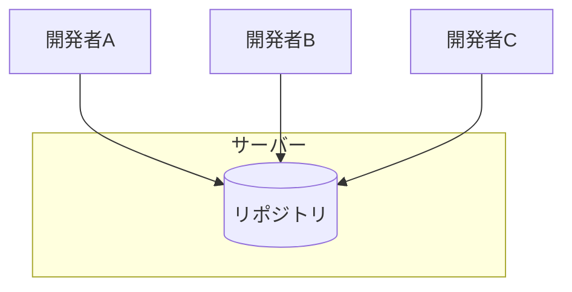
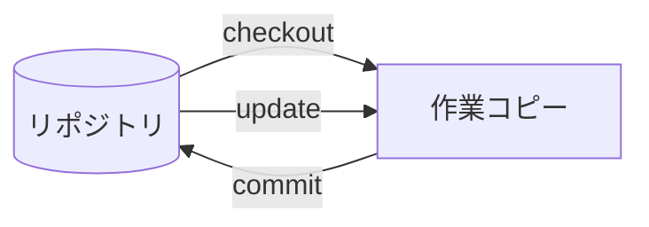

# SVNの基礎

Subversion（SVN）は、現在も多くの現場で使われているバージョン管理システムです。特に大企業やレガシーシステムの現場では、Gitではなく SVNを使っていることも珍しくありません。

## SVNとは

### 特徴

SVNは「集中型」のバージョン管理システムです。



- **中央に1つのリポジトリ**があり、全員がそこにアクセス
- 履歴は全てサーバー側に保存
- オフラインでは履歴確認やコミットができない

Gitとの詳しい違いについては [[208_GitとSVNの比較|GitとSVNの比較]] を参照してください。

## 最低限理解すべき概念

### リポジトリ構成

SVNでは、以下の3つのディレクトリ構成が一般的です。

```
repository/
├── trunk/      ← メインの開発ライン（Gitのmainに相当）
├── branches/   ← ブランチ（機能開発用など）
└── tags/       ← リリース版のスナップショット
```

**ポイント**：
- `trunk` で通常の開発を行う
- 大きな機能開発は `branches` で行う
- リリース時に `tags` にコピーを作る

### 作業コピー（Working Copy）

サーバーからチェックアウトした、自分のPC上のファイルです。



- ローカルリポジトリとは異なり、**履歴は含まれない**
- 編集して、サーバーにコミットする

### リビジョン（Revision）

コミットごとに付与される**連番の番号**です。

```
r1 → r2 → r3 → r4 → r5 → ...
```

- シンプルな連番で管理される
- 「r100に戻して」のように番号で指定できる
- リポジトリ全体で共有される（ファイル単位ではない）

## 基本操作

### よく使うコマンド

| コマンド | 説明 |
|---------|------|
| `svn checkout` | リポジトリから作業コピーを取得 |
| `svn update` | 最新の変更を取得 |
| `svn add` | 新しいファイルをバージョン管理に追加 |
| `svn commit` | 変更をサーバーに送信 |
| `svn status` | 変更状態を確認 |
| `svn diff` | 差分を確認 |
| `svn log` | 履歴を確認 |
| `svn revert` | 変更を取り消す |

### 基本的な作業フロー

```bash
# 1. 最新を取得
svn update

# 2. ファイルを編集
# （エディタで編集）

# 3. 状態を確認
svn status

# 4. 差分を確認
svn diff

# 5. コミット
svn commit -m "機能Aを追加"
```

### 新しいファイルを追加する

```bash
# 1. ファイルを作成
# （エディタで作成）

# 2. バージョン管理に追加
svn add newfile.txt

# 3. コミット
svn commit -m "新しいファイルを追加"
```

### ファイルを削除する

```bash
# 1. バージョン管理から削除
svn delete oldfile.txt

# 2. コミット
svn commit -m "不要なファイルを削除"
```

## ブランチ操作

### SVNのブランチ

SVNではブランチは「ディレクトリのコピー」として実現されます。

```bash
# ブランチを作成
svn copy http://svn.example.com/repo/trunk \
         http://svn.example.com/repo/branches/feature-a \
         -m "feature-aブランチを作成"

# ブランチに切り替え
svn switch http://svn.example.com/repo/branches/feature-a
```

**注意**：
- ブランチ作成は比較的重い操作
- 頻繁にブランチを切る文化は少ない
- 現場によってはtrunk直接作業も多い

## 1年目でよくある失敗

### 失敗1：updateせずにcommit

他の人の変更と衝突（conflict）が起きます。

```bash
# 必ずupdateしてからcommit
svn update
# 衝突がないことを確認
svn commit -m "変更内容"
```

### 失敗2：衝突（Conflict）でパニック

同じファイルを複数人が編集すると衝突が起きます。

```
<<<<<<< .mine
自分の変更
=======
他の人の変更
>>>>>>> .r123
```

**対処法**：
1. 両方の変更を確認
2. 正しい内容に編集
3. `svn resolved ファイル名` で解決を宣言
4. コミット

分からなければ先輩に相談してください。

### 失敗3：コミットメッセージが雑

分かりやすいメッセージを書くことが重要です。

```bash
# 良い例
svn commit -m "[add] ログイン機能を追加"

# 避けたい例
svn commit -m "修正"
```

### 失敗4：間違えてcommitしてしまった

**SVNでは、一度commitすると取り消しが難しい**です。

- 過去のリビジョンに戻すには `svn merge` を使う
- 間違えたら、すぐに先輩に相談

## GUIツールを活用しよう

実際の現場では、**コマンドラインよりGUIツールを使うことが多い**です。SVNの現場では**TortoiseSVN**が圧倒的に主流です。

### TortoiseSVN（Windows定番）

Windowsのエクスプローラーに統合されるツールで、SVNの現場では**ほぼ必須**といえます。

- **右クリックメニュー**で全ての操作ができる
- ファイルの状態が**アイコンで表示**される（緑＝変更なし、赤＝変更あり）
- 差分表示、履歴確認も視覚的に分かりやすい
- 無料で利用可能

詳しい使い方は「TortoiseSVN 使い方」で検索すると解説サイトが多数あります。

### その他のツール

| ツール | 特徴 |
|--------|------|
| Cornerstone | Mac向け、有料だが使いやすい |
| IDE内蔵 | Eclipse、IntelliJなどに統合されている |

### コマンドラインは覚えなくていい？

TortoiseSVNがあれば、コマンドラインを覚える必要はほぼありません。ただし、**何が起きているかを理解する**ことは重要です。上記のコマンド説明は「TortoiseSVNで何をしているか」を理解するための参考にしてください。

## SVNの現場で気をつけること

### trunkへの直接コミットが多い

ブランチを切らずにtrunkで作業することが多いです。

- **こまめにupdateする**習慣が重要
- 大きな変更は事前に相談
- 複数人で同じファイルを触る場合は声をかけ合う

### ロック機能

バイナリファイル（Excel、画像など）は、同時編集を防ぐため「ロック」を使うことがあります。

```bash
# ロックを取得
svn lock file.xlsx

# 編集後、コミット（ロックは自動解除）
svn commit -m "Excel更新"

# または明示的にロック解除
svn unlock file.xlsx
```

### サーバーへの依存

オフラインでは履歴確認やコミットができません。

- ネットワーク環境を確認
- VPN接続が必要な場合も

## まとめ

SVNで理解しておくべきポイント：

1. **集中型**：リポジトリは中央に1つ
2. **updateを忘れずに**：コミット前に必ず最新を取得
3. **リビジョン番号**で履歴を管理
4. **衝突は落ち着いて対処**（分からなければ相談）
5. **commitは慎重に**（取り消しが難しい）

GitとSVNの違いについては [[208_GitとSVNの比較|GitとSVNの比較]] も参照してください。
