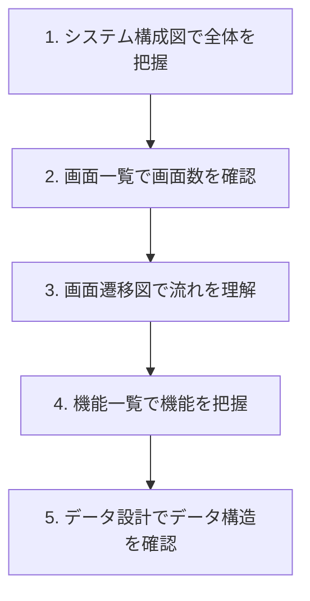
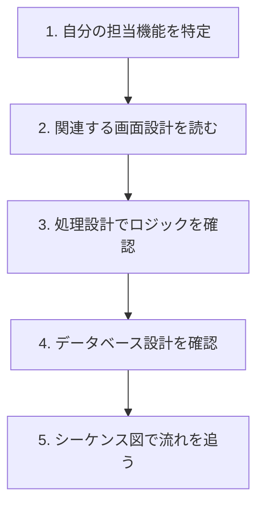
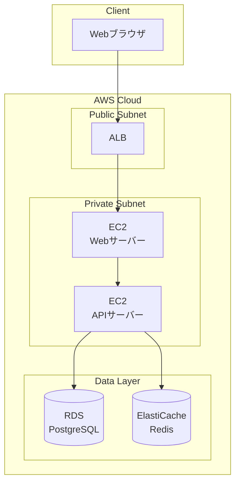
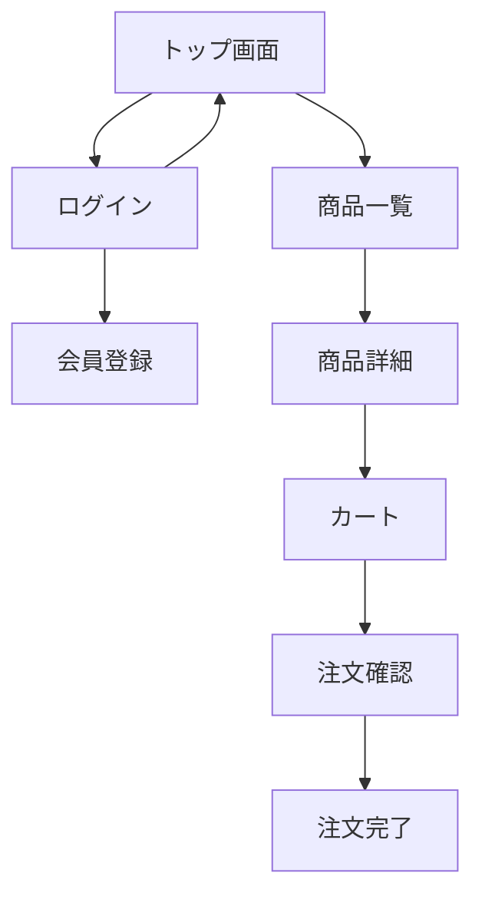
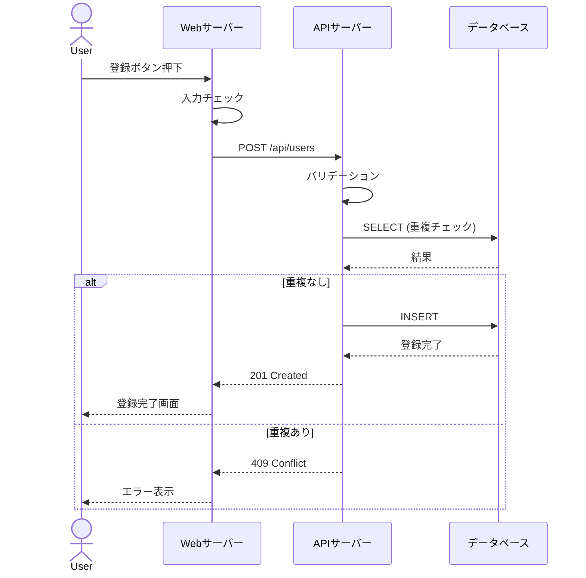
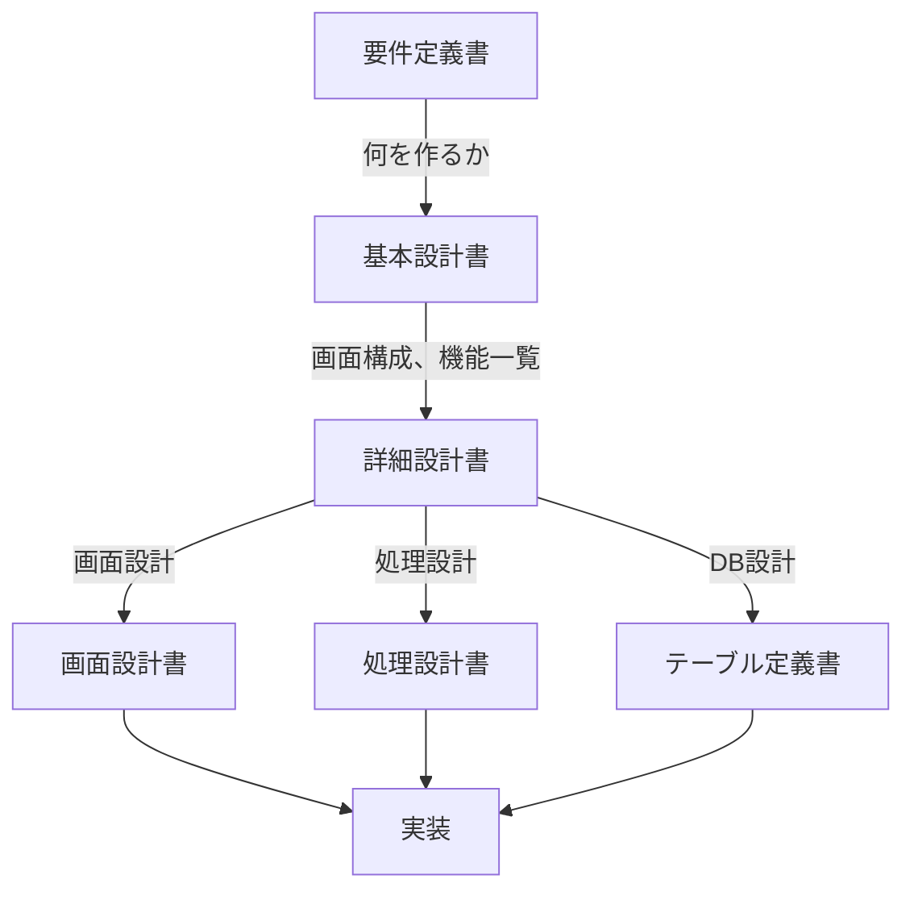

# 基本設計書・詳細設計書の読み方

基本設計書と詳細設計書は、システムの設計を記述したドキュメントです。要件定義の後に作成され、実装の指針となります。

## 基本設計書と詳細設計書の違い

| 項目 | 基本設計書 | 詳細設計書 |
|------|-----------|-----------|
| 別名 | 外部設計書 | 内部設計書 |
| 視点 | ユーザー視点（外部） | 開発者視点（内部） |
| 内容 | 何を作るか | どう作るか |
| 対象者 | お客様、SE | 開発者、PG |
| 詳細度 | 概念的 | 具体的 |

## 基本設計書（外部設計書）

### 役割

- システムの**外部仕様**を定義
- ユーザーから見える部分を設計
- 「何ができるか」を決める

### よくある構成要素

| 項目 | 内容 | 確認ポイント |
|------|------|-------------|
| システム構成図 | 全体のアーキテクチャ | サーバー構成、連携 |
| 画面一覧 | すべての画面リスト | 画面数、遷移 |
| 画面遷移図 | 画面間の遷移 | どこからどこへ行けるか |
| 機能一覧 | すべての機能リスト | 機能の範囲 |
| 帳票一覧 | 出力する帳票 | 帳票の種類 |
| データ設計 | テーブル設計（論理） | エンティティ、関係 |
| インターフェース設計 | 外部システム連携 | API、ファイル連携 |

### 基本設計書の読み方

---

## 詳細設計書（内部設計書）

### 役割

- システムの**内部仕様**を定義
- 開発者が実装するための詳細を記述
- 「どう作るか」を決める

### よくある構成要素

| 項目 | 内容 | 確認ポイント |
|------|------|-------------|
| クラス設計 | クラス構造、関係 | クラス図 |
| シーケンス設計 | 処理の流れ | シーケンス図 |
| データベース設計 | テーブル定義（物理） | カラム、型、制約 |
| 画面設計 | 画面レイアウト、項目 | 詳細な画面仕様 |
| 処理設計 | 処理ロジック | フロー、アルゴリズム |
| API設計 | APIの詳細仕様 | エンドポイント、I/O |

### 詳細設計書の読み方

---

## 【サンプル】設計書の実例

### システム構成図（基本設計）

### 画面遷移図（基本設計）

### 機能一覧（基本設計）

| 機能ID | 機能名 | 概要 | 優先度 |
|--------|--------|------|--------|
| F-001 | 商品検索 | キーワード、カテゴリで商品を検索 | 高 |
| F-002 | 商品詳細表示 | 商品の詳細情報を表示 | 高 |
| F-003 | カート管理 | 商品の追加、削除、数量変更 | 高 |
| F-004 | 会員登録 | 新規会員の登録 | 高 |
| F-005 | ログイン/ログアウト | 認証処理 | 高 |
| F-006 | 注文処理 | 商品の購入手続き | 高 |
| F-007 | 注文履歴 | 過去の注文を表示 | 中 |

### シーケンス図（詳細設計）

---

## 設計書から実装までの流れ

## 読むときのポイント

### 1. 全体から詳細へ

1. システム構成図で全体像を把握
2. 画面遷移図で流れを理解
3. 自分の担当範囲を特定
4. 詳細設計で実装内容を確認

### 2. 関連する設計書を横断的に読む

- 画面設計書と処理設計書は対になる
- データベース設計と処理設計書を照らし合わせる
- シーケンス図で流れを確認

### 3. 矛盾がないか確認する

設計書間で矛盾がある場合は、確認してから作業します。

| 矛盾の例 | 対応 |
|---------|------|
| 画面設計書の項目と処理設計書のパラメータが違う | どちらが正しいか確認 |
| 機能一覧にある機能の詳細設計がない | 詳細設計の追加が必要か確認 |
| テーブル定義と処理設計書のカラム名が違う | どちらに合わせるか確認 |

## よくある疑問

### Q: 基本設計書と詳細設計書、どちらを先に読むべき？

基本設計書を先に読みます。全体像を把握してから、詳細に入ります。

### Q: 設計書がない/古い場合は？

- ない場合：コードから設計を読み取る（リバースエンジニアリング）
- 古い場合：現状のコードと照らし合わせ、差分を確認

### Q: 設計書通りに実装すべき？

基本的には設計書通りに実装します。問題がある場合は、設計者に相談して設計を変更します。

## 1年目エンジニアとしての関わり方

| 場面 | やること |
|------|---------|
| プロジェクト参加時 | 基本設計書で全体像を把握 |
| 実装前 | 詳細設計書で実装内容を確認 |
| 実装中 | 設計書と照らし合わせて実装 |
| レビュー時 | 設計書通りか確認される |

> **ポイント**：設計書は「約束」です。設計と違う実装をすると、後工程（テスト、運用）で問題が発生します。

## 関連ドキュメント

- [[300_設計書・仕様書の読み方]] - 設計書全般の読み方
- [[307_要件定義書の読み方]] - 上流の要件定義
- [[303_画面設計書の読み方]] - 画面設計の詳細
- [[304_処理設計書の読み方]] - 処理設計の詳細
