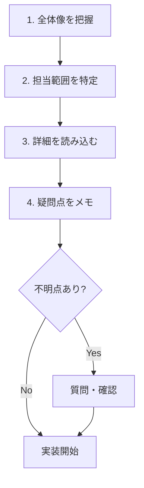

# 設計書・仕様書の読み方

業務で使用する設計書や仕様書を効率的に読むスキルを学びます。

## 設計書の種類と役割

| 種類 | 内容 | 読むタイミング | 詳細 |
|------|------|---------------|------|
| 要件定義書 | 何を作るか（システムの目的・機能） | プロジェクト理解時 | [[37_要件定義書の読み方]] |
| 基本設計書（外部設計書） | 画面・機能の設計 | 実装前 | [[39_基本設計書・詳細設計書の読み方]] |
| 詳細設計書（内部設計書） | プログラムの処理内容 | 実装時 | [[39_基本設計書・詳細設計書の読み方]] |
| 画面設計書 | 画面のレイアウト、項目、動作 | UI実装時 | [[33_画面設計書の読み方]] |
| 処理設計書 | バックエンドの処理内容 | ロジック実装時 | [[34_処理設計書の読み方]] |
| クラス図 | クラスの構造と関係 | 設計理解時 | [[35_クラス図の読み方]] |
| ER図 | データベースの構造 | DB操作時 | [[36_ER図の読み方]] |
| テーブル定義書 | テーブルの詳細仕様 | DB操作時 | [[3C_テーブル定義書の読み方]] |
| API仕様書 | APIのエンドポイント、リクエスト、レスポンス | API連携時 | [[3B_API仕様書の読み方]] |
| 処理フロー図 | 処理の流れを図で表現 | ロジック理解時 | [[3A_処理フロー図の読み方]] |
| 状態遷移図 | オブジェクトの状態変化 | ステータス管理時 | [[3D_状態遷移図の読み方]] |
| テスト仕様書 | テストの内容・手順 | テスト時 | [[38_試験仕様書の読み方]] |
| 運用マニュアル | 運用時の手順 | 運用・保守時 | - |

> **ポイント**：担当する業務によって、よく見る設計書が異なります。自分の業務に関係する設計書から優先して読み方を覚えましょう。

## 業務別：よく使う設計書

| 業務内容 | よく使う設計書 |
|----------|--------------|
| フロントエンド実装 | 画面設計書、API仕様書 |
| バックエンド実装 | 処理設計書、ER図、API仕様書 |
| テスト実施 | テスト仕様書、画面設計書 |
| データベース操作 | ER図、テーブル定義書 |
| 設計担当 | クラス図、ER図、画面設計書、処理設計書 |

## 設計書を読む前に

### 1. 目的を明確にする

- なぜこの設計書を読むのか
- どの部分を理解する必要があるか
- いつまでに理解する必要があるか

### 2. 前提知識を確認する

- システムの全体像は把握しているか
- 関連する用語は理解しているか
- 分からない用語はメモしておく

## 設計書の読み方（共通）

### 1. 全体像を先に把握する

いきなり詳細を読まず、まず全体を把握します。

- **目次を確認**：どんな内容が書かれているか
- **図を先に見る**：システム構成図、画面遷移図など
- **概要部分を読む**：各章の冒頭の説明

### 2. 自分の担当範囲を特定する

- どこからどこまでが自分の作業範囲か
- 関連する機能はどこに書いてあるか
- 前後の工程との関係は何か

### 3. 詳細を読み込む

- 自分の担当範囲を重点的に読む
- 処理の流れを追う
- 入力と出力を確認する

### 4. 疑問点をメモする

- 分からない部分に印をつける
- 質問事項をまとめる
- 矛盾点があれば記録する



## 設計書の種類別ガイド

各設計書の詳しい読み方は、以下の個別ガイドを参照してください。

| 設計書 | 内容 | リンク |
|--------|------|--------|
| 要件定義書 | システムの目的、機能要件、非機能要件 | [[37_要件定義書の読み方]] |
| 基本設計書・詳細設計書 | システム構成、画面遷移、処理詳細 | [[39_基本設計書・詳細設計書の読み方]] |
| 画面設計書 | レイアウト、項目定義、入力チェック、ボタン動作 | [[33_画面設計書の読み方]] |
| 処理設計書 | API仕様、処理フロー、エラー処理、使用テーブル | [[34_処理設計書の読み方]] |
| クラス図 | クラス構造、継承、関連、メソッド | [[35_クラス図の読み方]] |
| ER図 | テーブル構造、リレーション、主キー・外部キー | [[36_ER図の読み方]] |
| テーブル定義書 | カラム定義、データ型、制約、インデックス | [[3C_テーブル定義書の読み方]] |
| API仕様書 | エンドポイント、リクエスト、レスポンス | [[3B_API仕様書の読み方]] |
| 処理フロー図 | フローチャート、シーケンス図、アクティビティ図 | [[3A_処理フロー図の読み方]] |
| 状態遷移図 | 状態、遷移、トリガー、ステータス管理 | [[3D_状態遷移図の読み方]] |
| テスト仕様書 | テスト観点、テストケース、期待結果 | [[38_試験仕様書の読み方]] |

## 分からない部分の対処法

### 1. 自分で調べる

- 用語集を確認
- 関連する設計書を読む
- システムを実際に動かして確認

### 2. 質問する

すぐに質問せず、まず以下を整理してから質問します。

**質問の準備**
- どの設計書のどの部分か
- 何が分からないか
- 自分なりの解釈（「〇〇という理解で合っていますか？」）

**質問の例**
```
基本設計書の3.2章「ユーザー登録機能」について質問があります。
入力チェックの「メールアドレスの重複チェック」ですが、
これはリアルタイムでチェックするのか、登録ボタン押下時に
チェックするのか、どちらでしょうか？
```

### 3. 矛盾を見つけた場合

- 勝手に解釈して進めない
- 必ず確認してから作業する
- 確認結果を記録に残す

## 設計書を読むときの注意点

### バージョンに注意

- 最新版を読んでいるか確認
- 古いバージョンを見ていないか注意
- 更新日時を確認する習慣をつける

### 設計書は完璧ではない

- 設計書にも誤りや不足がある
- 疑問に思ったら確認する
- 「設計書に書いてあったから」は言い訳にならない

### メモを残す

- 自分の理解を書き込む（コピーに）
- 確認した結果を記録する
- 後で見返せるようにする

## まとめ

- 設計書は**全体像から詳細へ**の順番で読む
- **自分の担当範囲**を特定して重点的に読む
- **分からない部分**は整理してから質問する
- **バージョン**に注意し、矛盾があれば確認する
- 詳しい読み方は**各設計書の個別ガイド**を参照
