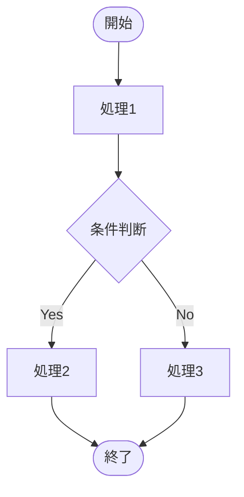
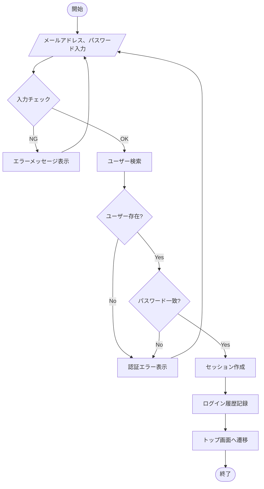
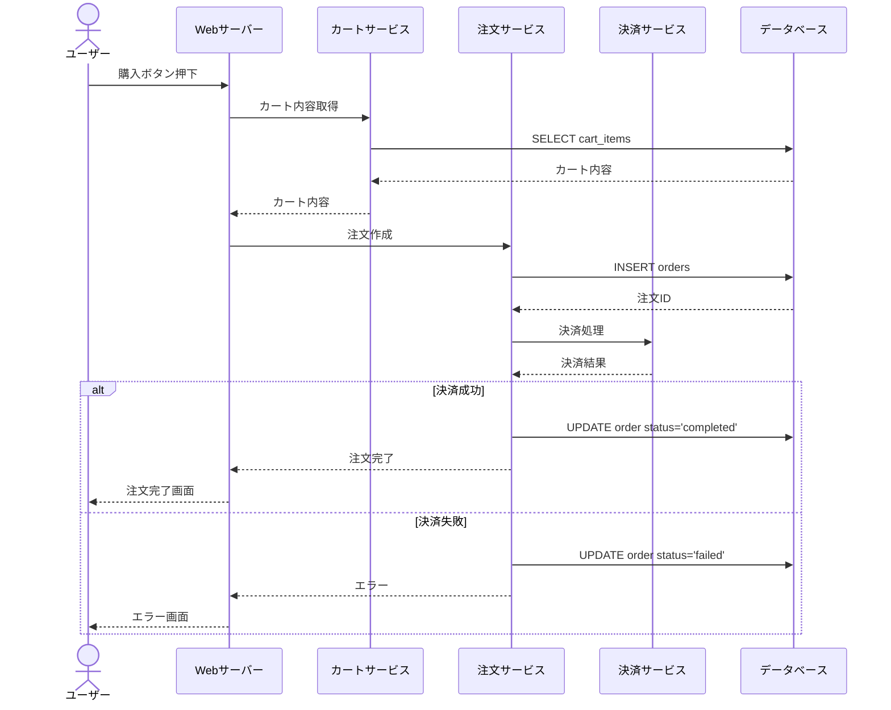
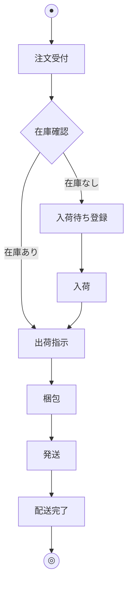
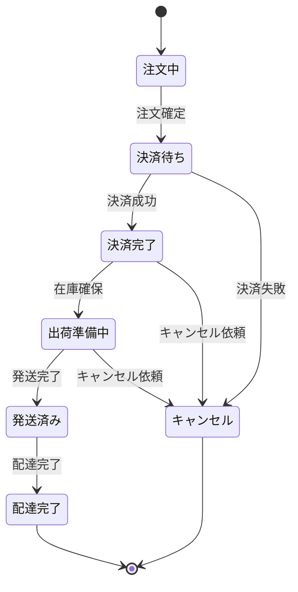

# 処理フロー図の読み方

処理フロー図は、処理の流れを図で表したものです。フローチャート、アクティビティ図、シーケンス図など様々な種類があります。

## 処理フロー図とは

### 役割

- 処理の**流れ**を視覚化
- **分岐条件**を明確化
- **繰り返し**を表現
- 処理の**開始と終了**を明示

### いつ使うか

| 場面 | 使い方 |
|------|--------|
| 設計理解時 | 処理の流れを把握 |
| 実装時 | ロジックの確認 |
| デバッグ時 | どこで問題が起きているか特定 |
| レビュー時 | 処理が正しいか確認 |

## フロー図の種類

| 種類 | 特徴 | 用途 |
|------|------|------|
| フローチャート | 最も基本的な流れ図 | 単一処理の流れ |
| シーケンス図 | オブジェクト間のやり取り | API呼び出し、画面遷移 |
| アクティビティ図 | UMLの活動図 | 業務フロー、ユースケース |
| 状態遷移図 | 状態の変化 | ステータス管理 |

---

## フローチャートの基本記号

### 基本記号

| 記号 | 名称 | 意味 |
|------|------|------|
| ○ / 楕円 | 端子 | 開始・終了 |
| □ / 長方形 | 処理 | 処理・操作 |
| ◇ / ひし形 | 判断 | 分岐・条件 |
| ▱ / 平行四辺形 | 入出力 | データの入力・出力 |
| → | 矢印 | 処理の流れ |

### 読み方の基本

1. **開始**から矢印に沿って読む
2. **分岐**では条件を確認
3. **終了**まで追う

---

## 【サンプル】フローチャートの実例

### ログイン処理のフローチャート

### 読み解き方

1. **開始**：ログイン画面表示
2. **入力**：ユーザーがメールアドレスとパスワードを入力
3. **入力チェック**：形式チェック（空欄、メール形式）
4. **ユーザー検索**：DBからユーザーを検索
5. **存在チェック**：ユーザーが見つかるか
6. **パスワード確認**：ハッシュ値を比較
7. **セッション作成**：ログイン状態を保持
8. **終了**：トップ画面へ遷移

---

## シーケンス図の読み方

シーケンス図は、オブジェクト間のやり取りを時系列で表します。

### 基本要素

| 要素 | 意味 |
|------|------|
| 縦の箱 | オブジェクト（参加者） |
| 縦の点線 | ライフライン（生存期間） |
| 横の矢印 | メッセージ（呼び出し） |
| 破線の矢印 | 戻り値（レスポンス） |

### サンプル：商品購入処理

### 読み解き方

1. **左から右へ**：呼び出し元→呼び出し先
2. **上から下へ**：時系列順
3. **実線**：呼び出し（リクエスト）
4. **破線**：戻り（レスポンス）
5. **alt**：分岐（条件による処理分け）

---

## アクティビティ図の読み方

アクティビティ図は、業務フローやユースケースを表します。

### 基本要素

| 要素 | 意味 |
|------|------|
| ● | 開始ノード |
| ◎ | 終了ノード |
| □（角丸） | アクション |
| ◇ | 分岐・合流 |
| ━ | フォーク・ジョイン（並行処理） |

### サンプル：注文処理の業務フロー

---

## 状態遷移図の読み方

状態遷移図は、オブジェクトの状態変化を表します。

### サンプル：注文ステータスの遷移

### 読み解き方

- **状態**：注文のステータス（注文中、決済完了など）
- **遷移**：ステータスの変化
- **トリガー**：遷移のきっかけ（注文確定、決済成功など）

---

## 処理フロー図を読むときのポイント

### 1. 開始と終了を確認する

- どこから始まるか
- どこで終わるか（複数の終了点があることも）

### 2. 分岐条件を確認する

- 条件は何か
- Yes/Noでどこに進むか

### 3. ループ（繰り返し）を確認する

- どこからどこまで繰り返すか
- 終了条件は何か

### 4. 例外処理を確認する

- エラー時はどこに進むか
- リトライはあるか

## よくある疑問

### Q: フロー図と実際のコードが違う場合は？

設計者に確認します。フロー図が古い可能性も、実装が間違っている可能性もあります。

### Q: フロー図がない場合は？

コードを読んで処理の流れを把握します。複雑な処理は自分でフロー図を描いて理解することも有効です。

### Q: フロー図を自分で書くべき？

複雑な処理を理解したり、レビューで説明したりするときに書くと効果的です。

## 関連ドキュメント

- [[300_設計書・仕様書の読み方]] - 設計書全般の読み方
- [[304_処理設計書の読み方]] - 処理設計書の詳細
- [[305_クラス図の読み方]] - クラス構造の読み方
