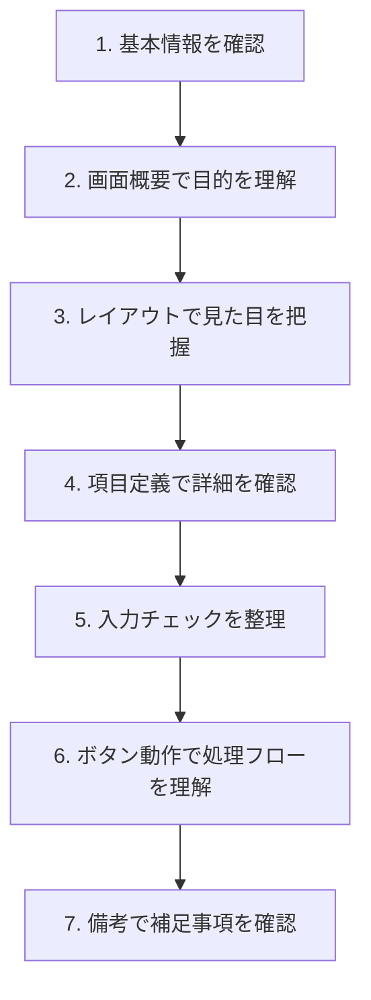

# 画面設計書の読み方

画面設計書は、ユーザーが操作する画面の見た目と動作を定義したドキュメントです。フロントエンド実装やテスト実施で必ず参照します。

## 画面設計書とは

### 役割

- 画面の**見た目（レイアウト）**を定義
- 各項目の**データ仕様**を定義
- **入力チェック**のルールを定義
- ボタン押下時の**動作と遷移先**を定義

### いつ使うか

| 場面 | 使い方 |
|------|--------|
| UI実装時 | レイアウト、項目配置の確認 |
| バリデーション実装時 | 入力チェックルールの確認 |
| テスト実施時 | 期待動作の確認 |
| 仕様確認時 | 画面の動きを確認 |

## 画面設計書の構成

### よくある構成要素

| 項目 | 内容 | 確認ポイント |
|------|------|-------------|
| 基本情報 | 画面ID、画面名、バージョン | 最新版か確認 |
| 画面概要 | この画面の目的 | 何をする画面か |
| 画面レイアウト | 項目の配置図 | 見た目のイメージ |
| 項目定義 | 各項目のデータ仕様 | 型、桁数、必須 |
| 入力チェック | バリデーションルール | エラーメッセージ |
| ボタン動作 | ボタン押下時の処理 | 遷移先、API呼び出し |
| 備考 | 補足事項 | 特殊な動作 |

## 読み方の流れ



---

## 【サンプル】画面設計書の実例

実際の画面設計書がどのようなものか、簡略化したサンプルで見てみましょう。

### 画面設計書サンプル：ユーザー登録画面

```
━━━━━━━━━━━━━━━━━━━━━━━━━━━━━━━━━━━━━━━━━━━━━━━━
画面設計書
━━━━━━━━━━━━━━━━━━━━━━━━━━━━━━━━━━━━━━━━━━━━━━━━

■ 基本情報
━━━━━━━━━━━━━━━━━━━━━━━━━━━━━━━━━━━━━━━━━━━━━━━━
画面ID      : SCR-001
画面名      : ユーザー登録画面
作成日      : 2024/01/15
更新日      : 2024/02/20
バージョン  : 1.2

■ 画面概要
━━━━━━━━━━━━━━━━━━━━━━━━━━━━━━━━━━━━━━━━━━━━━━━━
新規ユーザーがアカウントを作成するための画面。
メールアドレス、パスワード、氏名を入力して登録する。

■ 画面レイアウト
━━━━━━━━━━━━━━━━━━━━━━━━━━━━━━━━━━━━━━━━━━━━━━━━

┌─────────────────────────────────────────┐
│              ユーザー登録                │  ← ①タイトル
├─────────────────────────────────────────┤
│                                          │
│  メールアドレス *                        │  ← ②入力項目
│  ┌────────────────────────────────┐    │
│  │                                  │    │
│  └────────────────────────────────┘    │
│  ※半角英数字で入力してください           │  ← ③補足説明
│                                          │
│  パスワード *                            │
│  ┌────────────────────────────────┐    │
│  │ ●●●●●●●●                     │    │
│  └────────────────────────────────┘    │
│  ※8文字以上、英数字混合                  │
│                                          │
│  パスワード（確認） *                    │
│  ┌────────────────────────────────┐    │
│  │ ●●●●●●●●                     │    │
│  └────────────────────────────────┘    │
│                                          │
│  氏名 *                                  │
│  ┌────────────────────────────────┐    │
│  │                                  │    │
│  └────────────────────────────────┘    │
│                                          │
│  電話番号                                │  ← ④任意項目（*なし）
│  ┌────────────────────────────────┐    │
│  │                                  │    │
│  └────────────────────────────────┘    │
│                                          │
│      ┌─────────┐   ┌─────────┐         │
│      │  登録    │   │ キャンセル│        │  ← ⑤ボタン
│      └─────────┘   └─────────┘         │
│                                          │
└─────────────────────────────────────────┘

■ 項目定義
━━━━━━━━━━━━━━━━━━━━━━━━━━━━━━━━━━━━━━━━━━━━━━━━

| No | 項目名 | 項目ID | データ型 | 桁数 | 必須 | 初期値 |
|----|--------|--------|----------|------|------|--------|
| 1 | メールアドレス | email | 文字列 | 256 | ○ | なし |
| 2 | パスワード | password | 文字列 | 64 | ○ | なし |
| 3 | パスワード（確認） | password_confirm | 文字列 | 64 | ○ | なし |
| 4 | 氏名 | name | 文字列 | 100 | ○ | なし |
| 5 | 電話番号 | phone | 文字列 | 15 | - | なし |

■ 入力チェック
━━━━━━━━━━━━━━━━━━━━━━━━━━━━━━━━━━━━━━━━━━━━━━━━

| No | 項目名 | チェック内容 | エラーメッセージ |
|----|--------|--------------|------------------|
| 1 | メールアドレス | 必須チェック | メールアドレスを入力してください |
| 2 | メールアドレス | 形式チェック | メールアドレスの形式が正しくありません |
| 3 | メールアドレス | 重複チェック | このメールアドレスは既に登録されています |
| 4 | パスワード | 必須チェック | パスワードを入力してください |
| 5 | パスワード | 桁数チェック（8文字以上） | パスワードは8文字以上で入力してください |
| 6 | パスワード | 形式チェック（英数字混合） | パスワードは英字と数字を含めてください |
| 7 | パスワード（確認） | 一致チェック | パスワードが一致しません |
| 8 | 氏名 | 必須チェック | 氏名を入力してください |
| 9 | 電話番号 | 形式チェック | 電話番号の形式が正しくありません |

■ ボタン動作
━━━━━━━━━━━━━━━━━━━━━━━━━━━━━━━━━━━━━━━━━━━━━━━━

| ボタン名 | ボタンID | 動作 | 遷移先 |
|----------|----------|------|--------|
| 登録 | btn_register | 入力チェック→API呼び出し→登録処理 | 登録完了画面（SCR-002） |
| キャンセル | btn_cancel | 確認ダイアログ表示→トップへ戻る | トップ画面（SCR-000） |

■ 処理シーケンス
━━━━━━━━━━━━━━━━━━━━━━━━━━━━━━━━━━━━━━━━━━━━━━━━

【登録ボタン押下時】
1. 画面で入力チェック実行（No.1,2,4,5,6,7,8,9）
2. エラーがあれば該当項目にエラーメッセージ表示
3. エラーがなければAPI呼び出し（POST /api/users）
4. API側で重複チェック（No.3）
5. 登録成功→登録完了画面へ遷移
6. 登録失敗→エラーメッセージ表示

■ 備考
━━━━━━━━━━━━━━━━━━━━━━━━━━━━━━━━━━━━━━━━━━━━━━━━
- パスワードは入力中もマスク表示（●）する
- 登録ボタンは必須項目が全て入力されるまで非活性
- 更新履歴：v1.1 電話番号項目追加、v1.2 パスワード確認追加
```

---

## 読むときのチェックポイント

| 確認する箇所 | 確認すること | この例での確認結果 |
|-------------|-------------|-------------------|
| 基本情報 | バージョンは最新か？ | v1.2（更新日2024/02/20）|
| 項目定義 | 桁数はどれくらいか？ | メールは256文字、氏名は100文字 |
| 入力チェック | どのタイミングでチェックするか？ | 登録ボタン押下時（重複チェックはAPI側） |
| ボタン動作 | 次の画面はどこか？ | 成功→SCR-002、キャンセル→SCR-000 |
| 備考 | 特殊な動作はあるか？ | 必須未入力時はボタン非活性 |

## よくある疑問と確認ポイント

### Q: 「必須項目が全て入力されるまで非活性」とは？

実装方法の確認が必要です。

- リアルタイムでチェックするのか
- フォーカスアウト時にチェックするのか
- 空文字かどうかだけ見るのか

→ **不明なら先輩に確認**しましょう。

### Q: 「メールアドレスの重複チェック」はいつ行うか？

処理シーケンスを見ると「API側で」とあるので、サーバー側で実施します。

- 画面側：形式チェックまで
- サーバー側：重複チェック

### Q: パスワード確認欄の入力チェックはどう実装する？

入力チェックNo.7「パスワードが一致しません」でエラーにします。

- パスワード欄と確認欄を比較
- 不一致なら確認欄にエラー表示

## 画面設計書でよくある落とし穴

| 落とし穴 | 対策 |
|---------|------|
| 桁数制限を見落とす | 項目定義の桁数を確認して実装 |
| 入力チェックのタイミングを間違える | 処理シーケンスでタイミングを確認 |
| 備考を読み飛ばす | 必ず備考まで目を通す |
| 古いバージョンを見ている | 更新日を確認する習慣をつける |
| エラーメッセージを自作する | 設計書のメッセージをそのまま使う |

## 質問例：画面設計書について確認するとき

```
画面設計書SCR-001について確認させてください。

項目定義No.5の電話番号について、
「形式チェック」とありますが、許容するフォーマットを教えてください。
- ハイフンあり：03-1234-5678
- ハイフンなし：0312345678
- 括弧あり：03(1234)5678

どの形式を許容しますか？
```

## 関連ドキュメント

- [[30_設計書・仕様書の読み方]] - 設計書全般の読み方
- [[34_処理設計書の読み方]] - 対になるバックエンド側の設計書
