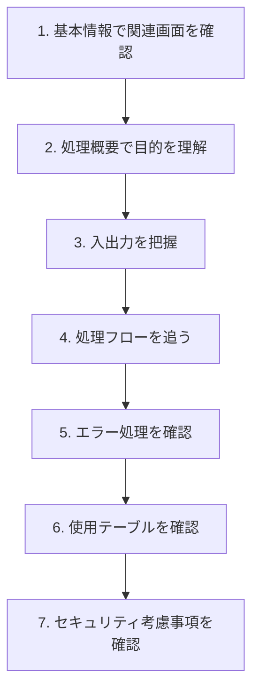
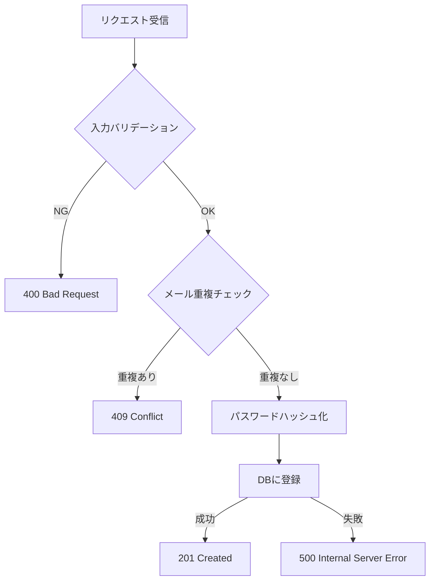
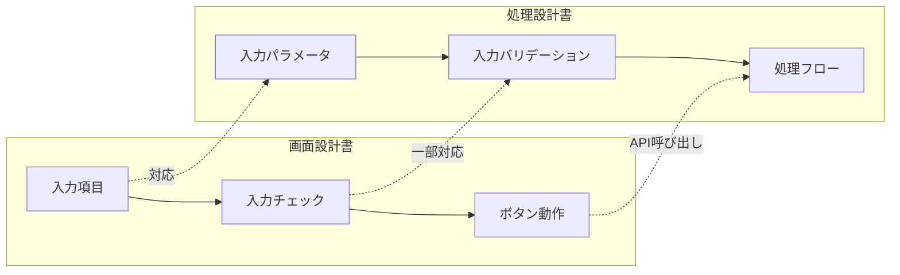

# 処理設計書の読み方

処理設計書は、バックエンドの処理ロジックを定義したドキュメントです。API実装やサーバーサイドの開発で必ず参照します。

## 処理設計書とは

### 役割

- **処理の目的と概要**を定義
- **入出力データ**を定義
- **処理フロー**（ロジック）を定義
- **エラー処理**を定義
- **使用するテーブル**を定義

### いつ使うか

| 場面 | 使い方 |
|------|--------|
| バックエンド実装時 | 処理ロジックの確認 |
| API実装時 | 入出力、エラー処理の確認 |
| テスト実施時 | 正常系・異常系の確認 |
| 障害調査時 | 処理フローの確認 |

## 処理設計書の構成

### よくある構成要素

| 項目 | 内容 | 確認ポイント |
|------|------|-------------|
| 基本情報 | 処理ID、処理名、関連画面 | 最新版か確認 |
| 処理概要 | この処理の目的 | 何をする処理か |
| API仕様 | エンドポイント、メソッド | URL、認証要否 |
| 入力パラメータ | リクエストデータ | 必須/任意、型 |
| 出力パラメータ | レスポンスデータ | 成功時/失敗時 |
| 処理フロー | 処理の順序 | チェック順序 |
| エラー処理 | エラー時の動作 | ステータスコード |
| 使用テーブル | DBテーブル | 参照/更新の区別 |

## 読み方の流れ



---

## 【サンプル】処理設計書の実例

画面設計書と対になる、処理（バックエンド）側の設計書サンプルです。

### 処理設計書サンプル：ユーザー登録API

```
━━━━━━━━━━━━━━━━━━━━━━━━━━━━━━━━━━━━━━━━━━━━━━━━
処理設計書
━━━━━━━━━━━━━━━━━━━━━━━━━━━━━━━━━━━━━━━━━━━━━━━━

■ 基本情報
━━━━━━━━━━━━━━━━━━━━━━━━━━━━━━━━━━━━━━━━━━━━━━━━
処理ID      : API-001
処理名      : ユーザー登録API
関連画面    : SCR-001（ユーザー登録画面）
作成日      : 2024/01/15
更新日      : 2024/02/20
バージョン  : 1.2

■ 処理概要
━━━━━━━━━━━━━━━━━━━━━━━━━━━━━━━━━━━━━━━━━━━━━━━━
新規ユーザーの情報をデータベースに登録する。
メールアドレスの重複チェック、パスワードのハッシュ化を行う。

■ API仕様
━━━━━━━━━━━━━━━━━━━━━━━━━━━━━━━━━━━━━━━━━━━━━━━━
エンドポイント  : POST /api/users
認証            : 不要
コンテンツタイプ: application/json

■ 入力パラメータ
━━━━━━━━━━━━━━━━━━━━━━━━━━━━━━━━━━━━━━━━━━━━━━━━

| No | パラメータ名 | 型 | 必須 | 説明 | 例 |
|----|-------------|------|------|------|-----|
| 1 | email | String | ○ | メールアドレス | "user@example.com" |
| 2 | password | String | ○ | パスワード | "Password123" |
| 3 | name | String | ○ | 氏名 | "山田太郎" |
| 4 | phone | String | - | 電話番号 | "03-1234-5678" |

【リクエストサンプル】
{
  "email": "user@example.com",
  "password": "Password123",
  "name": "山田太郎",
  "phone": "03-1234-5678"
}

■ 出力パラメータ
━━━━━━━━━━━━━━━━━━━━━━━━━━━━━━━━━━━━━━━━━━━━━━━━

【成功時】HTTPステータス: 201 Created

| No | パラメータ名 | 型 | 説明 |
|----|-------------|------|------|
| 1 | user_id | Integer | 登録されたユーザーID |
| 2 | email | String | メールアドレス |
| 3 | name | String | 氏名 |
| 4 | created_at | DateTime | 登録日時 |

【レスポンスサンプル】
{
  "user_id": 12345,
  "email": "user@example.com",
  "name": "山田太郎",
  "created_at": "2024-01-15T10:30:00+09:00"
}

■ 処理フロー
━━━━━━━━━━━━━━━━━━━━━━━━━━━━━━━━━━━━━━━━━━━━━━━━

┌─────────────────────────────────────────────────────────┐
│ 1. リクエスト受信                                         │
├─────────────────────────────────────────────────────────┤
│ 2. 入力バリデーション                                     │
│    - 必須チェック（email, password, name）                │
│    - 形式チェック（email形式、パスワード8文字以上）        │
├─────────────────────────────────────────────────────────┤
│ 3. メールアドレス重複チェック                             │
│    SELECT COUNT(*) FROM users WHERE email = ?            │
│    → 1件以上あれば重複エラー                             │
├─────────────────────────────────────────────────────────┤
│ 4. パスワードハッシュ化                                   │
│    bcrypt(password, salt_rounds=10)                      │
├─────────────────────────────────────────────────────────┤
│ 5. ユーザー情報登録                                       │
│    INSERT INTO users (email, password_hash, name, phone, │
│                       created_at, updated_at)            │
│    VALUES (?, ?, ?, ?, NOW(), NOW())                     │
├─────────────────────────────────────────────────────────┤
│ 6. レスポンス返却                                         │
│    登録されたuser_idを含むJSONを返す                      │
└─────────────────────────────────────────────────────────┘
```



```
■ エラー処理
━━━━━━━━━━━━━━━━━━━━━━━━━━━━━━━━━━━━━━━━━━━━━━━━

| HTTPステータス | エラーコード | 発生条件 | エラーメッセージ |
|---------------|-------------|---------|-----------------|
| 400 | INVALID_EMAIL | メール形式不正 | メールアドレスの形式が正しくありません |
| 400 | INVALID_PASSWORD | パスワード要件未達 | パスワードは8文字以上で入力してください |
| 400 | MISSING_REQUIRED | 必須項目未入力 | {項目名}を入力してください |
| 409 | EMAIL_EXISTS | メール重複 | このメールアドレスは既に登録されています |
| 500 | INTERNAL_ERROR | システムエラー | システムエラーが発生しました |

【エラーレスポンスサンプル】
{
  "error": {
    "code": "EMAIL_EXISTS",
    "message": "このメールアドレスは既に登録されています"
  }
}

■ 使用テーブル
━━━━━━━━━━━━━━━━━━━━━━━━━━━━━━━━━━━━━━━━━━━━━━━━

【usersテーブル】

| カラム名 | 型 | NULL | 説明 |
|---------|------|------|------|
| user_id | INT | × | 主キー（自動採番） |
| email | VARCHAR(256) | × | メールアドレス（ユニーク） |
| password_hash | VARCHAR(256) | × | パスワード（ハッシュ済） |
| name | VARCHAR(100) | × | 氏名 |
| phone | VARCHAR(15) | ○ | 電話番号 |
| created_at | DATETIME | × | 作成日時 |
| updated_at | DATETIME | × | 更新日時 |

■ セキュリティ考慮事項
━━━━━━━━━━━━━━━━━━━━━━━━━━━━━━━━━━━━━━━━━━━━━━━━
- パスワードは平文で保存しない（bcryptでハッシュ化）
- SQLインジェクション対策（プレースホルダー使用）
- レスポンスにpasswordを含めない

■ 備考
━━━━━━━━━━━━━━━━━━━━━━━━━━━━━━━━━━━━━━━━━━━━━━━━
- v1.1 phone項目追加
- v1.2 パスワード要件変更（英数字混合必須）
```

---

## 読むときのチェックポイント

| 確認する箇所 | 確認すること | 見落としがちなポイント |
|-------------|-------------|----------------------|
| 入力パラメータ | 必須/任意の区別 | phoneは任意（NULLを許容する必要あり） |
| 処理フロー | チェックの順序 | 入力バリデーション→重複チェックの順 |
| エラー処理 | HTTPステータスの使い分け | 重複は400ではなく409 Conflict |
| 使用テーブル | カラムの型と制約 | emailにユニーク制約がある |
| セキュリティ | パスワードの扱い | 平文保存NG、レスポンスに含めない |

## 画面設計書と処理設計書の対応関係



### フロントとバックエンドのバリデーション役割分担

| チェック種類 | 画面側（フロント） | 処理側（バックエンド） |
|-------------|-------------------|----------------------|
| 必須チェック | ○ | ○（二重チェック） |
| 形式チェック | ○ | ○（二重チェック） |
| 重複チェック | × | ○（DB参照が必要） |
| 桁数チェック | ○ | ○（二重チェック） |

> **ポイント**：セキュリティ上、バックエンド側でも必ずバリデーションを行います。フロント側は「ユーザビリティ向上」、バックエンド側は「セキュリティ担保」の役割です。

## 処理設計書でよくある落とし穴

| 落とし穴 | 対策 |
|---------|------|
| 任意項目のNULL処理を忘れる | 入力パラメータの必須欄を確認 |
| HTTPステータスコードを間違える | エラー処理の表を確認 |
| 処理順序を変える | 処理フローの順番通りに実装 |
| セキュリティ考慮を見落とす | セキュリティ考慮事項を必ず読む |
| レスポンスに余計な情報を含める | 出力パラメータに定義されたものだけ返す |

## 質問例：処理設計書について確認するとき

```
処理設計書API-001について確認させてください。

処理フローのステップ3「メールアドレス重複チェック」について、
大文字小文字を区別するかどうか教えてください。

例えば、以下は同一ユーザーとして扱いますか？
- User@example.com
- user@example.com
```

## 関連ドキュメント

- [[30_設計書・仕様書の読み方]] - 設計書全般の読み方
- [[33_画面設計書の読み方]] - 対になるフロントエンド側の設計書
- [[36_ER図の読み方]] - データベース構造の読み方
