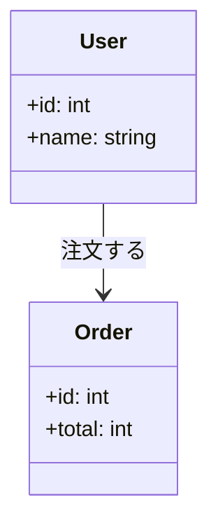
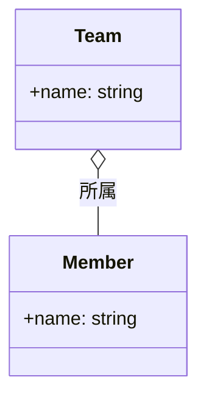
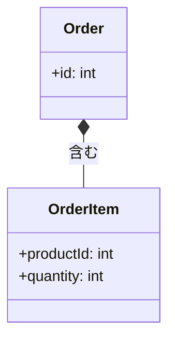
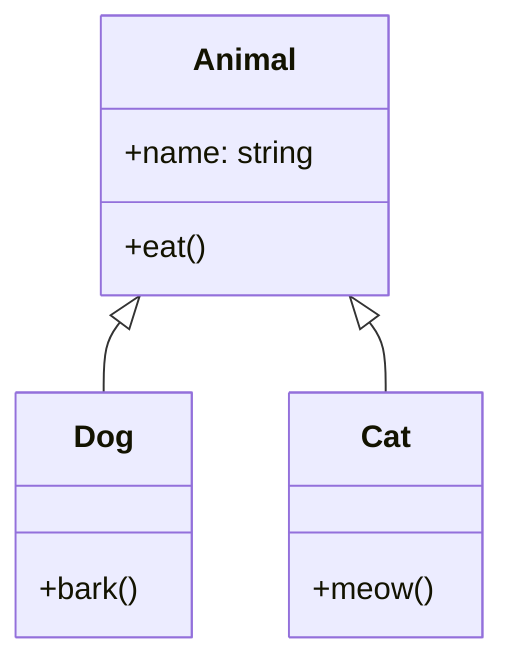
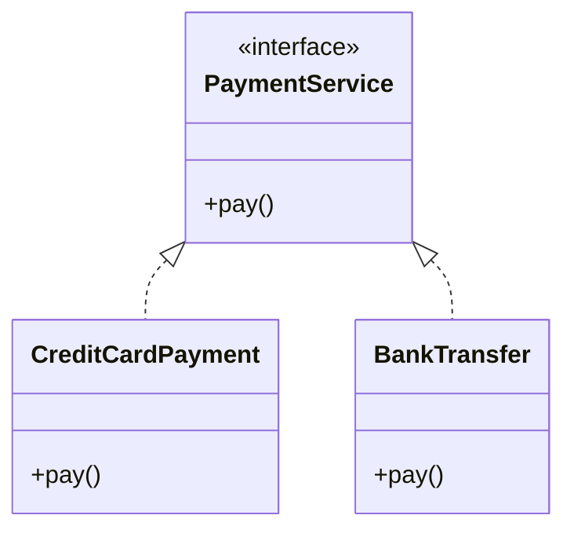
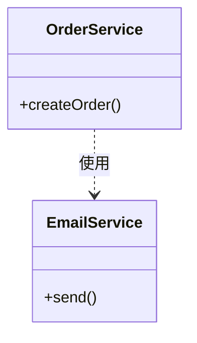
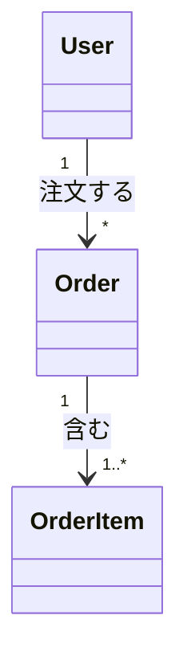
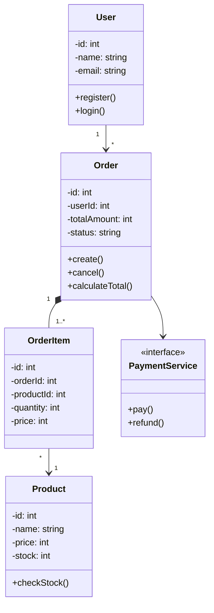

# クラス図の読み方

クラス図は、システムの構造をクラス（データと処理のまとまり）の関係として表した図です。オブジェクト指向の設計で使われます。

## クラス図とは

### 役割

- **クラスの構造**（属性とメソッド）を表現
- **クラス間の関係**（継承、関連など）を表現
- システムの**全体構造**を俯瞰

### いつ使うか

| 場面 | 使い方 |
|------|--------|
| 設計理解時 | システム構造の把握 |
| 新機能実装時 | どのクラスに実装するか判断 |
| コードリーディング時 | クラス間の関係を確認 |
| リファクタリング時 | 影響範囲の確認 |

## クラス図の基本要素

### クラスの表記

```
┌─────────────────────┐
│      User           │  ← クラス名
├─────────────────────┤
│ - id: int           │  ← 属性（フィールド）
│ - name: string      │
│ - email: string     │
├─────────────────────┤
│ + register()        │  ← メソッド
│ + login()           │
│ - validate()        │
└─────────────────────┘
```

### 可視性（アクセス修飾子）

| 記号 | 意味 | 説明 |
|------|------|------|
| + | public | どこからでもアクセス可能 |
| - | private | クラス内部からのみアクセス可能 |
| # | protected | 継承したクラスからアクセス可能 |
| ~ | package | 同じパッケージからアクセス可能 |

## クラス間の関係

### 1. 関連（Association）

クラス間に「つながり」がある関係。



**読み方**：「UserはOrderと関連がある（注文する）」

### 2. 集約（Aggregation）

「持っている」関係。部分は独立して存在できる。



**読み方**：「TeamはMemberを持つ（Memberはチームがなくても存在できる）」

### 3. コンポジション（Composition）

「構成する」関係。部分は全体がないと存在できない。



**読み方**：「OrderはOrderItemで構成される（OrderがなければOrderItemも存在しない）」

### 4. 継承（Inheritance / Generalization）

「〜の一種である」関係。



**読み方**：「DogはAnimalの一種である（Animalを継承している）」

### 5. 実装（Realization）

インターフェースの実装関係。



**読み方**：「CreditCardPaymentはPaymentServiceインターフェースを実装している」

### 6. 依存（Dependency）

一時的な「使う」関係。



**読み方**：「OrderServiceはEmailServiceを使う（依存している）」

## 関係の記号まとめ

| 関係 | 線の種類 | 矢印 | 意味 |
|------|---------|------|------|
| 関連 | 実線 | → | つながりがある |
| 集約 | 実線 | ◇→ | 持っている（独立可） |
| コンポジション | 実線 | ◆→ | 構成している（一体） |
| 継承 | 実線 | △→ | 〜の一種である |
| 実装 | 破線 | △→ | インターフェースを実装 |
| 依存 | 破線 | → | 一時的に使う |

## 多重度（Multiplicity）

関係の「数」を表します。

| 表記 | 意味 |
|------|------|
| 1 | ちょうど1つ |
| 0..1 | 0または1つ |
| * | 0以上（複数可） |
| 1..* | 1以上（複数可） |
| 0..* | 0以上（複数可）（*と同じ） |

### 例



**読み方**：
- 「1人のUserは0個以上のOrderを持つ」
- 「1つのOrderは1個以上のOrderItemを含む」

---

## 【サンプル】クラス図の実例

ECサイトの注文システムを例に、クラス図を読んでみましょう。



### 読み解き方

1. **User → Order**：ユーザーは複数の注文を持つ（1対多）
2. **Order ◆ OrderItem**：注文は注文明細で構成される（コンポジション）
3. **OrderItem → Product**：注文明細は商品を参照する
4. **Order → PaymentService**：注文は決済サービスを使う（依存）

### 実装時に確認すること

| 確認項目 | このクラス図から分かること |
|---------|-------------------------|
| どのクラスを作るか | User, Order, OrderItem, Product, PaymentService |
| クラスの責務 | Orderにcreate, cancel, calculateTotalがある |
| データの関係 | OrderはOrderItemを複数持つ |
| 外部連携 | PaymentServiceインターフェースで決済処理 |

## クラス図を読むときのポイント

### 1. まず全体を俯瞰する

- どんなクラスがあるか
- 中心となるクラスは何か
- クラスの数は多すぎないか

### 2. 関係の種類を確認する

- 実線か破線か
- 矢印の形は何か
- 多重度はどうなっているか

### 3. 自分の担当範囲を特定する

- 実装するのはどのクラスか
- 関連するクラスは何か
- 影響を受けるクラスはどこまでか

## よくある疑問

### Q: 継承と実装の違いは？

- **継承**：具体的なクラスを拡張（class Dog extends Animal）
- **実装**：インターフェースを実装（class CreditCard implements PaymentService）

### Q: 集約とコンポジションの違いは？

- **集約（◇）**：部分が独立して存在できる（チームとメンバー）
- **コンポジション（◆）**：部分は全体がないと存在できない（注文と注文明細）

### Q: クラス図に書いてないメソッドを追加していいか？

設計者に確認しましょう。ただし、privateなヘルパーメソッドなどは追加しても問題ないことが多いです。

## 関連ドキュメント

- [[30_設計書・仕様書の読み方]] - 設計書全般の読み方
- [[36_ER図の読み方]] - データベース構造の読み方
