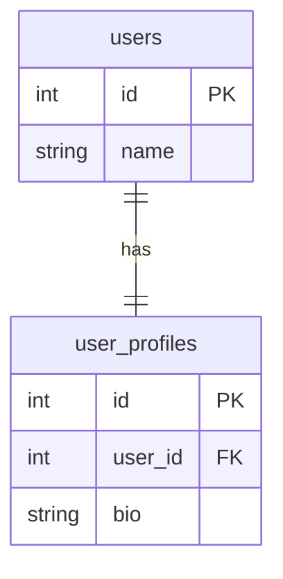
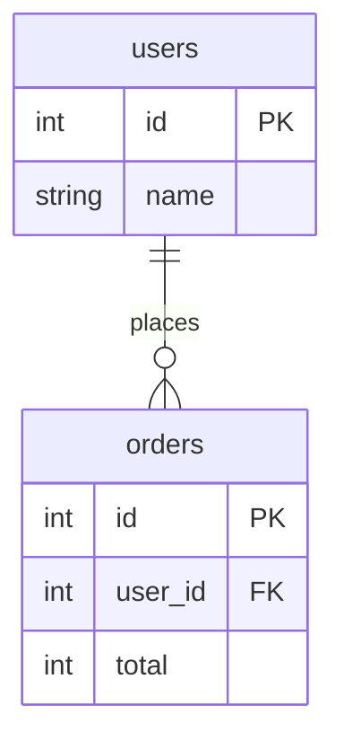
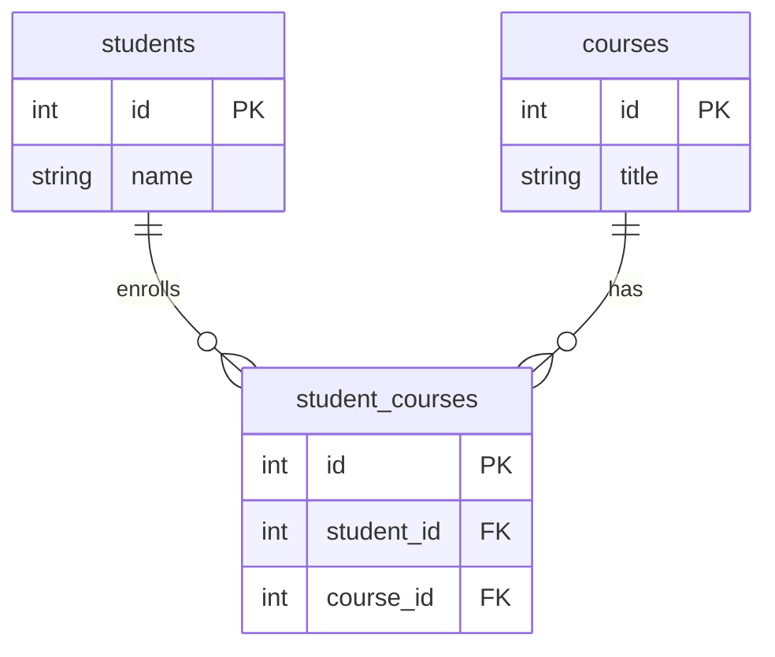
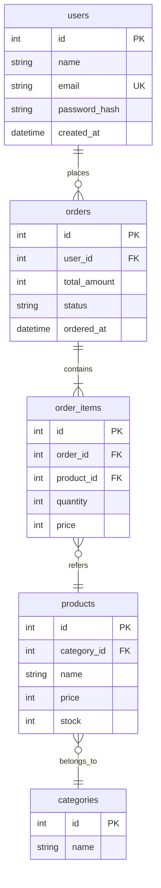
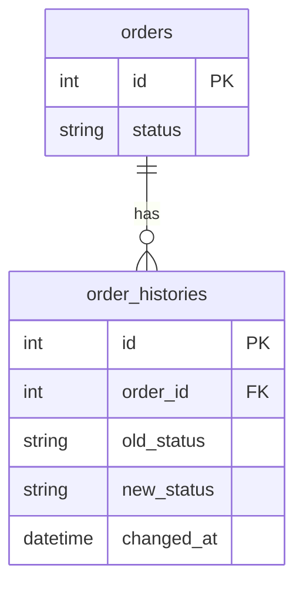
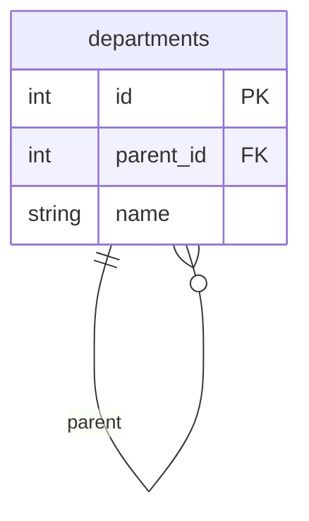

# ER図の読み方

ER図（Entity Relationship Diagram）は、データベースの構造を表した図です。テーブル間の関係を理解するために使います。

## ER図とは

### 役割

- **テーブル（エンティティ）**の構造を表現
- **テーブル間の関係（リレーション）**を表現
- **主キー・外部キー**の関係を明示

### いつ使うか

| 場面 | 使い方 |
|------|--------|
| DB設計理解時 | テーブル構造の把握 |
| SQL作成時 | JOIN条件の確認 |
| 新機能実装時 | 必要なテーブルの確認 |
| 障害調査時 | データの流れを追跡 |

## ER図の基本要素

### エンティティ（テーブル）の表記

```
┌─────────────────────┐
│       users         │  ← テーブル名
├─────────────────────┤
│ PK  id              │  ← 主キー
│     name            │  ← カラム
│     email           │
│     created_at      │
└─────────────────────┘
```

### キーの表記

| 表記 | 意味 | 説明 |
|------|------|------|
| PK | Primary Key | 主キー（レコードを一意に識別） |
| FK | Foreign Key | 外部キー（他テーブルを参照） |
| UK | Unique Key | ユニークキー（重複不可） |

## リレーション（関係）の種類

### 1. 1対1（One to One）

1つのレコードが、もう1つのテーブルの1つのレコードと対応。



**例**：ユーザーとユーザープロフィール（1人のユーザーに1つのプロフィール）

### 2. 1対多（One to Many）

1つのレコードが、複数のレコードと対応。**最も一般的**。



**例**：ユーザーと注文（1人のユーザーが複数の注文を持つ）

### 3. 多対多（Many to Many）

複数のレコードが、複数のレコードと対応。**中間テーブル**が必要。



**例**：学生と講座（1人の学生が複数の講座を受講、1つの講座に複数の学生が参加）

## カーディナリティ（多重度）の記号

| 記号 | 意味 |
|------|------|
| `\|\|` | ちょうど1つ（必須） |
| `\|o` | 0または1つ（オプション） |
| `o{` | 0以上（複数可） |
| `\|{` | 1以上（必須、複数可） |

### 記号の読み方

```
users ||--o{ orders
```

- 左側 `||`：usersは必ず1つ
- 右側 `o{`：ordersは0個以上

→「1人のユーザーは0個以上の注文を持つ」

---

## 【サンプル】ER図の実例

ECサイトのデータベースを例に、ER図を読んでみましょう。



### 読み解き方

1. **users → orders**（1対多）
   - 1人のユーザーが0個以上の注文を持つ
   - orders.user_id が users.id を参照

2. **orders → order_items**（1対多、必須）
   - 1つの注文に1個以上の注文明細がある
   - order_items.order_id が orders.id を参照

3. **order_items → products**（多対1）
   - 注文明細は1つの商品を参照
   - order_items.product_id が products.id を参照

4. **products → categories**（多対1）
   - 商品は1つのカテゴリに属する
   - products.category_id が categories.id を参照

### SQLを書くときの参考

**ユーザーの注文履歴を取得**
```sql
SELECT o.id, o.ordered_at, o.total_amount
FROM orders o
JOIN users u ON o.user_id = u.id
WHERE u.id = 123;
```

**注文の明細を取得**
```sql
SELECT oi.quantity, oi.price, p.name
FROM order_items oi
JOIN products p ON oi.product_id = p.id
WHERE oi.order_id = 456;
```

## ER図を読むときのポイント

### 1. 主キー（PK）を確認する

- 各テーブルのPKは何か
- 複合主キー（複数カラムでPK）はあるか

### 2. 外部キー（FK）を確認する

- どのカラムがFKか
- どのテーブルを参照しているか
- JOINするときの条件になる

### 3. リレーションの種類を確認する

- 1対1、1対多、多対多のどれか
- 必須か任意か（`||` vs `o`）

### 4. 中間テーブルを見つける

- 多対多の関係には中間テーブルがある
- 中間テーブルには複数のFKがある

## よくあるテーブル設計パターン

### マスターテーブルとトランザクションテーブル

| 種類 | 説明 | 例 |
|------|------|-----|
| マスターテーブル | 基本情報を持つ、あまり更新されない | users, products, categories |
| トランザクションテーブル | 取引情報を持つ、頻繁に追加される | orders, order_items |

### 履歴テーブル

変更履歴を残すためのテーブル。



## よくある疑問

### Q: 外部キー制約は必ずあるか？

設計によります。外部キー制約がなくても、論理的にはリレーションが存在することがあります。ER図と実際のテーブル定義を照らし合わせましょう。

### Q: NULL可のFKはどう読むか？

例えば `products.category_id` がNULL可なら「カテゴリに属さない商品もある」という意味です。

### Q: 自己参照はどう表現される？

同じテーブルを参照するFK。例：組織の階層構造



## ER図でよくある落とし穴

| 落とし穴 | 対策 |
|---------|------|
| FK先のテーブルを確認しない | 矢印の先を必ず確認 |
| NULL可/不可を見落とす | カラム定義でNULLを確認 |
| カーディナリティを間違える | 記号の意味を確認 |
| 中間テーブルの存在を見落とす | 多対多の関係を探す |

## 質問例：ER図について確認するとき

```
ER図のorder_itemsテーブルについて確認させてください。

product_idの外部キー制約についてですが、
商品が削除された場合、order_itemsのレコードは
どうなりますか？

- CASCADE DELETE（一緒に削除）
- SET NULL（NULLになる）
- RESTRICT（削除不可）

どの設定になっていますか？
```

## 関連ドキュメント

- [[30_設計書・仕様書の読み方]] - 設計書全般の読み方
- [[24_データベースの基礎]] - SQLの基礎
- [[35_クラス図の読み方]] - クラス構造の読み方
