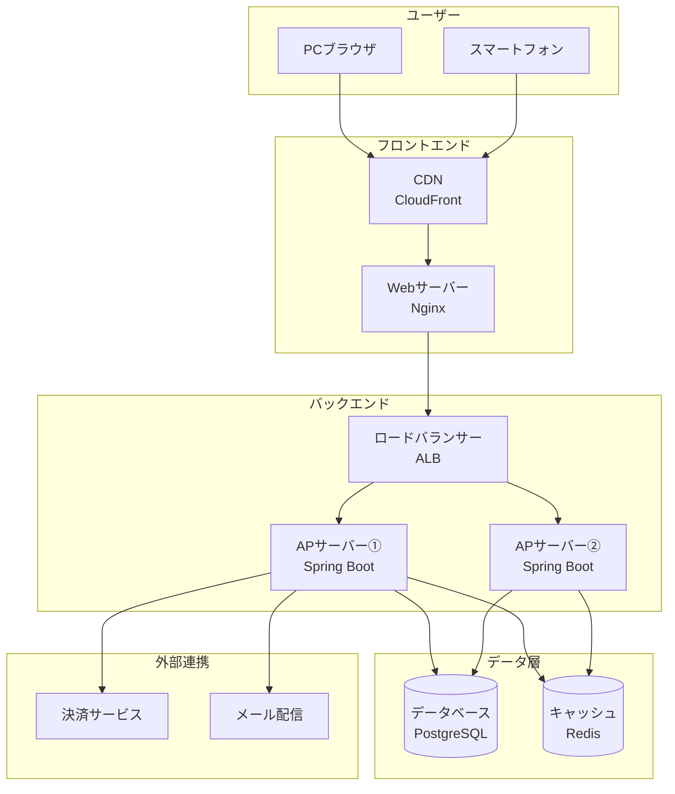
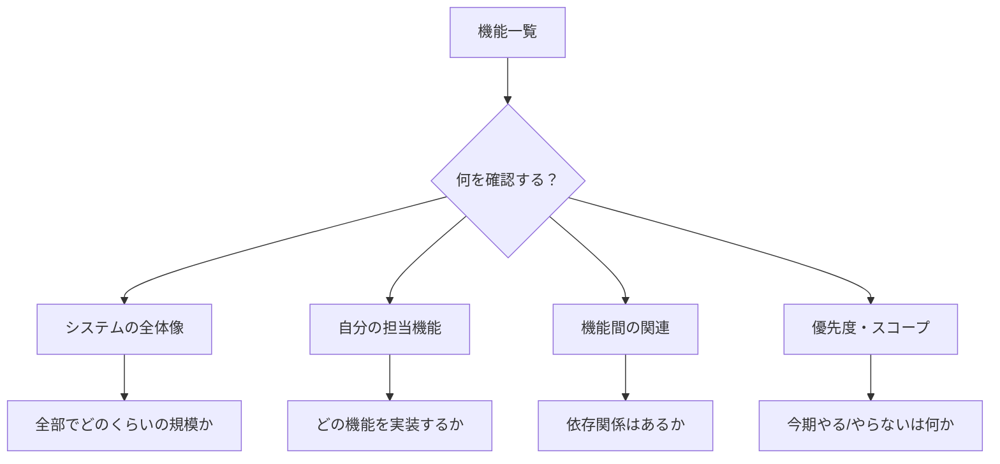
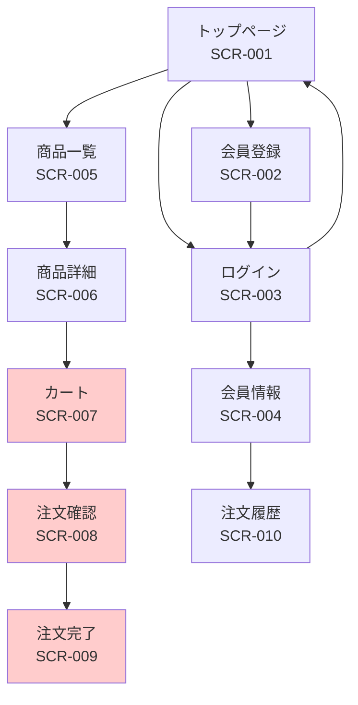
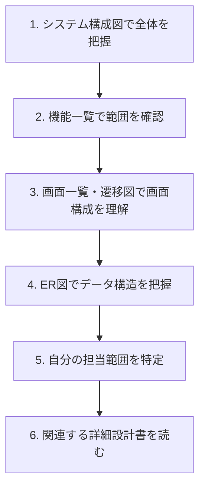

# 基本設計書の読み方

基本設計書は、システムの**外部仕様**を定義したドキュメントです。「何を作るか」「ユーザーにどう見えるか」を記述します。

## 基本設計書とは

### 別名

基本設計書は、現場によって以下のような呼び方をされることがあります。

- **外部設計書**
- **基本設計**
- **BD（Basic Design）**

> [!tip] 名前が違っても中身は同じ
> プロジェクトによって呼び方が異なりますが、内容は基本的に同じです。

### 役割


基本設計書は、要件定義書と詳細設計書の間に位置し、以下を定義します。

- システムの**全体像**（アーキテクチャ）
- **ユーザーから見える部分**の設計
- システムが**何ができるか**

### 視点の違い

| 観点 | 基本設計書 | 詳細設計書 |
|------|-----------|-----------|
| 別名 | 外部設計書 | 内部設計書 |
| 視点 | **ユーザー視点**（外部） | 開発者視点（内部） |
| 内容 | **何を作るか** | どう作るか |
| 対象者 | お客様、SE、PM | 開発者、PG |
| 詳細度 | 概念的・俯瞰的 | 具体的・詳細 |

> [!important] なぜ分けるのか？
> 基本設計書はお客様との合意形成に使うことが多いため、技術的な詳細よりも「何ができるか」を明確にします。詳細設計書は開発者が実装するための具体的な情報を記載します。

---

## 基本設計書の構成要素

### よくある構成

基本設計書は、以下のような構成で作られることが多いです。

| 項目 | 内容 | 確認ポイント |
|------|------|-------------|
| **システム構成図** | システム全体のアーキテクチャ | サーバー構成、ネットワーク構成 |
| **機能一覧** | システムが持つ機能の一覧 | 機能の範囲、優先度 |
| **画面一覧** | すべての画面のリスト | 画面数、画面の種類 |
| **画面遷移図** | 画面間の遷移関係 | どこからどこへ行けるか |
| **帳票一覧** | 出力する帳票・レポート | 帳票の種類、出力タイミング |
| **データ設計（論理）** | データの構造（概念レベル） | エンティティ、関係性 |
| **インターフェース設計** | 外部システムとの連携 | API、ファイル連携 |
| **非機能要件** | 性能、セキュリティなど | 応答時間、同時接続数 |

---

## 【実践】基本設計書サンプルと読み方

ここからは、実際の基本設計書に近いサンプルを使って、具体的な読み方を解説します。

### サンプル1：システム構成図

システム構成図は、システム全体のアーキテクチャを図示します。



#### この図から読み取るべきこと

| 確認項目 | 読み取る内容 | この例での内容 |
|---------|-------------|---------------|
| **構成要素** | どんなサーバーがあるか | Webサーバー、APサーバー、DB、キャッシュ |
| **冗長化** | 複数台構成か | APサーバーは2台構成（負荷分散） |
| **外部連携** | どこと連携するか | 決済サービス、メール配信 |
| **使用技術** | 何を使っているか | Nginx、Spring Boot、PostgreSQL、Redis |

> [!tip] 1年目エンジニアとして確認すること
> - 自分が担当する範囲はどこか？（APサーバー？フロント？）
> - 開発環境はこの構成と同じか？違いがあるか？

---

### サンプル2：機能一覧

機能一覧は、システムが持つ機能を一覧化します。

| 機能ID | 機能名 | 機能概要 | 優先度 | 備考 |
|--------|--------|---------|--------|------|
| F001 | 会員登録 | 新規ユーザーがアカウントを作成する | 高 | メール認証あり |
| F002 | ログイン | メールアドレスとパスワードでログイン | 高 | - |
| F003 | パスワードリセット | パスワードを忘れた場合に再設定 | 中 | メール送信 |
| F004 | 商品一覧 | 商品を一覧表示・検索する | 高 | ページング、絞り込み |
| F005 | 商品詳細 | 商品の詳細情報を表示する | 高 | - |
| F006 | カート | 商品をカートに追加・削除する | 高 | セッション管理 |
| F007 | 注文 | カートの商品を注文する | 高 | 決済連携 |
| F008 | 注文履歴 | 過去の注文を一覧表示する | 中 | - |
| F009 | お気に入り | 商品をお気に入りに登録する | 低 | 2期開発 |

#### この一覧から読み取るべきこと



> [!important] 優先度と備考を必ずチェック
> - 「2期開発」などの備考がある機能は、今回のスコープ外かもしれません
> - 優先度「低」の機能は後回しになる可能性があります

---

### サンプル3：画面一覧

画面一覧は、システムの全画面を一覧化します。

| 画面ID | 画面名 | 画面概要 | 認証 | 備考 |
|--------|--------|---------|------|------|
| SCR-001 | トップページ | サイトのトップ画面 | 不要 | - |
| SCR-002 | 会員登録 | 新規会員登録フォーム | 不要 | - |
| SCR-003 | ログイン | ログインフォーム | 不要 | - |
| SCR-004 | 会員情報 | 登録情報の表示・編集 | 必要 | - |
| SCR-005 | 商品一覧 | 商品の検索・一覧 | 不要 | ページング |
| SCR-006 | 商品詳細 | 商品の詳細表示 | 不要 | - |
| SCR-007 | カート | カート内容の表示 | 必要 | - |
| SCR-008 | 注文確認 | 注文内容の確認 | 必要 | - |
| SCR-009 | 注文完了 | 注文完了メッセージ | 必要 | - |
| SCR-010 | 注文履歴 | 過去の注文一覧 | 必要 | ページング |

#### この一覧から読み取るべきこと

| 確認項目 | 読み取る内容 |
|---------|-------------|
| **画面数** | 全体で何画面あるか（10画面） |
| **認証の有無** | ログインが必要な画面はどれか |
| **共通パターン** | 一覧＋詳細のパターンがあるか |

---

### サンプル4：画面遷移図

画面遷移図は、画面間の遷移を図示します。



#### この図から読み取るべきこと

- **入口**：どこからでもアクセスできる画面（トップ、商品一覧など）
- **流れ**：ユーザーの主要な導線（商品一覧→詳細→カート→注文）
- **認証が必要な遷移**：ログイン後しかアクセスできない画面

> [!tip] 実装時に確認すること
> - ログインしていない状態でカート画面にアクセスしたらどうなる？
> - ブラウザの戻るボタンで戻れるか？戻れない画面はあるか？

---

### サンプル5：ER図（概念レベル）

基本設計書のER図は、詳細なカラム定義ではなく、**エンティティ間の関係**を示します。

```mermaid
erDiagram
    USER ||--o{ ORDER : places
    USER ||--o{ FAVORITE : has
    ORDER ||--|{ ORDER_DETAIL : contains
    ORDER_DETAIL }|--|| PRODUCT : refers
    FAVORITE }|--|| PRODUCT : refers
    PRODUCT }|--|| CATEGORY : belongs_to

    USER {
        ユーザーID PK
        メールアドレス
        氏名
    }
    ORDER {
        注文ID PK
        ユーザーID FK
        注文日時
        合計金額
    }
    PRODUCT {
        商品ID PK
        商品名
        価格
    }
```

#### この図から読み取るべきこと

| 確認項目 | 読み取る内容 |
|---------|-------------|
| **主要エンティティ** | どんなデータを扱うか（ユーザー、注文、商品） |
| **関係性** | 1対多、多対多の関係 |
| **カーディナリティ** | ユーザーは複数の注文を持つ（1:N） |

> [!important] 基本設計のER図 vs 詳細設計のテーブル定義
> - 基本設計のER図：**概念レベル**（何と何が関係するか）
> - 詳細設計のテーブル定義：**物理レベル**（具体的なカラム名、型、制約）

---

## 基本設計書を読む流れ



### 読む順番のポイント

1. **全体から詳細へ**：まずシステム構成図で全体像を掴む
2. **機能の範囲を把握**：機能一覧で「何ができるシステムか」を理解
3. **画面構成を理解**：ユーザーの操作フローを把握
4. **データ構造を把握**：どんなデータを扱うか理解
5. **担当範囲を明確に**：自分が実装する部分を特定

---

## 読むときのチェックリスト

### 読む前に確認すること

- [ ] **バージョン**：最新の設計書か確認したか
- [ ] **自分の担当範囲**：どの機能/画面を担当するか明確か
- [ ] **前提知識**：専門用語や略語を理解しているか

### 読んだ後に確認すること

- [ ] **システムの全体像**を説明できるか
- [ ] **主要な機能**を列挙できるか
- [ ] **画面の流れ**を説明できるか
- [ ] **データの関係**を理解したか
- [ ] **不明点をリストアップ**したか

---

## よくある疑問

### Q: 基本設計書がない場合は？

**A: 要件定義書や既存のコードから読み取る必要があります。**

- 小規模プロジェクトでは省略されることがある
- 既存システムの改修では、コードがドキュメント代わりになることも
- 不明点は先輩に確認しましょう

### Q: 基本設計書と詳細設計書、どちらを先に読む？

**A: 基本設計書を先に読みます。**

全体像を把握してから、詳細に入ります。いきなり詳細設計書を読んでも、「なぜこうなっているか」が分かりません。

### Q: 設計書が古い場合は？

**A: 現状のコードと照らし合わせ、差分を確認します。**

設計書が最新でないことはよくあります。差分があれば先輩に確認し、どちらが正しいか判断を仰ぎましょう。

---

## 1年目エンジニアとしての関わり方

| 場面 | やること |
|------|---------|
| プロジェクト参加時 | 基本設計書で全体像を把握する |
| タスク着手前 | 自分の担当範囲を確認する |
| 不明点があるとき | 設計書の該当箇所を示して質問する |
| レビュー時 | 設計書通りに実装したか確認される |

> [!tip] 質問するときのコツ
> 「基本設計書の機能一覧F003について質問があります。パスワードリセットのメール送信タイミングは...」のように、**ドキュメントの具体的な箇所を示して**質問すると、スムーズに回答がもらえます。

---

## 関連ドキュメント

- [[第3部_ドキュメントスキル/第1章_読み書きの基本/000_設計書・仕様書の読み方]] - 設計書全般の読み方
- [[第3部_ドキュメントスキル/第2章_設計理解/000_要件定義書の読み方|要件定義書の読み方]] - 上流の要件定義
- [[第3部_ドキュメントスキル/第2章_設計理解/002_詳細設計書の読み方|詳細設計書の読み方]] - 詳細設計書の読み方
- [[第3部_ドキュメントスキル/第3章_画面実装/000_画面設計書の読み方|画面設計書の読み方]] - 画面設計の詳細
