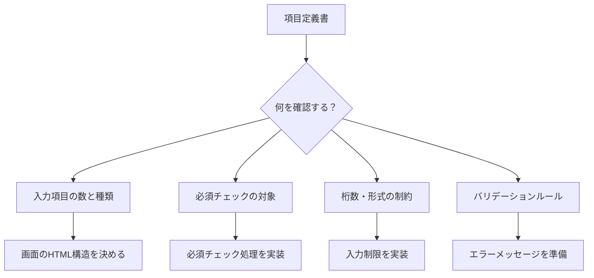
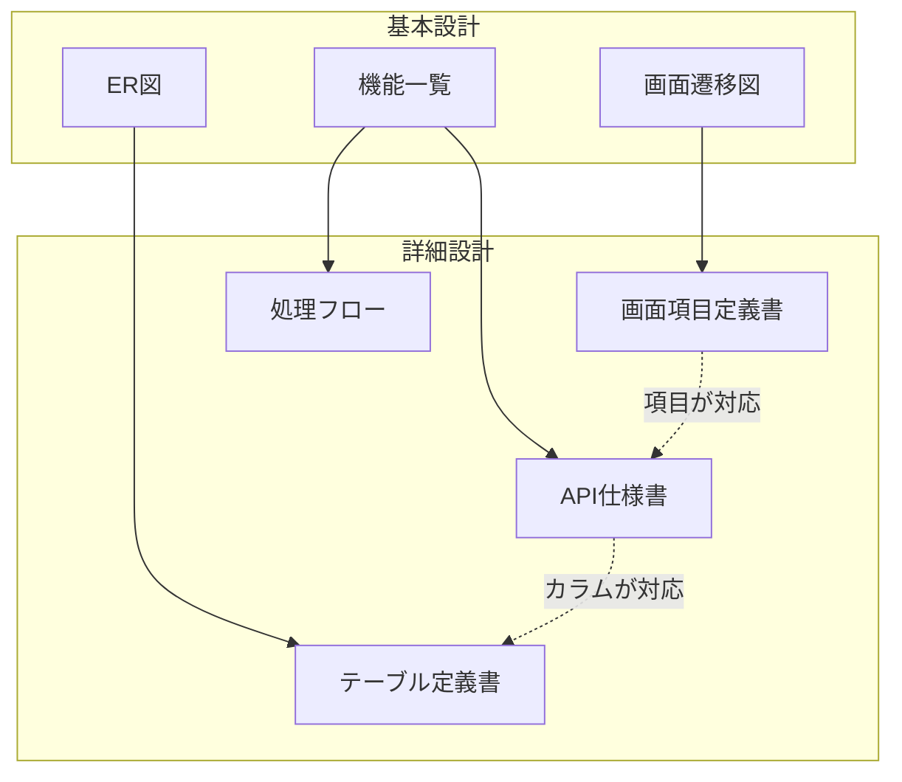
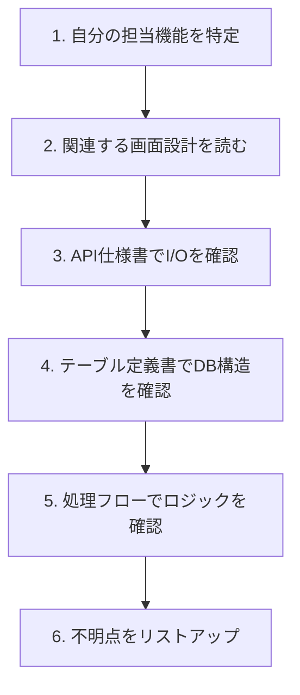

# 詳細設計書の読み方

詳細設計書は、システムの**内部仕様**を定義したドキュメントです。「どう作るか」「具体的にどう実装するか」を記述します。

## 詳細設計書とは

### 別名

詳細設計書は、現場によって以下のような呼び方をされることがあります。

- **内部設計書**
- **詳細設計**
- **DD（Detail Design）**
- **プログラム設計書**

### 役割


詳細設計書は、基本設計書と実装の間に位置し、**開発者が実装するために必要な具体的な情報**を記載します。

### 基本設計書との違い

| 観点 | 基本設計書 | 詳細設計書 |
|------|-----------|-----------|
| 別名 | 外部設計書 | **内部設計書** |
| 視点 | ユーザー視点（外部） | **開発者視点**（内部） |
| 内容 | 何を作るか | **どう作るか** |
| 対象者 | お客様、SE、PM | **開発者、PG** |
| 詳細度 | 概念的・俯瞰的 | **具体的・詳細** |

> [!important] なぜ詳細設計書が必要か？
> 基本設計書だけでは「どのテーブルにどんなカラムを作るか」「APIのリクエスト/レスポンスは何か」といった具体的な実装情報が分かりません。詳細設計書は、開発者が迷わず実装できるレベルまで詳細を記載します。

---

## 詳細設計書の構成要素

詳細設計書は、複数のドキュメントで構成されることが多いです。

| ドキュメント | 内容 | 詳細ページ |
|-------------|------|-----------|
| **画面設計書** | 画面レイアウト、項目定義、入力チェック | [[第3部_ドキュメントスキル/第3章_画面実装/000_画面設計書の読み方]] |
| **処理設計書** | 処理ロジック、条件分岐 | [[第3部_ドキュメントスキル/第4章_ロジック実装/000_処理設計書の読み方]] |
| **処理フロー図** | 処理の流れをフローチャートで表現 | [[第3部_ドキュメントスキル/第4章_ロジック実装/001_処理フロー図の読み方]] |
| **クラス図** | クラス構造と関係性 | [[第3部_ドキュメントスキル/第4章_ロジック実装/002_クラス図の読み方]] |
| **状態遷移図** | データや画面の状態変化 | [[第3部_ドキュメントスキル/第4章_ロジック実装/003_状態遷移図の読み方]] |
| **ER図** | テーブル間の関係 | [[第3部_ドキュメントスキル/第5章_データベース操作/000_ER図の読み方]] |
| **テーブル定義書** | カラム定義、型、制約 | [[第3部_ドキュメントスキル/第5章_データベース操作/001_テーブル定義書の読み方]] |
| **API仕様書** | エンドポイント、パラメータ、レスポンス | [[第3部_ドキュメントスキル/第6章_API連携/000_API仕様書の読み方]] |

> [!tip] すべてを暗記しなくていい
> 必要なときに該当するドキュメントを参照すればOKです。まずは「どんなドキュメントがあるか」を把握しましょう。

---

## 【実践】詳細設計書サンプルと読み方

ここからは、詳細設計書に含まれる代表的なドキュメントのサンプルを使って、具体的な読み方を解説します。

### サンプル1：画面項目定義書

画面項目定義書は、画面上の各項目の仕様を定義します。

#### 【サンプル】会員登録画面 項目定義書

| No | 項目ID | 項目名 | 種別 | 桁数 | 必須 | 初期値 | 説明 |
|----|--------|--------|------|------|------|--------|------|
| 1 | userId | ユーザーID | テキスト | 20 | ○ | - | 半角英数字、先頭は英字 |
| 2 | password | パスワード | パスワード | 20 | ○ | - | 8文字以上、英数字混合必須 |
| 3 | passwordConfirm | パスワード（確認） | パスワード | 20 | ○ | - | passwordと一致すること |
| 4 | lastName | 姓 | テキスト | 50 | ○ | - | 全角のみ |
| 5 | firstName | 名 | テキスト | 50 | ○ | - | 全角のみ |
| 6 | email | メールアドレス | メール | 256 | ○ | - | 形式チェック必須 |
| 7 | phone | 電話番号 | テキスト | 15 | - | - | ハイフンなし数字のみ |
| 8 | birthDate | 生年月日 | 日付 | - | - | - | yyyy/MM/dd形式 |
| 9 | gender | 性別 | ラジオ | - | - | 未選択 | 男性/女性/その他 |
| 10 | agree | 利用規約同意 | チェック | - | ○ | OFF | ONでないと登録不可 |

#### この設計書から読み取るべきこと



#### 【実践】この設計書から実装を考える

**ステップ1：HTMLの構造を考える**

```html
<!-- 項目定義書の「種別」を見てinputタイプを決める -->
<input type="text" id="userId" maxlength="20" required>      <!-- No.1 -->
<input type="password" id="password" maxlength="20" required> <!-- No.2 -->
<input type="email" id="email" maxlength="256" required>      <!-- No.6 -->
<input type="date" id="birthDate">                            <!-- No.8 -->
<input type="checkbox" id="agree" required>                   <!-- No.10 -->
```

**ステップ2：バリデーションを考える**

| 項目 | バリデーション内容 | 実装方法 |
|------|-------------------|---------|
| userId | 半角英数字、先頭英字 | 正規表現 `/^[a-zA-Z][a-zA-Z0-9]*$/` |
| password | 8文字以上、英数字混合 | 長さチェック + 正規表現 |
| passwordConfirm | passwordと一致 | 値の比較 |
| email | メール形式 | 正規表現またはライブラリ |
| phone | 数字のみ | 正規表現 `/^[0-9]*$/` |

> [!tip] 設計書を読むときのコツ
> 「必須」列を先にチェックして、必須項目の数を把握しましょう。必須項目が多いと、バリデーション処理も多くなります。

詳しくは [[第3部_ドキュメントスキル/第3章_画面実装/000_画面設計書の読み方|画面設計書の読み方]] を参照してください。

---

### サンプル2：API仕様書（IF仕様書）

API仕様書は、APIのリクエストとレスポンスを定義します。

#### 【サンプル】会員登録API仕様書

**■ 基本情報**

| 項目 | 内容 |
|------|------|
| API名 | 会員登録API |
| エンドポイント | POST /api/v1/users |
| 認証 | 不要 |
| Content-Type | application/json |

**■ リクエストパラメータ**

| No | パラメータ名 | 型 | 必須 | 桁数 | 説明 |
|----|-------------|-----|------|------|------|
| 1 | userId | String | ○ | 1-20 | ユーザーID |
| 2 | password | String | ○ | 8-20 | パスワード |
| 3 | lastName | String | ○ | 1-50 | 姓 |
| 4 | firstName | String | ○ | 1-50 | 名 |
| 5 | email | String | ○ | 1-256 | メールアドレス |
| 6 | phone | String | - | 0-15 | 電話番号 |
| 7 | birthDate | String | - | 10 | 生年月日（yyyy-MM-dd） |
| 8 | gender | String | - | - | 性別（MALE/FEMALE/OTHER） |

**■ リクエスト例**

```json
{
  "userId": "yamada123",
  "password": "Pass1234",
  "lastName": "山田",
  "firstName": "太郎",
  "email": "yamada@example.com",
  "phone": "09012345678",
  "birthDate": "1990-01-15",
  "gender": "MALE"
}
```

**■ レスポンス（正常時：201 Created）**

| No | パラメータ名 | 型 | 説明 |
|----|-------------|-----|------|
| 1 | id | Long | ユーザーの内部ID |
| 2 | userId | String | ユーザーID |
| 3 | createdAt | String | 登録日時（ISO8601） |

```json
{
  "id": 12345,
  "userId": "yamada123",
  "createdAt": "2025-01-15T10:30:00+09:00"
}
```

**■ エラーレスポンス**

| HTTPステータス | エラーコード | 説明 |
|---------------|-------------|------|
| 400 Bad Request | E001 | 必須項目が未入力 |
| 400 Bad Request | E002 | 形式エラー |
| 409 Conflict | E101 | ユーザーIDが既に存在 |
| 409 Conflict | E102 | メールアドレスが既に存在 |
| 500 Internal Server Error | E999 | システムエラー |

#### 【実践】この設計書から実装を考える

**ステップ1：リクエストクラスを作る**

```java
// API仕様書の「リクエストパラメータ」から作成
public class UserRegistrationRequest {
    @NotBlank
    @Size(min = 1, max = 20)
    private String userId;

    @NotBlank
    @Size(min = 8, max = 20)
    private String password;

    @NotBlank
    @Size(min = 1, max = 50)
    private String lastName;

    @NotBlank
    @Size(min = 1, max = 50)
    private String firstName;

    @NotBlank
    @Email
    @Size(max = 256)
    private String email;

    @Size(max = 15)
    private String phone;  // 必須でない

    private String birthDate;  // 必須でない

    private String gender;  // 必須でない
}
```

**ステップ2：レスポンスクラスを作る**

```java
// API仕様書の「レスポンス」から作成
public class UserRegistrationResponse {
    private Long id;
    private String userId;
    private String createdAt;
}
```

**ステップ3：エラーハンドリングを考える**

```java
// API仕様書の「エラーレスポンス」から作成
public class ApiError {
    private String errorCode;
    private String message;
}

// エラーコードを定数化
public enum ErrorCode {
    E001("必須項目が未入力です"),
    E002("入力形式が正しくありません"),
    E101("指定されたユーザーIDは既に使用されています"),
    E102("指定されたメールアドレスは既に使用されています"),
    E999("システムエラーが発生しました");

    private final String message;
    // ...
}
```

> [!important] API仕様書を読むときの鉄則
> 1. **必須項目を最初に確認**：バリデーションの範囲を把握
> 2. **型と桁数を確認**：DBカラムやバリデーションに直結
> 3. **エラーパターンを確認**：例外処理の設計に必要
> 4. **リクエスト例を動かしてみる**：Postman等でAPIを叩いて動作確認

詳しくは [[第3部_ドキュメントスキル/第6章_API連携/000_API仕様書の読み方]] を参照してください。

---

### サンプル3：テーブル定義書

テーブル定義書は、データベースのテーブル構造を定義します。

#### 【サンプル】ユーザーテーブル定義

**■ テーブル基本情報**

| 項目 | 内容 |
|------|------|
| テーブル名（物理） | m_user |
| テーブル名（論理） | ユーザーマスタ |
| 説明 | 会員情報を管理するマスタテーブル |

**■ カラム定義**

| No | カラム名（物理） | カラム名（論理） | 型 | 桁数 | NULL | PK | デフォルト | 説明 |
|----|-----------------|-----------------|-----|------|------|-----|-----------|------|
| 1 | id | ID | BIGINT | - | × | ○ | AUTO | サロゲートキー |
| 2 | user_id | ユーザーID | VARCHAR | 20 | × | - | - | ログインID |
| 3 | password_hash | パスワードハッシュ | VARCHAR | 256 | × | - | - | BCryptハッシュ |
| 4 | last_name | 姓 | VARCHAR | 50 | × | - | - | - |
| 5 | first_name | 名 | VARCHAR | 50 | × | - | - | - |
| 6 | email | メールアドレス | VARCHAR | 256 | × | - | - | - |
| 7 | phone | 電話番号 | VARCHAR | 15 | ○ | - | NULL | - |
| 8 | birth_date | 生年月日 | DATE | - | ○ | - | NULL | - |
| 9 | gender | 性別 | VARCHAR | 10 | ○ | - | NULL | MALE/FEMALE/OTHER |
| 10 | status | ステータス | VARCHAR | 20 | × | - | ACTIVE | ACTIVE/INACTIVE/DELETED |
| 11 | created_at | 作成日時 | TIMESTAMP | - | × | - | CURRENT_TIMESTAMP | - |
| 12 | updated_at | 更新日時 | TIMESTAMP | - | × | - | CURRENT_TIMESTAMP | 更新時自動更新 |

**■ インデックス**

| インデックス名 | カラム | ユニーク | 説明 |
|---------------|--------|----------|------|
| idx_user_id | user_id | ○ | ユーザーID検索用 |
| idx_email | email | ○ | メール検索用 |
| idx_status | status | × | ステータス絞り込み用 |

#### この設計書から読み取るべきこと

| 確認ポイント | 読み取る内容 | 実装への影響 |
|-------------|-------------|-------------|
| PK列 | どのカラムが主キーか | エンティティの@Id設定 |
| NULL可否 | 必須カラムはどれか | NOT NULL制約、バリデーション |
| 型と桁数 | データ型と最大長 | エンティティのフィールド型 |
| デフォルト値 | 初期値は何か | INSERT時の値設定 |
| ユニークインデックス | 一意制約があるカラム | 重複チェック処理が必要 |

#### 【実践】この設計書からエンティティを作る

```java
@Entity
@Table(name = "m_user")
public class User {

    @Id
    @GeneratedValue(strategy = GenerationType.IDENTITY)
    private Long id;  // No.1: PK, AUTO

    @Column(name = "user_id", nullable = false, length = 20)
    private String userId;  // No.2: NOT NULL, VARCHAR(20)

    @Column(name = "password_hash", nullable = false, length = 256)
    private String passwordHash;  // No.3

    @Column(name = "last_name", nullable = false, length = 50)
    private String lastName;  // No.4

    @Column(name = "first_name", nullable = false, length = 50)
    private String firstName;  // No.5

    @Column(nullable = false, length = 256)
    private String email;  // No.6

    @Column(length = 15)
    private String phone;  // No.7: NULL許可

    @Column(name = "birth_date")
    private LocalDate birthDate;  // No.8: NULL許可

    @Column(length = 10)
    private String gender;  // No.9: NULL許可

    @Column(nullable = false, length = 20)
    private String status = "ACTIVE";  // No.10: デフォルト値

    @Column(name = "created_at", nullable = false)
    private LocalDateTime createdAt;  // No.11

    @Column(name = "updated_at", nullable = false)
    private LocalDateTime updatedAt;  // No.12
}
```

> [!tip] テーブル定義書とAPI仕様書の対応
> - テーブル定義書の「物理名」はスネークケース（user_id）
> - API仕様書の「パラメータ名」はキャメルケース（userId）
> - 変換が必要なことを意識して実装しましょう

詳しくは [[第3部_ドキュメントスキル/第5章_データベース操作/001_テーブル定義書の読み方]] を参照してください。

---

## 設計書間の関係を理解する

詳細設計書は複数のドキュメントで構成され、それぞれが関連しています。



### 設計書を横断的に読む

1つの機能を実装するには、複数の設計書を横断的に読む必要があります。

**【例】会員登録機能を実装する場合**

| 順番 | 読む設計書 | 確認すること |
|------|-----------|-------------|
| 1 | 機能一覧 | 機能の概要、優先度 |
| 2 | 画面遷移図 | どこから来て、どこへ行くか |
| 3 | 画面項目定義書 | 入力項目と制約 |
| 4 | API仕様書 | リクエスト/レスポンス |
| 5 | テーブル定義書 | 保存するデータ構造 |
| 6 | 処理フロー | 処理の流れ |

---

## 詳細設計書を読む流れ



---

## 読むときのチェックリスト

### 読む前に確認すること

- [ ] **自分の担当機能**を明確にしたか
- [ ] **関連する設計書一式**を入手したか
- [ ] **設計書のバージョン**が最新か確認したか
- [ ] **不明点をメモする準備**ができているか

### 読んだ後に確認すること

- [ ] **入力項目と出力項目**を把握したか
- [ ] **必須項目とバリデーション**を把握したか
- [ ] **エラーパターン**を把握したか
- [ ] **DBのテーブル構造**を把握したか
- [ ] **設計書間の矛盾**はなかったか
- [ ] **不明点をリストアップ**したか

---

## 設計書間の矛盾に注意

設計書間で矛盾がある場合は、確認してから作業します。

| 矛盾の例 | 対応 |
|---------|------|
| 画面設計書の項目とAPI仕様書のパラメータが違う | どちらが正しいか確認 |
| API仕様書のカラム名とテーブル定義書が違う | どちらに合わせるか確認 |
| 機能一覧にある機能の詳細設計がない | 詳細設計の追加が必要か確認 |

> [!important] 設計書は「約束」
> 設計書は開発チーム全体の「約束」です。設計と違う実装をすると、後工程（テスト、運用）で問題が発生します。疑問があれば、実装前に確認しましょう。

---

## よくある疑問

### Q: 詳細設計書がない/古い場合は？

**A: コードから設計を読み取る必要があります。**

- ない場合：コードがドキュメント代わり（リバースエンジニアリング）
- 古い場合：現状のコードと照らし合わせ、差分を確認

### Q: 設計書通りに実装すべき？

**A: 基本的には設計書通りに実装します。**

問題がある場合は、設計者に相談して設計を変更します。勝手に変更して実装すると、テスト工程で問題になります。

### Q: 設計書のどこから読めばいい？

**A: 「自分が実装する機能」から逆算して読みます。**

1. 機能一覧で自分の担当を確認
2. その機能に関連する画面設計、API設計、DB設計を読む
3. 分からない部分は基本設計に戻って確認

---

## 1年目エンジニアとしての関わり方

| 場面 | やること |
|------|---------|
| 実装前 | 詳細設計書で実装内容を確認 |
| 実装中 | 設計書と照らし合わせて実装 |
| レビュー時 | 設計書通りか確認される |
| 不明点があるとき | 設計書の該当箇所を示して質問 |

---

## 関連ドキュメント

- [[第3部_ドキュメントスキル/第1章_読み書きの基本/000_設計書・仕様書の読み方]] - 設計書全般の読み方
- [[第3部_ドキュメントスキル/第2章_設計理解/001_基本設計書の読み方|基本設計書の読み方]] - 基本設計書の読み方
- [[第3部_ドキュメントスキル/第3章_画面実装/000_画面設計書の読み方|画面設計書の読み方]] - 画面設計の詳細
- [[第3部_ドキュメントスキル/第4章_ロジック実装/000_処理設計書の読み方]] - 処理設計の詳細
- [[第3部_ドキュメントスキル/第5章_データベース操作/001_テーブル定義書の読み方]] - DB設計の詳細
- [[第3部_ドキュメントスキル/第6章_API連携/000_API仕様書の読み方]] - API設計の詳細
