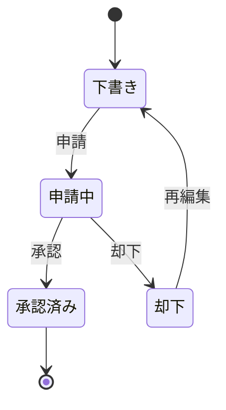
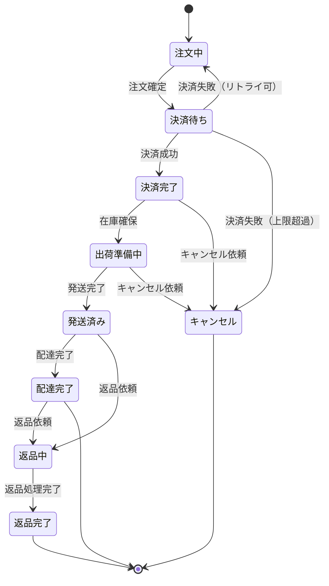
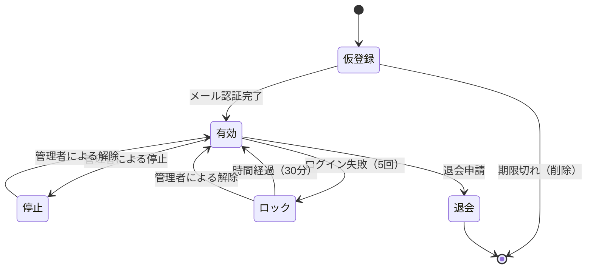
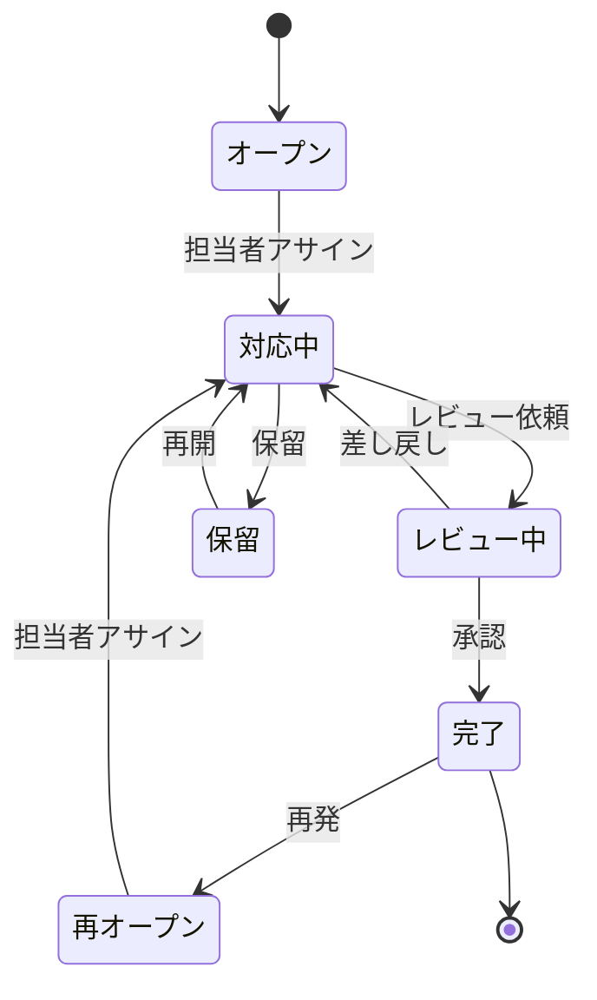

# 状態遷移図の読み方

状態遷移図は、オブジェクトの状態とその変化を表した図です。ステータス管理やワークフローの理解に使います。

## 状態遷移図とは

### 役割

- **状態**（オブジェクトの状況）を表現
- **遷移**（状態の変化）を表現
- **トリガー**（遷移のきっかけ）を明示
- 許可される状態変化を定義

### いつ使うか

| 場面 | 使い方 |
|------|--------|
| ステータス管理実装時 | 許可される遷移の確認 |
| ワークフロー理解時 | 業務の流れを把握 |
| テスト時 | 全パターンの確認 |
| 障害調査時 | 不正な状態遷移の特定 |

## 状態遷移図の基本要素

### 基本記号

| 記号 | 名称 | 意味 |
|------|------|------|
| ● | 開始状態 | 最初の状態 |
| ◎ | 終了状態 | 最後の状態 |
| □（角丸） | 状態 | オブジェクトの状態 |
| → | 遷移 | 状態の変化 |
| ラベル | トリガー | 遷移のきっかけ |

### 読み方の基本



- **状態**：「下書き」「申請中」「承認済み」「却下」
- **遷移**：矢印で表現
- **トリガー**：「申請」「承認」「却下」「再編集」

---

## 【サンプル】状態遷移図の実例

### ECサイトの注文ステータス



### 状態遷移表

状態遷移図を表形式で表現したものです。

| 現在の状態 | トリガー | 次の状態 | 備考 |
|-----------|---------|---------|------|
| - | 注文作成 | 注文中 | 初期状態 |
| 注文中 | 注文確定 | 決済待ち | - |
| 決済待ち | 決済成功 | 決済完了 | - |
| 決済待ち | 決済失敗（リトライ可） | 注文中 | 3回まで |
| 決済待ち | 決済失敗（上限超過） | キャンセル | 自動キャンセル |
| 決済完了 | 在庫確保 | 出荷準備中 | - |
| 決済完了 | キャンセル依頼 | キャンセル | 返金処理 |
| 出荷準備中 | 発送完了 | 発送済み | - |
| 出荷準備中 | キャンセル依頼 | キャンセル | 返金処理 |
| 発送済み | 配達完了 | 配達完了 | 終了状態 |
| 発送済み | 返品依頼 | 返品中 | - |
| 配達完了 | 返品依頼 | 返品中 | 14日以内 |
| 返品中 | 返品処理完了 | 返品完了 | 終了状態 |

---

### ユーザーアカウントの状態



### 読み解き方

1. **開始**：ユーザー登録で「仮登録」状態になる
2. **仮登録→有効**：メール認証が完了すると「有効」になる
3. **有効→停止**：管理者が停止処理を行うと「停止」になる
4. **有効→ロック**：ログイン失敗が5回続くと「ロック」になる
5. **有効→退会**：退会申請で「退会」状態になり終了

---

### チケット（課題）の状態



---

## 実装での活用

### 状態遷移をコードで表現する

```java
// Java: Enumで状態を定義
public enum OrderStatus {
    PENDING,      // 注文中
    PAYMENT_WAIT, // 決済待ち
    PAID,         // 決済完了
    PREPARING,    // 出荷準備中
    SHIPPED,      // 発送済み
    DELIVERED,    // 配達完了
    CANCELLED,    // キャンセル
    RETURNING,    // 返品中
    RETURNED      // 返品完了
}
```

### 遷移可否のチェック

```java
// 許可される遷移かチェック
public boolean canTransitionTo(OrderStatus from, OrderStatus to) {
    switch (from) {
        case PENDING:
            return to == PAYMENT_WAIT;
        case PAYMENT_WAIT:
            return to == PAID || to == PENDING || to == CANCELLED;
        case PAID:
            return to == PREPARING || to == CANCELLED;
        case PREPARING:
            return to == SHIPPED || to == CANCELLED;
        case SHIPPED:
            return to == DELIVERED || to == RETURNING;
        case DELIVERED:
            return to == RETURNING;
        case RETURNING:
            return to == RETURNED;
        default:
            return false;
    }
}
```

### DBでの状態管理

```sql
-- ordersテーブルのstatus更新
UPDATE orders
SET status = 3,  -- 出荷準備中
    updated_at = NOW()
WHERE id = 12345
  AND status = 2;  -- 決済完了からのみ遷移可能

-- 影響行数が0なら不正な遷移
```

---

## 状態遷移図を読むときのポイント

### 1. 開始状態を確認する

- どの状態から始まるか
- 初期状態への遷移条件は何か

### 2. 終了状態を確認する

- どの状態で終わるか
- 終了状態は複数あることも（正常終了、異常終了など）

### 3. すべての遷移を確認する

- どの状態からどの状態へ遷移できるか
- 遷移できない組み合わせは何か

### 4. トリガーを確認する

- 何が起きると遷移するか
- ユーザー操作か、システム処理か、時間経過か

### 5. 逆方向の遷移を確認する

- 状態を戻せるか
- 戻せない遷移は何か（不可逆な遷移）

## 状態遷移のテストパターン

### 正常系

- すべての正常な遷移パターンをテスト
- 開始→...→終了までの一連の流れ

### 異常系

- 許可されていない遷移を試みる
- エラーになることを確認

### 境界

- 終了状態からの遷移（不可であること）
- 特定条件下での遷移（時間経過、回数制限など）

## よくある疑問

### Q: 状態遷移図とフローチャートの違いは？

- **フローチャート**：処理の流れ（手順）
- **状態遷移図**：オブジェクトの状態変化

フローチャートは「何をするか」、状態遷移図は「何になるか」を表現します。

### Q: 状態が増えすぎたらどうする？

状態をグループ化（サブステート）したり、状態遷移表で整理します。複雑な場合は設計者に相談しましょう。

### Q: 同じ状態に戻る遷移は？

ありえます。例えば「決済失敗→注文中に戻る（リトライ可）」のようなケース。

## 状態遷移図でよくある落とし穴

| 落とし穴 | 対策 |
|---------|------|
| 遷移できない組み合わせを実装してしまう | 遷移表で全パターンを確認 |
| 終了状態から遷移してしまう | 終了状態をチェック |
| 不正な状態を許容してしまう | 遷移可否チェックを必ず実装 |
| 同時に複数の遷移が起きる | 排他制御を検討 |

## 関連ドキュメント

- [[第3部_ドキュメントスキル/第1章_読み書きの基本/000_設計書・仕様書の読み方]] - 設計書全般の読み方
- [[第3部_ドキュメントスキル/第4章_ロジック実装/001_処理フロー図の読み方]] - フローチャートなどの読み方
- [[第3部_ドキュメントスキル/第5章_データベース操作/001_テーブル定義書の読み方]] - DBでのステータス管理
