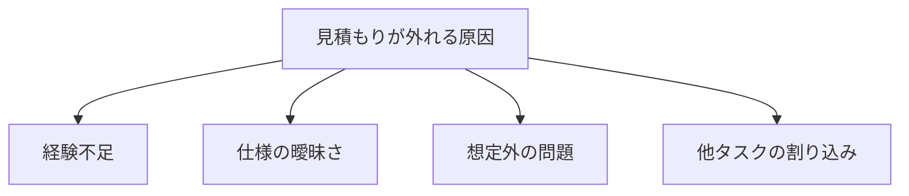
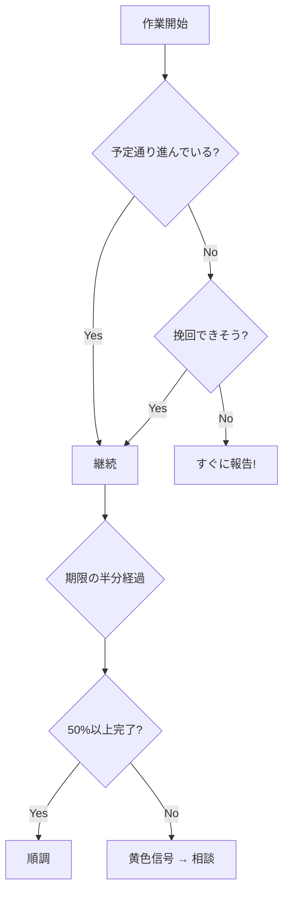

# 作業の依頼を受けたら

上司や先輩から作業を依頼されたとき、どのように進めるかを学びます。

## 依頼を受けたときの流れ

```
依頼を受ける → 内容を理解する → 計画を立てる → 作業を進める → 完了報告する
```

## Step 1：依頼内容を正確に理解する

### 確認すべきこと

| 項目 | 確認内容 |
|------|---------|
| 何をするか | 具体的な作業内容 |
| なぜやるか | 作業の目的・背景 |
| いつまでに | 期限 |
| どこまでやるか | 完了条件、成果物 |
| 誰に報告するか | 報告先、確認者 |

### 理解を確認する

依頼を受けたら、自分の理解を確認します。

```
「〇〇の画面で、△△のバリデーションを追加する作業ですね。
期限は金曜日で、完了したら□□さんにレビュー依頼すればよいですか？」
```

### 分からないことは質問する

- 曖昧なまま進めない
- 「分かりました」と言う前に確認
- 質問は早めにする

## Step 2：タスクを細分化する

### 大きな作業を小さく分ける

**例：バリデーション機能の追加**

1. 仕様を確認する
2. 関連するコードを読む
3. 実装する
4. 動作確認する
5. テストコードを書く
6. レビュー依頼する

### 細分化のコツ

- 1タスク = 数時間〜半日程度
- 完了が明確に判断できる単位で分ける
- 前後の依存関係を整理する

## Step 3：不明点・課題を洗い出す

### 作業前に確認する

- 仕様で不明な点はないか
- 技術的に分からないことはないか
- 他の作業との依存関係はないか
- 必要なリソースは揃っているか

### 早めに相談する

- 不明点は曖昧なままにしない
- 「調べても分かりませんでした」で相談OK
- 課題が見つかったら早めに報告

## Step 4：計画を立てる

### 見積もりを出す

各タスクにかかる時間を見積もります。

| タスク | 見積もり |
|--------|---------|
| 仕様確認 | 1時間 |
| コード読解 | 2時間 |
| 実装 | 4時間 |
| 動作確認 | 1時間 |
| テスト作成 | 2時間 |
| レビュー対応 | 2時間 |
| **合計** | **12時間** |

### 見積もりのコツ

- 慣れないうちは多めに見積もる
- 予期せぬ問題のバッファを入れる
- 過去の似た作業を参考にする

### 見積もりの詳細解説

**なぜ見積もりが難しいのか**



**見積もりの方法**

| 方法 | やり方 | 適した場面 |
|------|--------|-----------|
| **類推法** | 似た作業にかかった時間を参考にする | 過去に似た経験がある場合 |
| **分解法** | 細かく分解して積み上げる | 初めての作業 |
| **3点見積もり** | 楽観・標準・悲観の3パターンで見積もる | 不確実性が高い場合 |

**初心者向け：見積もりの目安**

| 作業の種類 | 想定時間の目安 | 備考 |
|-----------|---------------|------|
| 小さなバグ修正 | 2〜4時間 | 原因調査込み |
| 既存機能の修正 | 半日〜1日 | コード理解込み |
| 新規機能追加（小） | 1〜2日 | テスト込み |
| 新規機能追加（中） | 3〜5日 | 設計込み |

> **ポイント**：1年目は**見積もりの1.5〜2倍**を実績として考えましょう。経験を積むと精度が上がります。

### 「間に合わない」と判断する基準

以下のような状況になったら、すぐに報告・相談しましょう。



**具体的な判断基準**：

| 状況 | 判断 | アクション |
|------|------|-----------|
| 期限の半分で50%未満 | 遅れそう | 相談する |
| 想定外の問題で1日以上止まっている | 危険 | すぐ報告 |
| 仕様確認待ちで進められない | ブロック | 報告して対応を仰ぐ |
| 他の急ぎタスクが入った | 調整必要 | 優先度を確認 |

**報告の例**：
```
〇〇の作業について相談です。

現在、期限まで残り2日ですが、進捗は40%程度です。
△△の部分で想定より時間がかかっています。

このまま進めると、2日程度の遅れになりそうです。
対応として以下が考えられますが、どうしましょうか？

A案：期限を延長する
B案：スコープを縮小する（□□を次フェーズに回す）
C案：他メンバーにヘルプを依頼する
```

### スケジュールを確認する

見積もりと期限を比較して、実現可能か確認します。

- 間に合わなそうなら早めに相談
- 「無理です」ではなく「〇日あれば可能です」

## Step 5：作業を進める

### 段階的に進める

- 一度に全部やろうとしない
- 1タスクずつ完了させる
- こまめに動作確認する

### 進捗を把握する

- 計画と実績を比較する
- 遅れそうなら早めに報告
- 予定より早く終わっても報告

### 困ったら相談する

- 15〜30分調べても解決しなければ相談
- 「ここまで試しました」と伝える
- 一人で抱え込まない

## Step 6：完了報告する

### 報告の内容

```
〇〇の作業が完了しました。

【完了内容】
- バリデーション機能を追加
- 単体テストを作成

【確認事項】
- △△の仕様について、□□と解釈して実装しました

【次のアクション】
- レビュー依頼済み
```

### 報告のタイミング

- 作業が完了したとき
- 作業が予定より遅れそうなとき
- 問題が発生したとき
- 確認が必要なことがあるとき

### 進捗報告のテンプレート

すぐに使えるテンプレートを用意しました。

**日次の進捗報告（チャット向け）**
```
【進捗報告】〇〇機能の実装

■ 今日やったこと
- △△の実装完了
- □□のテスト作成

■ 明日やること
- ◇◇の実装
- レビュー依頼

■ 課題・相談
- 特になし（または：××で確認したいことがあります）

■ 進捗
全体の約60%完了、予定通り
```

**週次の進捗報告**
```
【週次報告】〇〇機能の実装（11/20〜11/24）

■ 今週の成果
- 機能Aの実装完了
- 機能Bの実装 70%完了
- 機能Aのテスト作成

■ 来週の予定
- 機能Bの残り30%を完了
- 機能Bのテスト作成
- レビュー対応

■ 進捗状況
計画比：予定通り / やや遅れ / 遅れ
完了予定：11/30（当初予定通り）

■ 課題・リスク
- △△の仕様確認が必要（□□さんに確認中）
```

**遅延報告**
```
【遅延報告】〇〇機能の実装

■ 現状
期限：11/30
進捗：全体の40%（予定では70%のはず）

■ 遅延の理由
- 既存コードの調査に想定より時間がかかった（+2日）
- △△の仕様確認で1日待ち状態だった

■ 完了見込み
現在のペースだと 12/5 頃になりそうです

■ 対応案
A案：期限を12/5に延長
B案：□□の機能を次フェーズに回す（11/30に間に合う）
C案：◇◇さんにヘルプを依頼

ご判断をお願いします。
```

## よくある失敗と対策

| 失敗 | 対策 |
|------|------|
| 依頼内容を誤解していた | 最初に理解を確認する |
| 期限に間に合わなかった | 早めに見積もりを出し、遅れそうなら報告 |
| 完了したのに報告していない | 完了したらすぐ報告 |
| 途中で詰まって時間が過ぎた | 困ったら早めに相談 |

## まとめ

作業依頼を受けたら：

1. **内容を正確に理解**する（確認する）
2. **タスクを細分化**する
3. **不明点を洗い出し**て解決する
4. **計画を立てる**（見積もり・スケジュール）
5. **段階的に作業**を進める
6. **完了報告**する

「報告・連絡・相談」を忘れずに！
