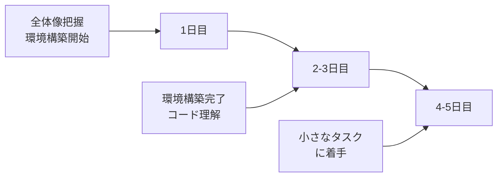

# 案件に入ったら最初にやること

新しい案件（プロジェクト）に参加したとき、最初にやるべきことを学びます。

## 最初の1週間でやること



### 最初の1週間タイムライン（サンプル）

| 日 | やること | 完了の目安 |
|----|---------|-----------|
| **1日目** | キックオフ、自己紹介、環境構築開始 | 開発PCが届く、チャットに参加 |
| **2日目** | 環境構築、ドキュメント確認 | ローカルでアプリが動く |
| **3日目** | コードベースを眺める、質問リスト作成 | 主要なファイルの場所を把握 |
| **4日目** | 小さなタスクをもらう、着手 | 既存コードを参考に修正開始 |
| **5日目** | タスク続き、レビュー依頼 | 最初のPRを出せればベスト |

> **ポイント**：1週間で完璧に理解する必要はありません。「分からないことを整理して質問できる状態」になればOKです。

### 1. プロジェクトの全体像を把握する

#### 確認すること

| 項目 | 確認内容 |
|------|---------|
| 目的 | 何のためのシステムか、誰が使うのか |
| 規模 | どのくらいの規模か、チーム構成は |
| スケジュール | いつまでに何をするのか |
| 自分の役割 | 何を担当するのか |

#### 確認方法

- プロジェクト計画書を読む
- 上司や先輩に聞く
- キックオフ資料を確認する

### 2. 技術スタックを理解する

#### 確認すること

| 項目 | 例 |
|------|-----|
| プログラミング言語 | Java、C#、JavaScript など |
| フレームワーク | Spring、.NET、React など |
| データベース | MySQL、PostgreSQL、SQL Server など |
| バージョン管理 | Git、SVN など |
| 開発ツール | Visual Studio、IntelliJ など |

#### やること

- 使ったことがない技術があれば、基礎を調べる
- 公式ドキュメントのGetting Startedを試す
- 先輩におすすめの学習リソースを聞く

### 3. 開発環境を構築する

#### 手順

1. 環境構築手順書を入手する
2. 手順書に従って環境を構築する
3. サンプルを動かして動作確認する
4. 困ったら先輩に聞く

#### 注意点

- 手順書通りにやってもうまくいかないことがある
- エラーメッセージをメモして質問する
- 自分で解決できたら手順書に追記する

#### 環境構築でよくあるエラーと対処法

| エラー | 原因の可能性 | 対処法 |
|--------|-------------|--------|
| **コマンドが見つからない** | パスが通っていない | 環境変数を確認、ターミナル再起動 |
| **ポートが使用中** | 他のアプリが使っている | 該当アプリを終了、または別ポートを指定 |
| **権限エラー** | 管理者権限が必要 | 管理者として実行、または権限を付与 |
| **依存パッケージのエラー** | バージョンの不一致 | 手順書のバージョンを確認、キャッシュをクリア |
| **DBに接続できない** | 設定ミス、DB未起動 | 接続情報を確認、DBサービスを起動 |

**環境構築で詰まったときの相談テンプレート**：
```
環境構築で詰まっています。

■ やろうとしていること
手順書の「〇〇をインストール」の手順

■ 実行したコマンド
npm install

■ エラーメッセージ
（エラー全文をコピペ）

■ 試したこと
1. キャッシュをクリアした → 変わらず
2. Node.jsのバージョンを確認 → v18.0.0

■ 環境
OS：Windows 11
Node.js：v18.0.0

何か確認すべき点はありますか？
```

> **ポイント**：環境構築は1年目でなくても詰まることがあります。**半日〜1日**を目安に、解決しなければ相談しましょう。

### 4. コードベースを理解する

#### 確認すること

- ディレクトリ構成
- 主要なクラス・ファイルの役割
- 処理の流れ（エントリーポイントから追う）

#### やり方

1. まずREADMEを読む
2. ディレクトリ構成を眺める
3. 簡単な機能を1つ選んで処理を追う
4. デバッガで動かしながら理解する

### 5. ドキュメントを確認する

#### 確認すべきドキュメント

| ドキュメント | 内容 |
|-------------|------|
| 設計書 | システムの設計 |
| コーディング規約 | コードの書き方ルール |
| 開発ルール | ブランチ戦略、レビュールールなど |
| 議事録 | 過去の決定事項 |

#### 置き場所を確認

- 共有フォルダ
- Wiki
- チケット管理ツール
- チャットツール

## コミュニケーションの準備

### チームメンバーを把握する

- 誰が何を担当しているか
- 困ったときに誰に聞けばいいか
- 報告・相談の相手は誰か

### ツールを使えるようにする

| 種類 | 例 |
|------|-----|
| チャット | Slack、Teams、Chatwork |
| チケット管理 | Jira、Backlog、Redmine |
| ドキュメント | Confluence、Notion、SharePoint |
| 会議 | Zoom、Teams、Meet |

### 定例会議を把握する

- 朝会（デイリースクラム）
- 週次ミーティング
- レビュー会

## 最初の1ヶ月でやること

### 小さなタスクから始める

- いきなり大きなタスクは担当しない
- 簡単なバグ修正や小さな機能追加から
- 分からないことは聞きながら進める

### 質問しやすい関係を作る

- 積極的に挨拶・声かけをする
- 教えてもらったらお礼を言う
- 自分が学んだことを共有する

### メモを取る習慣をつける

- プロジェクト固有の用語
- 決まりごと、ルール
- 困ったことと解決方法

## 質問リストのテンプレート

案件に入ったら、以下のテンプレートを使って質問事項を整理しましょう。

```markdown
# 〇〇プロジェクト 質問リスト

## 環境・ツール
- [ ] 開発環境の構築手順書はどこにありますか？
- [ ] 使用するIDE/エディタに指定はありますか？
- [ ] VPN接続は必要ですか？

## コミュニケーション
- [ ] チャットツールは何を使っていますか？
- [ ] 定例会議はいつありますか？
- [ ] 日報・週報のフォーマットはありますか？

## 開発ルール
- [ ] コーディング規約はどこにありますか？
- [ ] ブランチの命名規則はありますか？
- [ ] レビューの依頼方法は？

## タスク管理
- [ ] チケット管理ツールは何ですか？
- [ ] タスクのアサイン方法は？
- [ ] 進捗報告の頻度・方法は？

## 技術面
- [ ] 参考になる既存のコードはどれですか？
- [ ] テストの書き方に決まりはありますか？
- [ ] デプロイの方法は？

## その他
- [ ] 困ったときは誰に相談すればいいですか？
- [ ] 勤怠の報告方法は？
- [ ] 経費精算のルールは？
```

> **使い方**：このリストを最初に確認し、分かったことはチェック、分からないことは質問しましょう。

## よくある失敗と対策

| 失敗 | 対策 |
|------|------|
| 環境構築で1週間以上かかる | 早めに相談する、期限を決める |
| ドキュメントを読まずに作業開始 | まず関連ドキュメントを確認 |
| 分からないまま作業を進める | 疑問点は早めに質問 |
| 自分の担当範囲が不明確 | 最初に確認する |

## まとめ

案件に入ったら、まず以下を確認しましょう。

1. **プロジェクトの全体像**：何を作るのか、自分の役割は何か
2. **技術スタック**：使う技術、学ぶべきこと
3. **開発環境**：動く環境を作る
4. **コードベース**：既存のコードを理解する
5. **ドキュメント**：設計書、ルールの置き場所

焦らず、1つずつ確認していきましょう。
