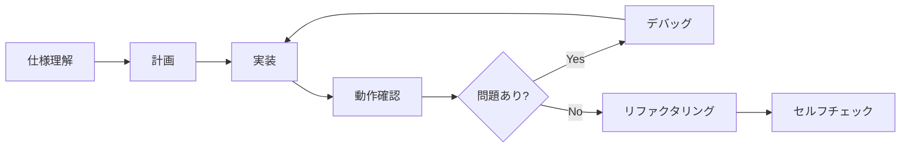
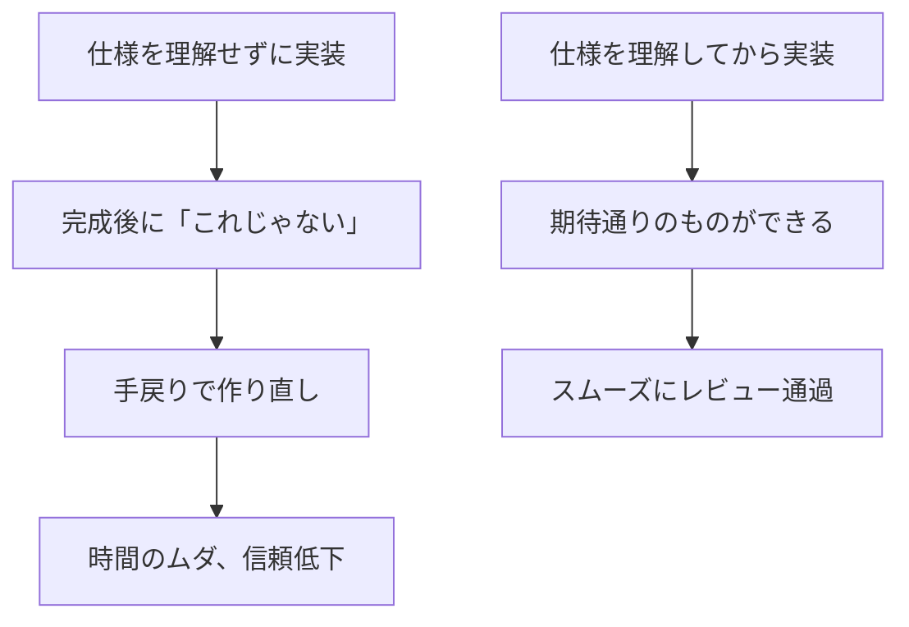
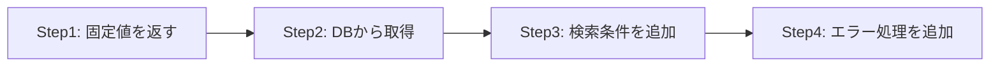
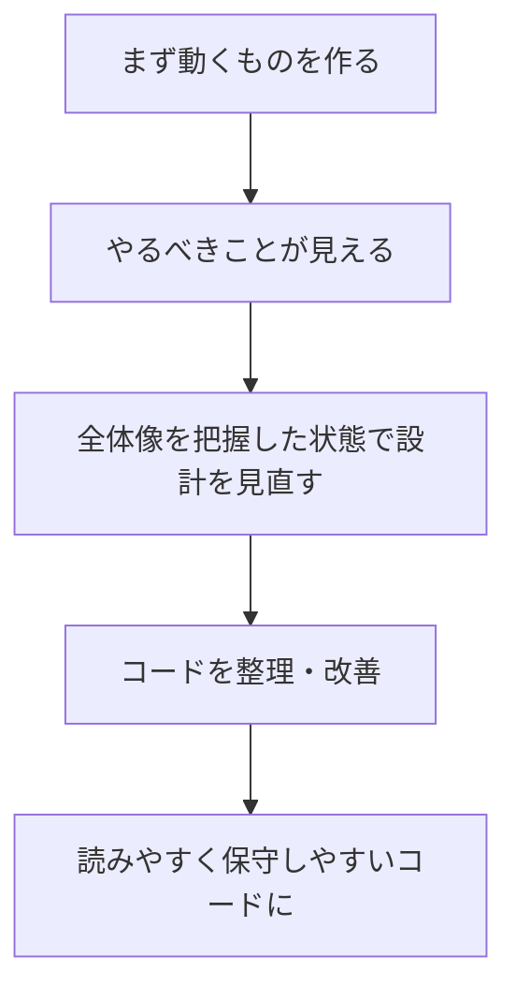
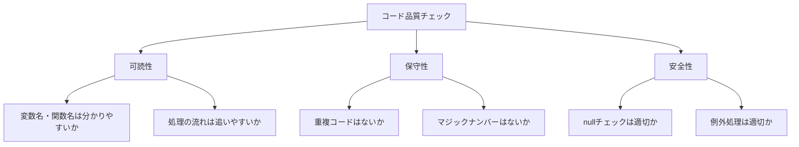

# 実装の進め方

設計書に基づいて実装（コーディング）を行う際の進め方を学びます。

## 実装の流れ



## Step 1：仕様を理解する

### なぜ仕様理解が重要なのか



**実装前に仕様を理解することで**：
- 「作ったけど違った」という手戻りを防げる
- 途中で迷わず実装を進められる
- レビューで「仕様と違う」と指摘されない

### 確認すること

- 何を実装するのか
- どう動くべきか（入力・出力・振る舞い）
- 関連する機能は何か
- 制約や注意点はあるか

### 設計書の読み方

1. まず全体を眺める
2. 自分の担当範囲を特定
3. 詳細を読み込む
4. 不明点をメモする

### 不明点は確認する

設計書を読んで不明な点があれば、実装前に確認します。

- 曖昧な仕様はそのまま実装しない
- 「〇〇という理解で合っていますか？」と確認

> **なぜ確認が必要？**：曖昧な仕様を自分の解釈で実装すると、高確率で「そういう意味じゃなかった」となります。**確認に5分かけることで、作り直しの5時間を防げます**。

## Step 2：実装計画を立てる

### なぜ計画が必要なのか

計画なしにいきなりコードを書き始めると：
- どこから手をつけていいか分からなくなる
- 途中で「あれも必要だった」と気づいて混乱する
- 見積もりが立てられず、進捗報告ができない

**計画を立てることで**：
- 全体像が見えて迷わない
- 抜け漏れを事前に発見できる
- 「今日はここまで」と区切りがつけられる

### タスクを分解する

実装する内容を小さなタスクに分解します。

**例：ユーザー登録機能**
1. 入力フォームの作成
2. バリデーション処理
3. データベースへの登録処理
4. 完了画面への遷移
5. エラー時の処理

> **なぜ分解する？**：大きな塊のまま取り組むと「終わりが見えない」感覚になります。小さく分解すれば「1つ終わった」という達成感を得ながら進められます。

### 実装順序を決める

- 依存関係を考慮して順序を決める
- 単純な部分から始める
- テストしやすい単位で進める

## Step 3：実装する

### 実装の進め方

#### 1. 小さく始める

- 最初から完璧を目指さない
- まず動くものを作る
- 少しずつ改善する

**具体例：ユーザー検索機能の実装**



**Step1：まず動く骨格を作る（固定値を返す）**
```java
public User findUser(String userId) {
    // TODO: 後でDBから取得する
    User user = new User();
    user.setId("001");
    user.setName("テストユーザー");
    return user;
}
```
→ この時点で呼び出し元の画面が動くことを確認

**Step2：本来の処理を実装**
```java
public User findUser(String userId) {
    return userRepository.findById(userId);
}
```
→ DBから正しく取得できることを確認

**Step3：検索条件・バリデーションを追加**
```java
public User findUser(String userId) {
    if (userId == null || userId.isEmpty()) {
        throw new IllegalArgumentException("userIdは必須です");
    }
    return userRepository.findById(userId);
}
```

**Step4：エラー処理を追加**
```java
public User findUser(String userId) {
    if (userId == null || userId.isEmpty()) {
        throw new IllegalArgumentException("userIdは必須です");
    }
    User user = userRepository.findById(userId);
    if (user == null) {
        throw new UserNotFoundException("ユーザーが見つかりません: " + userId);
    }
    return user;
}
```

> **ポイント**：一気に完成形を書こうとすると、どこで問題が起きているか分からなくなります。Step1で動くことを確認してから次に進むことで、問題の切り分けが容易になります。

#### 2. こまめに動作確認

- 数行書いたら動かしてみる
- 長時間書き続けてから確認しない
- 問題は早期に発見する

> **なぜこまめに確認？**：100行書いてから動かして動かないと、どこが悪いか分かりません。10行書いて確認、また10行書いて確認とすれば、**問題が起きても「直前の10行のどこか」とすぐ特定できます**。

### コーディングのポイント

#### 可読性を意識

- 分かりやすい変数名・関数名
- 適切なコメント
- 一貫したフォーマット

> **なぜ可読性が大切？**：コードは「書く時間」より「読まれる時間」の方がずっと長いです。半年後の自分や、他のメンバーが読むことを考えて書きましょう。

#### 既存コードに合わせる

- プロジェクトのコーディング規約に従う
- 周りのコードのスタイルを参考にする
- 独自のスタイルを持ち込まない

> **なぜ合わせる？**：チームのコードは「1人が書いたように見える」のが理想です。スタイルがバラバラだと読みづらく、保守が大変になります。

#### シンプルに保つ

- 複雑なロジックは避ける
- 必要以上の機能を追加しない
- 仕様通りに実装する

> **なぜシンプルに？**：「あとで使うかも」と余計な機能を入れると、テストが増え、バグが増え、保守が大変になります。**今必要なものだけを作りましょう**（YAGNI原則）。

## Step 4：動作確認する

### なぜ自分で動作確認するのか

「動くはず」と思ってレビューに出すと：
- レビュアーが動かしてみたら動かなかった → 信頼を失う
- 簡単なミスで差し戻し → お互いの時間がムダに
- 「ちゃんと確認してから出して」と言われる

**自分で動作確認することで**：
- 明らかなバグを事前に発見できる
- 自信を持ってレビューに出せる
- レビュアーはロジックの確認に集中できる

### 確認の観点

| 観点 | 内容 | なぜ必要か |
|------|------|------------|
| 正常系 | 想定通りの入力で正しく動くか | 基本機能が動くことを確認 |
| 異常系 | 想定外の入力でエラーになるか | エラー処理の漏れを発見 |
| 境界値 | 境界の値で正しく動くか | off-by-oneエラーを発見 |

### 確認方法

- 実際に画面を操作する
- デバッガで変数の値を確認
- ログを出力して確認

### 確認項目をチェックリスト化

```markdown
## 動作確認チェックリスト
- [ ] 正常なデータで登録できる
- [ ] 必須項目が空だとエラーになる
- [ ] メールアドレスの形式チェックが動く
- [ ] 重複チェックが動く
```

## Step 5：デバッグする

### 問題が発生したら

1. エラーメッセージを確認
2. どこで問題が起きているか特定
3. 原因を調査
4. 修正
5. 動作確認

### デバッグのコツ

- 焦らず1つずつ確認
- 仮説を立てて検証
- 変更は1箇所ずつ

→ 詳細は [[23_デバッグの基本|デバッグの基本]] を参照

## Step 6：リファクタリングする

### なぜリファクタリングが必要なのか



**リファクタリングとは**：動作を変えずに、コードの構造を改善することです。

最初から完璧なコードを書こうとすると：
- 何を作るべきか見えていない状態で設計するので、的外れになりやすい
- 考えすぎて手が止まり、進まない
- 結局、作ってみたら設計を変えたくなる

**まず動くものを作ってからリファクタリングすることで**：
- 実際に動かすことで「やるべきこと」が明確になる
- 全体像が見えた状態で設計を見直せる
- 無駄な試行錯誤を減らせる

> **ポイント**：**「動くコード」と「良いコード」は別物**です。まず動くものを作り、それから「良いコード」に整えましょう。

### リファクタリングの観点

| 観点 | やること | 例 |
|------|----------|-----|
| **重複の除去** | 同じ処理をまとめる | 共通処理をメソッド化 |
| **命名の改善** | 分かりやすい名前に | `proc` → `validateUserInput` |
| **構造の整理** | 責務を分ける | 1つのメソッドが複数の役割を持っていたら分割 |
| **定数化** | マジックナンバーを定数に | `20` → `ADULT_AGE` |

### 具体例

**Before（動くけど読みにくい）**
```java
public void proc(List<User> users) {
    for (User u : users) {
        if (u.getAge() >= 20) {
            // メール送信処理（10行くらい）
            String to = u.getEmail();
            String subject = "お知らせ";
            String body = "...";
            // ...送信処理
        }
    }
}
```

**After（リファクタリング後）**
```java
private static final int ADULT_AGE = 20;

public void sendNotificationToAdults(List<User> users) {
    for (User user : users) {
        if (user.isAdult()) {
            sendNotificationEmail(user);
        }
    }
}

private void sendNotificationEmail(User user) {
    // メール送信処理
}
```

**改善点**：
- メソッド名で何をするか分かる
- 条件判定をメソッド化（`isAdult()`）
- メール送信処理を別メソッドに切り出し
- マジックナンバーを定数化

### リファクタリングのタイミング

1. **機能が動くことを確認した後**：動かないコードをリファクタリングしても意味がない
2. **レビューに出す前**：読みやすいコードにしてからレビューへ
3. **大きな変更を加える前**：理解しやすい状態にしてから機能追加

> **注意**：リファクタリングと機能追加は分けて行いましょう。同時にやると、何が原因でバグが出たか分からなくなります。

## Step 7：セルフチェック

### セルフチェックの重要性

レビューに出す前に、自分でコードをチェックします。**レビュアーに指摘される前に自分で見つける**ことが大切です。

#### 基本チェック

- [ ] 仕様通りに実装されているか
- [ ] コーディング規約に従っているか
- [ ] 不要なコメント・デバッグコードは削除したか
- [ ] テストは書いたか（または既存テストが通るか）
- [ ] 動作確認は完了したか

#### コード品質チェック



| 観点 | チェック内容 |
|------|-------------|
| **可読性** | 変数名・関数名は意味が分かるか？ |
| | 1つのメソッドが長すぎないか？（目安：30行以内） |
| | ネストが深すぎないか？（目安：3段まで） |
| **保守性** | 同じ処理を複数箇所に書いていないか？ |
| | マジックナンバー（謎の数値）はないか？ |
| | 定数は適切に定義されているか？ |
| **安全性** | nullチェックは適切か？ |
| | 例外処理は適切か？（握りつぶしていないか） |
| | SQLインジェクション等の脆弱性はないか？ |

#### 見落としやすいポイント

| ポイント | 確認内容 |
|----------|----------|
| **境界値** | 0件、1件、最大件数のケースは考慮したか？ |
| **エラー時** | エラーメッセージは分かりやすいか？ |
| **ログ** | 必要なログは出力されているか？ |
| **パフォーマンス** | N+1問題など、明らかな問題はないか？ |
| **既存コード** | 既存の処理に影響を与えていないか？ |

#### やってしまいがちな例

**Before（問題あり）**
```java
// 何をしているか分からない
public void proc(List<User> l) {
    for (int i = 0; i < l.size(); i++) {
        if (l.get(i).getAge() > 20) {
            // 処理
        }
    }
}
```

**After（改善後）**
```java
private static final int ADULT_AGE = 20;

public void sendAdultNotification(List<User> users) {
    for (User user : users) {
        if (user.isAdult()) {  // isAdult() 内で ADULT_AGE を使用
            notificationService.send(user);
        }
    }
}
```

**改善点**：
- メソッド名で何をするか分かる
- マジックナンバー（20）を定数化
- 拡張forループで読みやすく
- 条件をメソッド化（isAdult）

## よくある失敗と対策

| 失敗 | 対策 |
|------|------|
| 仕様を誤解して実装した | 実装前に仕様を確認 |
| 長時間書いてからテストして大量のバグ | こまめに動作確認 |
| レビューで大量の指摘 | 規約を確認、事前にセルフレビュー |

## まとめ

実装を進めるときは：

1. **仕様を理解**してから始める
2. **小さく分解**して計画を立てる
3. **こまめに動作確認**しながら進める
4. **動いたらリファクタリング**でコードを整理する
5. **レビュー前に**セルフチェックする
