# 不具合対応の進め方

不具合（バグ）の調査と修正の進め方を学びます。1年目のうちは「調査しても原因が分からない」「修正したのに直らない」ということがよく起きます。ここで紹介する手順を踏むことで、効率的に原因を特定し、確実に修正できるようになります。

> **補足**：デバッガやログなど調査に使うツールの使い方は、[[23_デバッグの基本|デバッグの基本]] を参照してください。

## 不具合対応の流れ

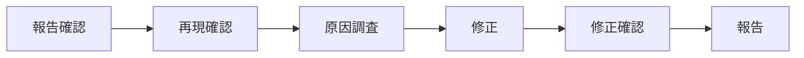

各ステップには**それぞれ重要な意味**があります。「面倒だから」と飛ばすと、後で余計な時間がかかることが多いです。

## Step 1：不具合報告を確認する

### 確認すること

| 項目 | 内容 |
|------|------|
| 現象 | 何が起きているか |
| 再現手順 | どうすれば再現するか |
| 期待結果 | 本来どうなるべきか |
| 発生環境 | どの環境で発生したか |
| 発生頻度 | 毎回か、たまにか |

### 情報が不足していたら

報告内容が不明確な場合は、報告者に確認します。

- 「再現手順をもう少し詳しく教えてください」
- 「どの環境で発生しましたか？」
- 「エラーメッセージは表示されましたか？」

## Step 2：再現確認する

### なぜ再現確認が必要か

**再現確認は不具合対応で最も重要なステップ**です。これを飛ばすと、以下のような問題が起きます。

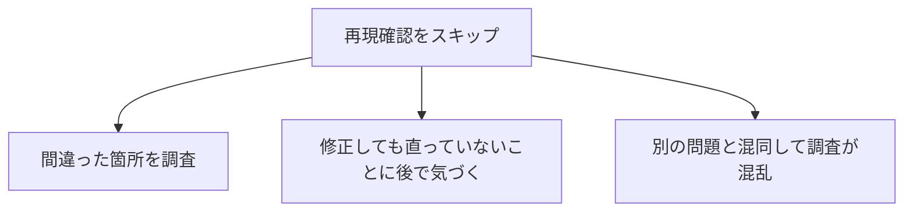

**再現確認をする理由**：

| 理由 | 詳細 |
|------|------|
| **現象を正確に理解するため** | 報告だけでは分からない細かい動作を確認できる。「ボタンを押しても反応しない」と言われても、実際に見ると「1秒遅れて反応している」だったりする |
| **原因調査の起点にするため** | 再現できれば、デバッガで止めて変数を見たり、ログを確認したりできる。再現できなければ調査のしようがない |
| **修正後の確認のため** | 「修正前は再現した」→「修正後は再現しない」で修正できたことを証明できる |
| **報告内容の認識齟齬を防ぐため** | 報告者と自分で「何が問題か」の認識がずれていることがある。再現確認で齟齬に気づける |

> **1年目あるある**：再現確認せずに「たぶんここが原因だろう」と修正して、実は全然違う問題だった。結果的に何時間も無駄にしてしまった…

### 再現できない場合

再現できないときは、**焦らず情報を集める**ことが大切です。

1. **報告者に詳細を確認**
   - 「手順の〇番と〇番の間に、他に操作はありましたか？」
   - 「ログインしているユーザーはどのアカウントですか？」

2. **環境の違いを確認**
   - 開発環境とテスト環境の違い
   - OSやブラウザのバージョン
   - データベースのデータの違い

3. **発生条件を絞り込む**
   - 特定のユーザーだけで発生するか
   - 特定の時間帯だけで発生するか
   - 特定のデータでだけ発生するか

4. **「再現できませんでした」と報告**
   - 試したことを具体的に伝える
   - 追加情報をもらう

## Step 3：原因を調査する

### なぜ「仮説を立てる」ことが重要か

1年目がやりがちな調査方法は、**「なんとなくコードを眺める」「手当たり次第にログを出す」**です。これでは時間がいくらあっても足りません。

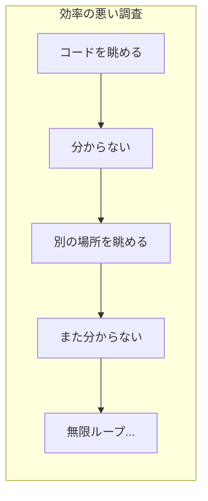

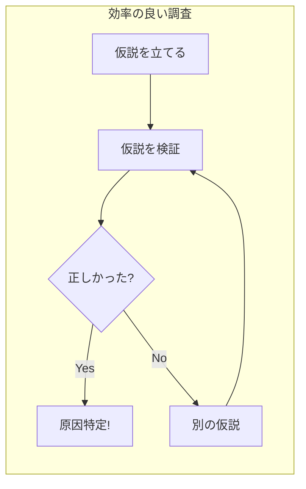

**仮説を立てることのメリット**：

| メリット | 詳細 |
|----------|------|
| **調査範囲を絞れる** | 「どこを見ればいいか」が明確になる。全コードを読む必要がなくなる |
| **検証可能になる** | 「この仮説が正しければ、〇〇のはず」と確認ポイントが決まる |
| **進捗が見える** | 「仮説Aは違った、仮説Bを検証中」と状況を説明できる |
| **相談しやすくなる** | 「〇〇が原因だと思うのですが」と具体的に相談できる |

> **ポイント**：仮説は外れても良い。「仮説が外れた」＝「原因ではない箇所が分かった」なので、調査は確実に前進しています。

### 調査の進め方

#### 1. 仮説を立てる

現象から、原因の仮説を立てます。最初は間違っていても構いません。

**仮説の立て方**：
- 現象を言葉にする：「〇〇の画面で△△すると、□□になる」
- 関係しそうな処理を考える：「〇〇の画面は、この Controller が処理している」
- 仮説を作る：「Controller の△△メソッドに問題がありそう」

**仮説の例**：
- 「バリデーションのロジックに問題がありそう」
- 「データベースの値が想定と違うかも」
- 「条件分岐が間違っているかも」
- 「nullチェックが漏れているかも」

#### 2. 仮説を検証する

仮説に基づいて、**確認すべきポイント**を決めて調査します。

```
仮説：「バリデーションのロジックに問題がありそう」
  ↓
確認ポイント：「バリデーションメソッドに渡される値は何か？」
  ↓
調査方法：「デバッガでバリデーションメソッドにブレークポイントを置く」
```

- 関連するコードを読む
- デバッガで値を確認
- ログを確認

#### 3. 絞り込む

「正常な箇所」と「異常な箇所」の境界を見つけます。

```
入力 → [処理A] → [処理B] → [処理C] → 出力
         ↑正常      ↑正常      ↑異常!

→ 処理Cに問題がある可能性が高い
```

- 「ここまでは正常、ここから異常」を特定
- **二分探索**で効率的に絞り込む（処理の真ん中あたりで確認→前半か後半かを判断→さらに半分で確認…）

### 調査に役立つ手法

| 手法 | 内容 | 詳細 |
|------|------|------|
| デバッガ | ブレークポイントで停止して変数を確認 | [[23_デバッグの基本#デバッガの使い方\|デバッガの使い方]]を参照 |
| ログ出力 | 処理の途中経過を出力 | [[23_デバッグの基本#ログの活用\|ログの活用]]を参照 |
| 差分確認 | 正常時と異常時の違いを比較 | git diff などで変更箇所を確認 |
| 直近の変更確認 | 最近変更された箇所を確認 | git log、git blame で確認 |

### あなたのケースに合った調査アプローチを選ぶ

不具合の調査は、**状況によってアプローチが大きく変わります**。以下のフローチャートで、自分のケースに合ったアプローチを確認してください。

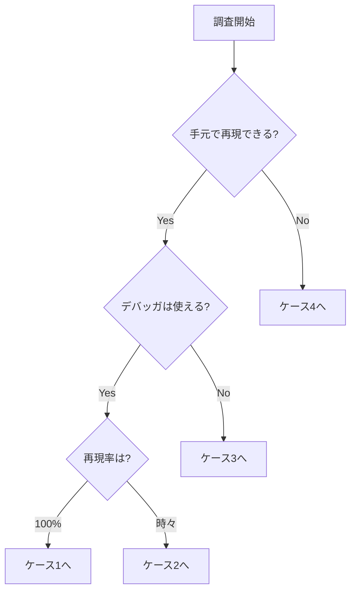

---

#### ケース1：手元で再現でき、デバッガが使え、100%再現する

**最も調査しやすいケース**です。

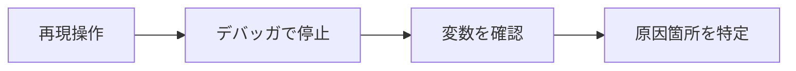

**やること**：
1. 再現する操作を行う
2. 関係しそうな処理にブレークポイントを設定
3. 変数の値を確認しながら、ステップ実行で処理を追う
4. 「ここまでは正常、ここからおかしい」という境界を見つける

**例**：「ユーザー登録でエラーになる」
→ 登録処理のメソッドにブレークポイントを置いて、どの時点で値がおかしくなるか確認

---

#### ケース2：手元で再現できるが、再現率が低い（たまにしか再現しない）

**条件の特定が重要**なケースです。

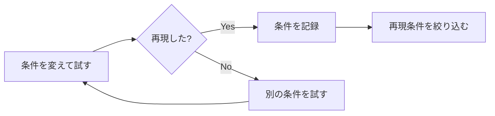

**やること**：
1. 何度か試して、再現するときとしないときの違いを観察
2. 条件を変えて試す（データ、タイミング、操作順序など）
3. 再現条件が分かったら、ケース1と同じ方法で調査
4. 条件が分からなければ、ログを仕込んで情報収集

**よくある原因**：
- タイミング依存（処理の順番、レースコンディション）
- データ依存（特定の値のときだけ発生）
- 状態依存（特定の画面遷移の後だけ発生）

---

#### ケース3：手元で再現できるが、デバッガが使えない

**ログが頼り**のケースです。

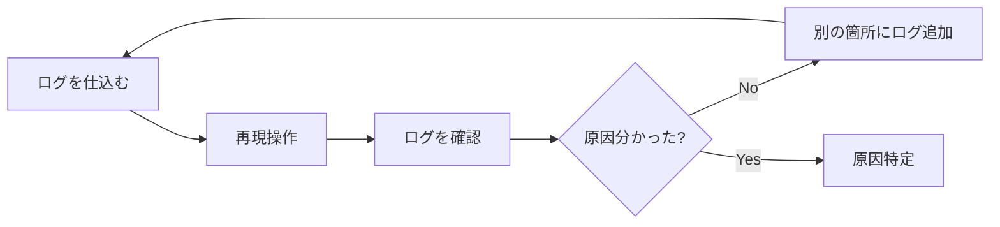

**やること**：
1. 処理の要所にログ出力を追加
2. 再現操作を行う
3. ログから処理の流れと変数の値を確認
4. 二分探索的にログを追加して、原因箇所を絞り込む

**ログを追加する場所**：
- メソッドの入口と出口（引数と戻り値）
- 条件分岐の前後（どの分岐に入ったか）
- エラーが発生しそうな箇所

---

#### ケース4：手元で再現しない（本番環境でのみ発生など）

**最も難易度が高い**ケースです。

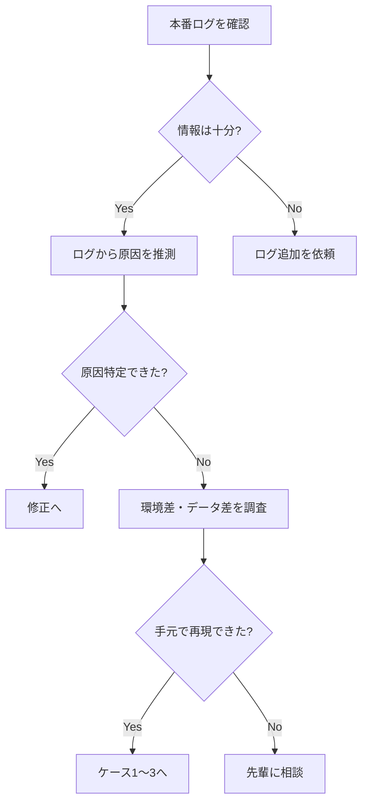

**やること**：
1. 本番環境のログを確認
2. 発生時刻、ユーザー、操作内容などから情報を収集
3. 環境やデータの違いを調査して、手元で再現を試みる
4. 再現できれば、ケース1〜3の方法で調査
5. 再現できなければ、先輩に相談

**確認すべき環境差**：

| 観点 | 確認内容 |
|------|----------|
| **環境** | OS、ミドルウェアのバージョン、設定ファイル |
| **データ** | 本番データの特徴、テストデータとの違い |
| **タイミング** | 発生時間帯、負荷状況、同時アクセス数 |
| **操作** | ブラウザ種類、操作の順番やスピード |

---

### 再現率と発生条件の確認が重要な理由

**再現率によって調査難易度が大きく変わります**。

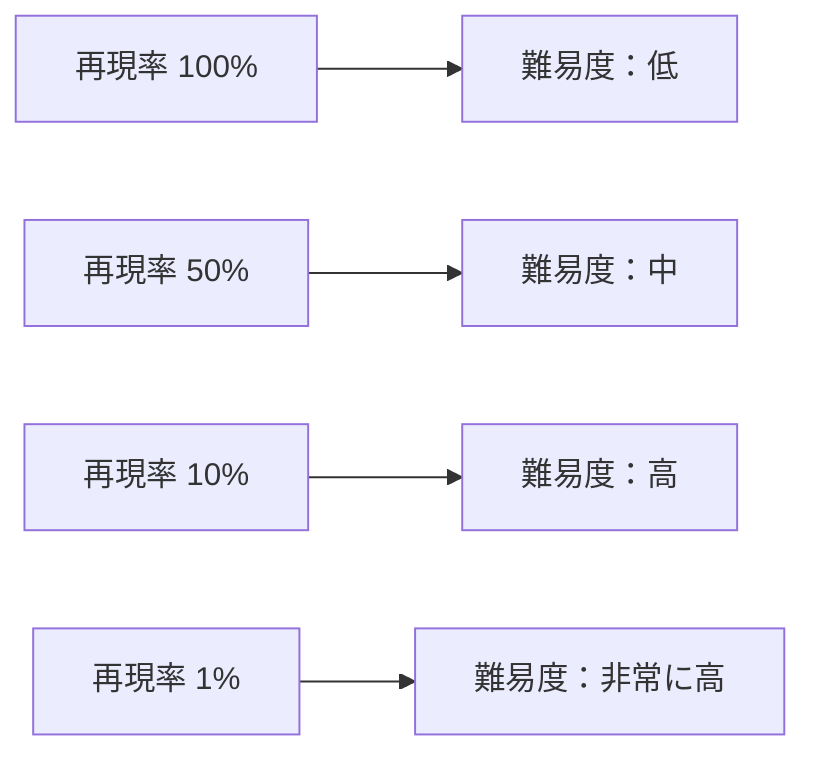

| 再現率 | 特徴 | 調査アプローチ |
|--------|------|---------------|
| **100%** | 条件が特定できている | デバッガで止めて調査。**最も楽** |
| **50%〜90%** | ほぼ再現するが、たまに再現しない | 何度か試して再現を待つ。再現時に情報を取得 |
| **10%〜50%** | 条件が絞り切れていない | **まず条件の特定に注力**。ログを仕込んで情報収集 |
| **10%未満** | ほとんど再現しない | 発生時のログが頼り。**早めに先輩に相談** |

**発生条件を絞り込む質問**：
- 「特定のユーザーでだけ発生しますか？」
- 「特定のデータでだけ発生しますか？」
- 「特定の時間帯にだけ発生しますか？」
- 「特定の操作の後にだけ発生しますか？」
- 「同時に複数人が操作しているときに発生しますか？」

> **1年目へのアドバイス**：再現率が低い不具合は難易度が高いです。「どういう条件で発生するか」を報告者に詳しく聞くことが第一歩です。分からなければ早めに先輩に相談しましょう。

### 「表面的な原因」と「根本原因」の違い

1年目がよくやる失敗は、**「表面的な事象」を原因だと思って修正してしまう**ことです。

**例：「画面にエラーメッセージが表示されない」という不具合**

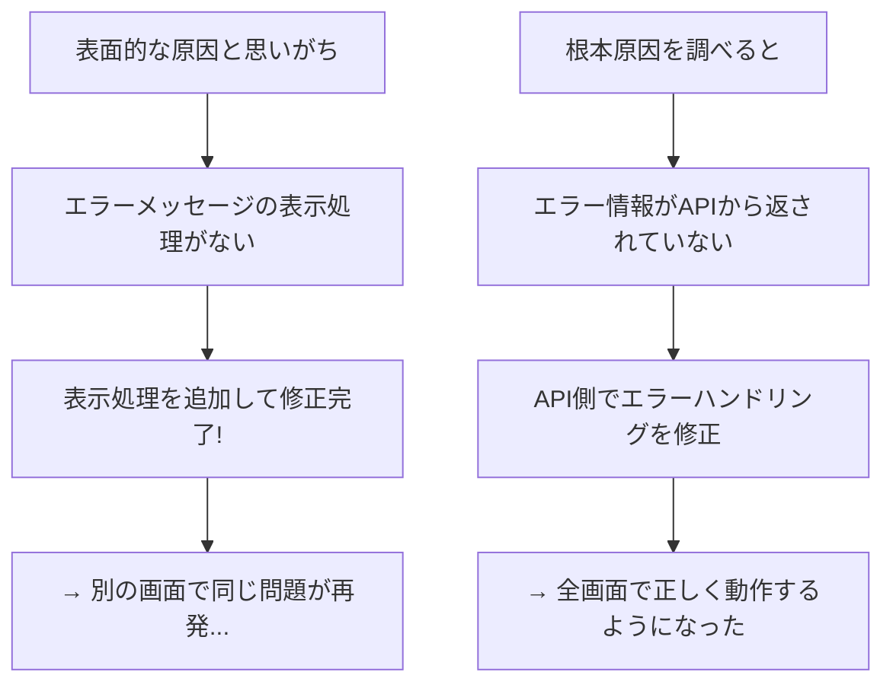

**表面的な原因で修正すると何が起きるか**：

| 問題 | 詳細 |
|------|------|
| **同じ問題が別の場所で再発する** | 根本が直っていないので、関連する他の機能でも同じ問題が起きる |
| **新たな問題を引き起こす** | 本来不要な「回避コード」を追加することで、コードが複雑になり別のバグを生む |
| **技術的負債になる** | 「なぜこんなコードがあるのか分からない」という負債が溜まる |

**根本原因を見つけるためのチェックポイント**：

1. **「なぜ？」を繰り返す**
   - 現象：エラーメッセージが表示されない
   - なぜ？ → 表示処理が呼ばれていない
   - なぜ？ → エラー情報が渡されていない
   - なぜ？ → API がエラー情報を返していない ← **これが根本原因**

2. **「この修正で本当に直るか？」を考える**
   - 「表示処理を追加する」→ 他の画面は？APIの問題は残ったまま？
   - 「APIを修正する」→ 全ての画面で正しくエラーが表示されるか？

3. **類似箇所を確認する**
   - 同じ処理を使っている他の箇所で問題が起きていないか？
   - 起きていなければ、なぜ起きていないか？

> **先輩への相談ポイント**：「〇〇が原因だと思うのですが、これが根本原因で合っていますか？」と確認すると、見落としに気づけることが多いです。

### 原因が分からない場合

**30分〜1時間**調べても分からなければ、相談しましょう。相談するときは、調査内容をまとめて伝えます。

**相談の仕方**：
```
「〇〇の不具合を調査しています。
現象：△△すると□□になる
調べたこと：
  - ××を確認 → 正常だった
  - ◇◇を確認 → ここで値がおかしくなっている
仮説：◇◇の処理に問題があると思うのですが、
      ここから先の調べ方が分かりません。」
```

- 「ここまで調べて、〇〇が怪しいと思うのですが」と伝える
- **一人で抱え込まない**（時間をかけすぎると、チーム全体の進捗に影響する）

## Step 4：修正する

### 修正の原則

#### 1. 根本原因を修正する

- 表面的な対処ではなく、根本原因を直す
- なぜその修正で直るのかを理解する

#### 2. 影響範囲を確認する

- 修正が他の機能に影響しないか
- 関連する箇所を確認

#### 3. 最小限の修正にする

- 必要以上に変更しない
- 「ついでに」の修正は別の対応にする

### 修正時の注意点

- 修正前のコードを理解してから修正
- 「なぜこう書かれていたか」を考える
- 意図せず他の機能を壊さないように

## Step 5：修正を確認する

### 確認すること

1. **元の不具合が直っているか**
   - 報告された再現手順で確認
   - 不具合が再現しないことを確認

2. **他の機能に影響がないか**
   - 関連する機能のテスト
   - 回帰テスト

3. **類似のケースは大丈夫か**
   - 同じロジックを使っている他の箇所
   - 類似の条件での動作

## Step 6：報告する

### 報告の内容

```markdown
## 対応完了報告

### 不具合
ユーザー登録時、メールアドレスのバリデーションが動作しない

### 原因
バリデーション処理で使用している正規表現のパターンに誤りがあった。
「@」の後ろの文字列チェックが不十分だった。

### 修正内容
- 正規表現パターンを修正
- 関連するテストケースを追加

### 確認結果
- 元の不具合が解消されたことを確認
- 正常なメールアドレスで登録できることを確認
- 他のバリデーションに影響がないことを確認

### 関連コミット
abc1234
```

## 調査資料の作成

複雑な不具合は、調査資料を作成することがあります。

### 調査資料の構成

```markdown
# 〇〇不具合 調査報告

## 現象
（何が起きているか）

## 再現手順
1. ...
2. ...

## 調査内容
- 〇〇を確認 → △△だった
- □□を確認 → ◇◇だった

## 原因
（なぜ発生しているか）

## 対応案
1. 案A：〇〇を修正
   - メリット：...
   - デメリット：...
2. 案B：△△を修正
   - メリット：...
   - デメリット：...

## 所感
（その他気づいたこと）
```

## よくある失敗と対策

### 失敗1：再現確認せずに調査を始めた

**何が問題か**：
- 報告と実際の現象が違っていた場合、間違った方向に調査してしまう
- 「直った」と思っても、そもそも再現していなかっただけかもしれない
- 修正後に「まだ直っていない」と言われて二度手間になる

**どうすれば良いか**：
- 必ず最初に再現を試みる
- 再現できたら、その手順をメモしておく（修正後の確認に使う）
- 再現できなければ、報告者に追加情報をもらう

---

### 失敗2：原因を特定せずに「たぶんここだろう」で修正した

**何が問題か**：
- 本当の原因が別の場所にあった場合、修正しても直らない
- 運良く直ったように見えても、根本原因が残っているので再発する
- 不要なコードを追加してしまい、後で混乱の原因になる

**どうすれば良いか**：
- 修正する前に「なぜこの修正で直るのか」を説明できる状態にする
- 「この行を変えるとこうなるから、不具合が直る」と論理的に説明できれば OK
- 自信がなければ、先輩に「この修正で合っていますか？」と確認する

---

### 失敗3：修正の影響範囲を確認しなかった

**何が問題か**：
- 修正したことで、別の機能が壊れる（デグレード、回帰バグ）
- 「不具合を直したら別の不具合が出た」という最悪のパターン
- 信頼を失い、以降の修正も疑われるようになる

**どうすれば良いか**：
- 修正する箇所を「どこから呼ばれているか」を確認する
- 呼び出し元の機能も動作確認する
- 既存のテストを実行して、失敗するものがないか確認する
- 不安なら、先輩に「影響範囲はここだけで大丈夫でしょうか」と相談する

---

### 失敗4：調査に時間をかけすぎた

**何が問題か**：
- 1日かけて調べても分からないことを、ベテランは10分で解決できることがある
- 一人で抱え込むと、チーム全体の進捗に影響する
- 「困っているなら早く言ってほしかった」と言われてしまう

**どうすれば良いか**：
- **30分〜1時間**を目安に、進展がなければ相談する
- 相談するときは「調べたこと」と「分からないこと」を整理して伝える
- 「何も分からない」状態でも相談して良い（調べ方を教えてもらえる）

---

### 失敗5：修正後のテストが不十分だった

**何が問題か**：
- 「直した」と報告したのに、実は直っていなかった
- 報告者やテスト担当者に再度確認してもらう手間が発生
- 信頼性が下がり、以降の報告も疑われるようになる

**どうすれば良いか**：
- 報告された手順で再現しないことを確認する
- 関連する他のケースも確認する（類似パターン、境界値など）
- 修正前と修正後の動作の違いを明確に説明できるようにする

## まとめ

不具合対応を進めるときは：

1. **報告内容を正確に理解**する
2. **再現確認**してから調査を始める
3. **仮説を立てて検証**する
4. **根本原因を修正**する
5. **影響範囲を含めて確認**する
6. **原因と修正内容を報告**する
