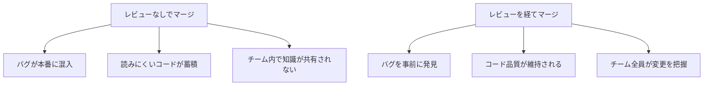
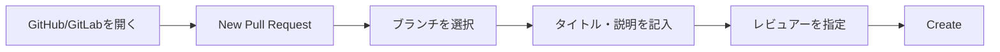

# コードレビューの受け方

コードレビューを受けるときの心構えと対応方法を学びます。また、レビュー依頼を出すまでの一連の流れ（ソースコードの取得から修正、レビュー依頼まで）も解説します。

## コードレビューとは

コードレビューとは、他のエンジニアに自分のコードを確認してもらうことです。

### なぜコードレビューが必要なのか



**レビューの目的**：
- バグを早期に発見する
- コードの品質を向上させる
- 知識を共有する
- チームのコード品質を統一する

### レビューで見られること

| 観点 | 内容 |
|------|------|
| 正しさ | 仕様通りに実装されているか |
| 可読性 | 読みやすいコードか |
| 保守性 | 修正しやすいコードか |
| 一貫性 | 規約に従っているか |
| セキュリティ | セキュリティ上の問題はないか |

## レビュー依頼までの流れ

修正を始めてからレビュー依頼を出すまでの一連の流れを理解しましょう。


### なぜこの流れが大切なのか

- **最新ソースを取得しないと**：古いコードをベースに修正してしまい、他の人の変更と競合する
- **ブランチを作成しないと**：作業中のコードが他の人に影響を与えてしまう
- **こまめにコミットしないと**：問題が起きたときに戻せない、変更履歴が分からなくなる

---

### Gitの場合

#### 1. 最新ソースコードを取得する

```bash
# リモートの最新情報を取得
git fetch origin

# mainブランチに切り替えて最新化
git checkout main
git pull origin main
```

> **なぜ最新化が必要？**：古いコードをベースに修正すると、後で「コンフリクト（競合）」が発生し、マージが大変になります。

#### 2. 作業ブランチを作成する

```bash
# 新しいブランチを作成して切り替え
git checkout -b feature/add-user-validation
```

**ブランチ名の例**：
| 種類 | 命名例 |
|------|--------|
| 機能追加 | `feature/add-login` |
| バグ修正 | `fix/user-not-found` |
| リファクタリング | `refactor/cleanup-validation` |

> **なぜブランチを作る？**：mainブランチを直接変更すると、作業中の不完全なコードが他のメンバーに影響します。ブランチを分けることで、完成するまで安全に作業できます。

#### 3. 修正してコミットする

```bash
# 変更をステージング
git add ファイル名

# コミット（意味のある単位で）
git commit -m "ユーザー入力のバリデーションを追加"
```

**コミットのコツ**：
- **意味のある単位でコミット**：「動く状態」でコミットする
- **分かりやすいメッセージ**：何をしたかが分かるように
- **こまめにコミット**：大きな塊でまとめてコミットしない

```bash
# 良いコミット例（細かく分ける）
git commit -m "入力値のnullチェックを追加"
git commit -m "メールアドレスの形式チェックを追加"
git commit -m "エラーメッセージを追加"

# 悪いコミット例（何をしたか分からない）
git commit -m "修正"
git commit -m "バグ対応"
```

#### 4. リモートにプッシュする

```bash
# 初回プッシュ（上流ブランチを設定）
git push -u origin feature/add-user-validation

# 2回目以降
git push
```

#### 5. プルリクエストを作成する

GitHubやGitLabなどのWebサイトでプルリクエスト（PR）を作成します。



---

### SVNの場合

SVNはGitと異なり、**集中型**のバージョン管理システムです。ブランチの概念はありますが、Gitほど頻繁には使いません。

#### 1. 最新ソースコードを取得する

```bash
# 作業コピーを最新化
svn update
```

TortoiseSVNの場合：フォルダを右クリック → 「SVN 更新」

#### 2. 修正する

SVNでは通常、ブランチを作らずにトランクで直接作業することが多いです（プロジェクトのルールに従ってください）。

#### 3. 変更を確認してコミットする

```bash
# 変更状況を確認
svn status

# 変更内容を確認
svn diff

# コミット
svn commit -m "ユーザー入力のバリデーションを追加"
```

TortoiseSVNの場合：フォルダを右クリック → 「SVN コミット」

> **SVNの注意点**：SVNのコミットは即座にサーバーに反映されます。Gitのようにローカルでコミットしてから後でプッシュ、ということはできません。

#### 4. レビュー依頼を出す

SVNにはプルリクエストの仕組みがないため、別の方法でレビュー依頼を出します。

| 方法 | 説明 |
|------|------|
| **メール/チャット** | 「リビジョンXXXをレビューお願いします」と連絡 |
| **チケットシステム** | Redmine、Jiraなどでレビュー依頼チケットを作成 |
| **レビューツール** | Crucible、Review Boardなどの専用ツールを使用 |

---

### GitとSVNの流れの違い

| ステップ | Git | SVN |
|----------|-----|-----|
| 最新化 | `git pull` | `svn update` |
| ブランチ作成 | `git checkout -b` | （通常は不要） |
| コミット | ローカルに保存 | サーバーに即反映 |
| レビュー依頼 | プルリクエスト | メール/チケット等 |

## レビュー依頼の出し方

### レビュー依頼前の確認

レビューを依頼する前に、自分で確認しましょう。

- [ ] 仕様通りに実装されているか
- [ ] 動作確認は完了しているか
- [ ] コーディング規約に従っているか
- [ ] 不要なコメント・デバッグコードは削除したか
- [ ] テストは書いたか

### プルリクエストの書き方

```markdown
## 概要
〇〇機能を追加しました。

## 変更内容
- 入力バリデーションを追加
- エラーメッセージを追加

## 動作確認
- 正常系：〇〇を確認
- 異常系：△△を確認

## 確認してほしいポイント
- □□の実装方法は適切でしょうか
- ◇◇の命名は分かりやすいでしょうか

## 関連チケット
#123
```

### 確認してほしいポイントを書く

迷った点や自信がない点があれば、明記しておくと良いです。

- 「この実装方法で問題ないでしょうか」
- 「他に良い方法があれば教えてください」

## 指摘を受けたときの心構え

### 指摘は「コード」に対するもの

- 指摘は「あなた」への攻撃ではない
- 「コード」をより良くするためのフィードバック
- 感情的にならず、冷静に受け止める

### 成長の機会と捉える

- 指摘は学びのチャンス
- 知らなかったことを教えてもらえる
- 同じ指摘を繰り返さないようにメモする

### 防御的にならない

```
# 良くない反応
「でも仕様書にはこう書いてあったので...」
「これでも動きますけど...」

# 良い反応
「なるほど、そういう観点がありますね。修正します」
「確かにその方が読みやすいですね。ありがとうございます」
```

## 指摘への対応方法

### 理解できた指摘

1. 指摘内容を理解する
2. 修正する
3. 「修正しました」とコメント

### 理解できない指摘

質問しましょう。

```
ご指摘ありがとうございます。
「〇〇を△△にした方が良い」とのことですが、
どのような理由でしょうか？理解を深めたいので教えてください。
```

### 納得できない指摘

議論することは悪いことではありません。ただし、建設的に。

```
ご指摘ありがとうございます。
〇〇については、□□という理由でこの実装にしました。
△△の方が良いでしょうか？
```

## よくある指摘と対策

| 指摘 | 対策 |
|------|------|
| 変数名が分かりにくい | 意味のある具体的な名前をつける |
| コメントがない | 「なぜ」を説明するコメントを追加 |
| 複雑すぎる | メソッドを分割、シンプルに |
| 規約に従っていない | コーディング規約を確認 |
| テストがない | テストコードを追加 |
| マジックナンバー | 定数として定義 |

### マジックナンバーの例

```java
// 悪い例
if (status == 1) {
    // ...
}

// 良い例
private static final int STATUS_ACTIVE = 1;
if (status == STATUS_ACTIVE) {
    // ...
}
```

## レビュー後の対応

### 修正したら

1. 指摘に対応して修正
2. コメントで「修正しました」と返信
3. 再度レビュー依頼

### 学びをメモする

指摘された内容は、次に活かせるようにメモしておきましょう。

```markdown
## レビューで学んだこと

### 2024/01/15
- 変数名は具体的に（user → activeUser）
- null チェックは早期リターンで

### 2024/01/20
- ループ内でのDB接続は避ける
- トランザクションの範囲を意識する
```

## 自分でセルフレビューする

レビュー依頼前に、自分でレビューする習慣をつけましょう。

### セルフレビューの観点

- コードを他人が読む視点で見る
- 「これで意図が伝わるか」を考える
- 規約に違反していないか確認
- 不要なコードが残っていないか確認

## まとめ

### レビュー依頼までの流れ

1. **最新ソースを取得**してから作業を始める
2. **ブランチを作成**して安全に作業する（Git）
3. **こまめにコミット**して変更履歴を残す
4. **プルリクエスト/レビュー依頼**を作成する

### レビューを受けるときの心構え

1. **レビュー前にセルフチェック**する
2. **PRには背景と確認ポイント**を書く
3. **指摘は成長の機会**と捉える
4. **分からなければ質問**する
5. **学びをメモして次に活かす**
