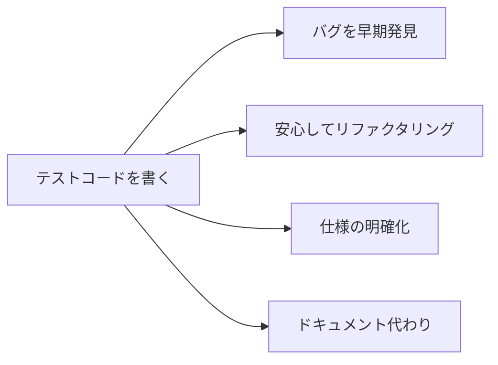
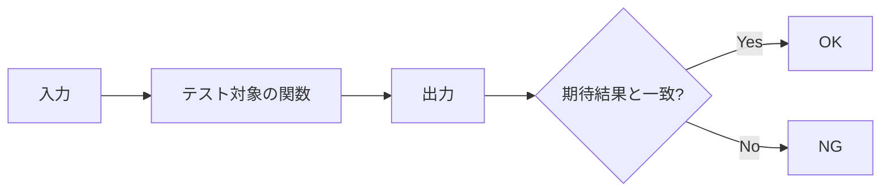
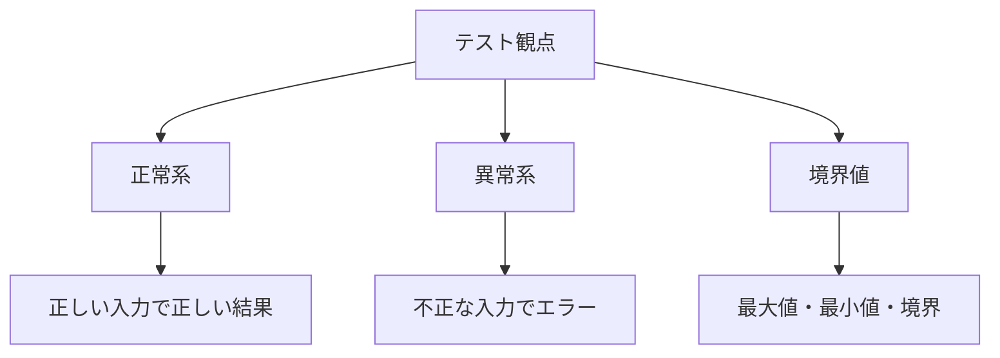
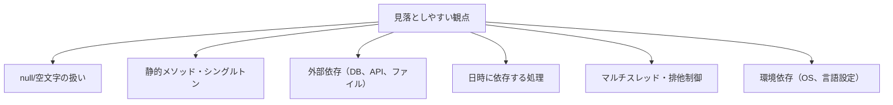

# テストコードの書き方

単体テスト（ユニットテスト）の基本を学びます。テストコードを書くことで、バグを早期に発見し、安心してコードを修正できるようになります。

## なぜテストコードを書くのか

### テストコードのメリット



- **バグを早期発見**：コードを書いた直後に問題に気づける
- **安心してリファクタリング**：テストが通れば壊れていない
- **仕様の明確化**：テストを書くことで仕様を整理できる
- **ドキュメント代わり**：テストを見れば使い方が分かる

### 1年目でテストを書く機会

| 場面 | 説明 |
|------|------|
| 新機能を作ったとき | 自分のコードの動作確認 |
| バグを直したとき | 再発防止のためのテスト |
| 既存コードを修正したとき | 壊していないことを確認 |

## 単体テストとは

### 単体テストの定義

**1つの関数やメソッドが正しく動くかを確認するテスト**です。



### 単体テストの例

**テスト対象のコード（Java）**
```java
public class Calculator {
    public int add(int a, int b) {
        return a + b;
    }
}
```

**テストコード（JUnit）**
```java
public class CalculatorTest {
    /**
     * 正常な足し算ができることを確認
     * 2 + 3 = 5 となること
     */
    @Test
    public void testAddWithPositiveNumbers() {
        Calculator calc = new Calculator();
        int result = calc.add(2, 3);
        assertEquals(5, result);  // 期待値: 5
    }
}
```

## テストコードの基本構造

### AAAパターン

テストは**Arrange（準備）→ Act（実行）→ Assert（検証）**の順で書きます。

```java
@Test
public void testExample() {
    // Arrange（準備）
    Calculator calc = new Calculator();

    // Act（実行）
    int result = calc.add(2, 3);

    // Assert（検証）
    assertEquals(5, result);
}
```

### テストメソッドの命名

テストの内容が分かる名前をつけます。現場では**日本語のメソッド名は避けられる**ことが多いため、英語で書きます。代わりに**JavaDocコメント**で説明を補います。

```java
// 良い例：英語で意図が分かる名前 + JavaDocで補足
/** 正の数同士を足すと正しい結果が返ること */
public void testAddWithPositiveNumbers()

/** 0を足すと元の数が返ること */
public void testAddWithZero()

/** 負の数を足すと正しい結果が返ること */
public void testAddWithNegativeNumbers()

// 避けたい例
public void test1()      // 何のテストか分からない
public void addTest()    // 具体性がない
```

**命名のパターン例**：
- `test[対象メソッド]With[条件]` 例：`testAddWithZero`
- `test[対象メソッド]_[条件]_[期待結果]` 例：`testIsAdult_Age20_ReturnsTrue`
- `should[期待動作]When[条件]` 例：`shouldReturnTrueWhenAgeIs20`

## 言語別の基本

### Java（JUnit）

```java
import org.junit.jupiter.api.Test;
import static org.junit.jupiter.api.Assertions.*;

public class UserServiceTest {

    /**
     * isAdult: 20歳以上はtrueを返すこと
     */
    @Test
    public void testIsAdult_Age20OrOver_ReturnsTrue() {
        UserService service = new UserService();
        assertTrue(service.isAdult(20));
        assertTrue(service.isAdult(30));
    }

    /**
     * isAdult: 20歳未満はfalseを返すこと
     */
    @Test
    public void testIsAdult_AgeUnder20_ReturnsFalse() {
        UserService service = new UserService();
        assertFalse(service.isAdult(19));
        assertFalse(service.isAdult(0));
    }
}
```

### Python（pytest）

```python
def test_add_with_positive_numbers():
    """正常な足し算ができること（2 + 3 = 5）"""
    calc = Calculator()
    result = calc.add(2, 3)
    assert result == 5

def test_add_with_zero():
    """0を足すと元の数が返ること"""
    calc = Calculator()
    assert calc.add(5, 0) == 5
    assert calc.add(0, 5) == 5
```

### JavaScript（Jest）

```javascript
describe('Calculator', () => {
    // 正常な足し算ができること
    test('add returns correct sum with positive numbers', () => {
        const calc = new Calculator();
        expect(calc.add(2, 3)).toBe(5);
    });

    // 0を足すと元の数が返ること
    test('add returns original number when adding zero', () => {
        const calc = new Calculator();
        expect(calc.add(5, 0)).toBe(5);
    });
});
```

## 何をテストするか

### テストすべきパターン



### 具体例：年齢チェック関数

**テスト対象**
```java
public boolean isValidAge(int age) {
    return age >= 0 && age <= 150;
}
```

**テストケース**
| 分類 | 入力 | 期待結果 | 理由 |
|------|------|----------|------|
| 正常系 | 25 | true | 普通の年齢 |
| 境界値 | 0 | true | 最小値 |
| 境界値 | 150 | true | 最大値 |
| 境界値 | -1 | false | 最小値-1 |
| 境界値 | 151 | false | 最大値+1 |

**テストコード**
```java
/**
 * isValidAge: 境界値のテスト
 * 0〜150が有効範囲、それ以外は無効
 */
@Test
public void testIsValidAge_BoundaryValues() {
    Validator v = new Validator();

    // 境界内
    assertTrue(v.isValidAge(0));    // 最小値
    assertTrue(v.isValidAge(150));  // 最大値

    // 境界外
    assertFalse(v.isValidAge(-1));  // 最小値-1
    assertFalse(v.isValidAge(151)); // 最大値+1
}
```

## テスト観点は対象によって変わる

ここまで紹介した「正常系・異常系・境界値」は基本的な観点ですが、**実際のテストでは対象のプログラムによって観点が大きく変わります**。

### プログラムの種類別テスト観点

| 対象 | 主なテスト観点 |
|------|---------------|
| **画面（UI）** | 表示の正しさ、入力バリデーション、画面遷移、エラーメッセージ表示 |
| **ビジネスロジック** | 計算結果、条件分岐、データ変換、ルールの適用 |
| **API** | リクエスト/レスポンス、ステータスコード、認証・認可 |
| **データベース処理** | CRUD操作、トランザクション、排他制御 |
| **非同期処理** | タイミング、タイムアウト、コールバック、並行実行 |
| **例外処理** | 例外の発生条件、例外メッセージ、リカバリー処理 |
| **組み込み系** | ハードウェア連携、リソース制約、割り込み処理 |

### 見落としやすいテスト観点



**よくある例**：
- `null`が渡されたときの動作
- 空のリストやコレクションの扱い
- 日付の境界（月末、年末、うるう年）
- 同時アクセス時の動作
- 外部サービスがダウンしているとき

### テストケースの洗い出し方

1. **仕様書を確認**：正常系の動作を把握
2. **入力のパターンを考える**：有効値、無効値、境界値
3. **エラー条件を考える**：何が起きたらエラーになるか
4. **組み合わせを考える**：複数条件の組み合わせ
5. **先輩やレビュアーに相談**：見落としがないか確認

> **ポイント**：1年目は全ての観点を網羅するのは難しいです。まずは基本的な観点を押さえつつ、**先輩のテストコードを参考にする**ことで、徐々に観点を広げていきましょう。

## 学習リソース

テストの書き方をさらに学ぶための参考サイトを紹介します。

### おすすめサイト

| サイト | 内容 | おすすめ度 |
|--------|------|----------|
| **t-wada氏「テスト駆動開発」関連記事** | TDDの第一人者による解説。考え方から実践まで | ★★★★★ |
| **JUnit 5 ユーザーガイド（公式）** | Java向け。公式ドキュメントで正確 | ★★★★☆ |
| **pytest公式ドキュメント** | Python向け。実例が豊富 | ★★★★☆ |
| **Jest公式ドキュメント** | JavaScript向け。チュートリアルが分かりやすい | ★★★★☆ |

### 書籍（余裕があれば）

- **『テスト駆動開発』**（Kent Beck著）：TDDの原典
- **『単体テストの考え方/使い方』**（Vladimir Khorikov著）：良いテストの書き方を学べる

### 検索キーワード

テストの書き方で困ったときは、以下のキーワードで検索すると情報が見つかります。

- `[言語名] 単体テスト 書き方`
- `[フレームワーク名] テスト 入門`
- `[テスト対象] テスト観点`（例：「API テスト観点」）
- `モック 使い方 [言語名]`

## テストを書くコツ

### 1つのテストで1つのことを確認

```java
// 良い例：1つのテストで1つの観点
/** 20歳はtrueを返すこと */
@Test
public void testIsAdult_Age20_ReturnsTrue() {
    assertTrue(service.isAdult(20));
}

/** 19歳はfalseを返すこと */
@Test
public void testIsAdult_Age19_ReturnsFalse() {
    assertFalse(service.isAdult(19));
}

// 避けたい例：1つのテストで複数の観点
@Test
public void testIsAdult() {
    assertTrue(service.isAdult(20));
    assertFalse(service.isAdult(19));
    assertFalse(service.isAdult(0));
    // どれが失敗したか分かりにくい
}
```

### テストは独立させる

テスト同士が影響し合わないようにします。

```java
// 良い例：各テストが独立
@Test
public void testUserCreation_WithName_Tanaka() {
    User user = new User("田中");  // 毎回新しく作る
    // ...
}

@Test
public void testUserCreation_WithName_Suzuki() {
    User user = new User("鈴木");  // 毎回新しく作る
    // ...
}
```

### テストしやすいコードを書く

テストが書きにくいコードは、設計に問題があることが多いです。

```java
// テストしにくい例
public class OrderService {
    public void processOrder() {
        Date now = new Date();  // 現在時刻に依存
        // ...
    }
}

// テストしやすい例
public class OrderService {
    public void processOrder(Date orderDate) {  // 日時を引数で受け取る
        // ...
    }
}
```

## よくある失敗と対策

| 失敗 | 対策 |
|------|------|
| 正常系しかテストしていない | 異常系・境界値も必ずテスト |
| テストが複雑すぎる | 1テスト1観点に分割 |
| テストが壊れやすい | 実装の詳細に依存しない |
| テストを書かずに終わる | 実装と同時にテストを書く |

## テストの実行

### IDEでの実行

- テストクラスを右クリック→「テストを実行」
- 緑：成功、赤：失敗

### コマンドラインでの実行

```bash
# Java（Maven）
mvn test

# Python（pytest）
pytest

# JavaScript（Jest）
npm test
```

## まとめ

テストコードを書くときのポイント：

1. **AAAパターン**（Arrange → Act → Assert）
2. **1テスト1観点**
3. **正常系・異常系・境界値**をテスト
4. **分かりやすいテスト名**
5. **テストは独立させる**

最初は時間がかかりますが、テストを書く習慣がつくと、バグが減り、コードの品質が上がります。まずは簡単な関数から始めてみましょう。
