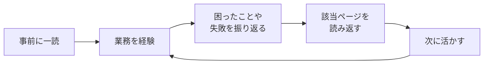

# 第4部：実務スキル

案件への参加から、実装、テスト、不具合対応まで、実際の業務の進め方を学びます。

技術スキルだけでは仕事は進みません。**「どう動けばいいか」を知っているかどうか**で、周囲からの信頼度が大きく変わります。

## この部の活用の仕方

### 業務に入る前に一度読んでおく

この部は、**業務に入る前に一通り目を通しておく**ことをおすすめします。

技術的なスキルは業務をしながら身につけることができますが、「案件に入ったら何をすべきか」「作業を依頼されたらどう動くか」といった**立ち回り方**は、知らないと最初から躓いてしまいます。

```
❌ 技術スキルだけ磨いて、業務の進め方は「なんとかなる」と思っている
⭕ 業務の基本的な流れを事前に把握しておく
```

### 実際の業務で振り返りながら読む

一度読んだだけでは、ピンとこない部分もあるかもしれません。

**実際に業務を経験してから読み返す**と、「ああ、こういうことだったのか」と理解が深まります。特に失敗したときや困ったときに該当ページを読むと、次に活かせる気づきが得られます。



### 現場によってやり方は異なる

この部で紹介する進め方は、**多くの現場で共通する基本的なもの**です。

ただし、現場によって以下のような違いがあります：

- **ツールが違う** - チケット管理がJIRAの現場もあれば、Backlogの現場もある
- **プロセスが違う** - レビューの手順やテストの進め方が異なる
- **文化が違う** - 報連相の頻度やコミュニケーションスタイルが異なる

> [!important] 現場のルールを優先する
> この教科書に書いてあることと現場のルールが違う場合は、**現場のルールを優先**してください。ここに書いてあるのは「よくあるパターン」であり、唯一の正解ではありません。

### 各章の概要

| 章 | トピック | いつ読むと効果的か |
|---|---|---|
| 第1章 | 案件開始 | プロジェクトに参加する前・参加直後 |
| 第2章 | 実装作業 | 初めてのコーディング作業を始める前 |
| 第3章 | テスト作業 | テスト工程に入る前 |
| 第4章 | 不具合対応 | バグ修正を担当することになったとき |
| 第5章 | コミュニケーション | チームでの作業に慣れてきたとき |
| 第6章 | 技術リファレンス | 必要になったときに都度参照 |

### よくある疑問

> [!question] Q. 技術スキルを先に身につけるべきでは？
> **A. 両方を並行して身につけるのがベストです。**
>
> 技術スキルがあっても、報告の仕方が悪かったり、作業の進め方がまずかったりすると、チームに迷惑をかけてしまいます。逆に、実務スキルがあれば、技術が足りなくてもチームに貢献できる部分は多いです。

> [!question] Q. 読んでも実感がわかないのですが？
> **A. それは正常です。業務を経験すれば実感できます。**
>
> 実務経験がない状態では「そういうものか」程度の理解で大丈夫です。実際に業務を経験し、困ったことや失敗を経験してから読み返すと、書いてあることの意味が身に染みてわかります。

> [!question] Q. 先輩の指示と違うことが書いてある場合は？
> **A. 先輩の指示を優先してください。**
>
> 現場にはその現場なりの理由やルールがあります。まずは現場のやり方に従い、その理由を理解することが大切です。疑問があれば「なぜこのやり方なのか」を質問してみましょう。

---

## 第1章：案件開始

プロジェクトに参加したときの動き方を学びます。

- [[第1章_案件開始/400_案件に入ったら最初にやること|案件に入ったら最初にやること]]
- [[第1章_案件開始/401_作業の依頼を受けたら|作業の依頼を受けたら]]

## 第2章：実装作業

コードを書く作業の進め方を学びます。

- [[第2章_実装作業/402_実装の進め方|実装の進め方]]
- [[第2章_実装作業/405_コードレビューの受け方|コードレビューの受け方]]

## 第3章：テスト作業

テストの進め方とテストコードの書き方を学びます。

- [[第3章_テスト作業/403_テストの進め方|テストの進め方]]
- [[第3章_テスト作業/407_テストコードの書き方|テストコードの書き方]]

## 第4章：不具合対応

バグ修正の進め方を学びます。

- [[第4章_不具合対応/404_不具合対応の進め方|不具合対応の進め方]]

## 第5章：コミュニケーション

チームでの報告・連絡・相談の基本を学びます。

- [[第5章_コミュニケーション/408_報連相の基本|報連相の基本]]

## 第6章：技術リファレンス

よく使う技術知識をまとめています。

- [[第6章_技術リファレンス/406_よく使う技術知識|よく使う技術知識]]

## 理解度チェック

- [[499_理解度チェック|この部の理解度をチェックする]]
