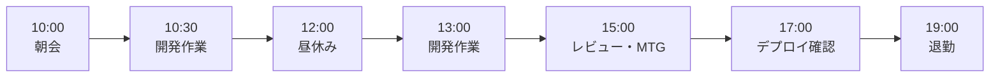
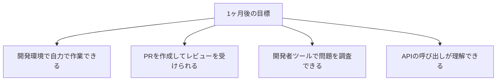
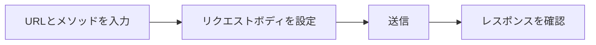
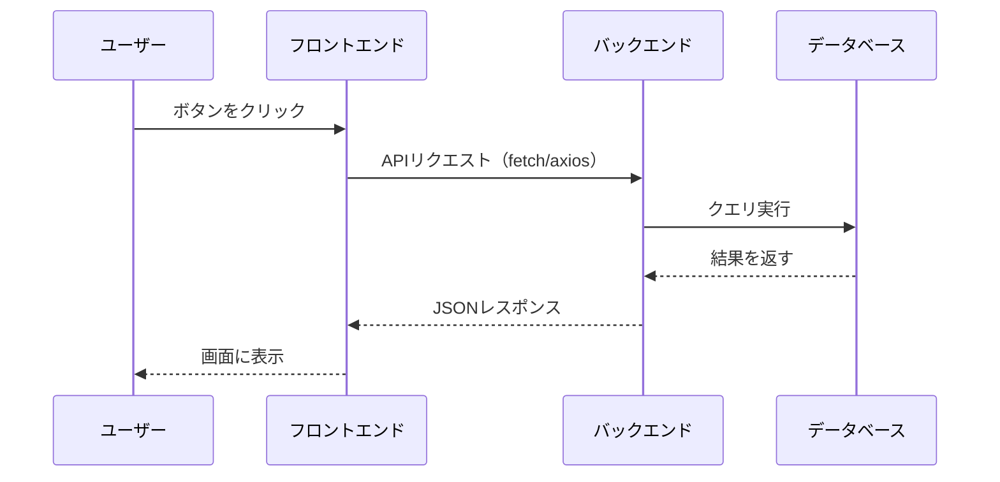
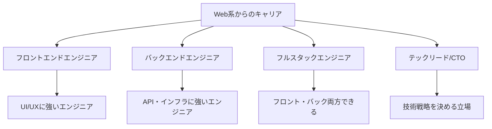

# Web系の場合

Web開発（JavaScript、Python、PHPなど）の場合のガイドです。

## この領域の特徴

- フロントエンドとバックエンドがある
- 技術の変化が速い
- アジャイル開発が多い
- ユーザー体験（UX）が重視される

## よくある1日の流れ



### タイムスケジュール例（スタートアップ/Web系企業）

| 時間 | 活動 | 詳細 |
|------|------|------|
| 10:00 | デイリースタンドアップ | 昨日やったこと、今日やること、困っていることを共有 |
| 10:30 | 開発作業 | コーディング、動作確認 |
| 12:00 | 昼休み | - |
| 13:00 | 開発作業 | 午前の続き、PR作成 |
| 15:00 | コードレビュー | 他のメンバーのPRをレビュー、指摘対応 |
| 16:00 | ミーティング | 仕様確認、設計相談など |
| 17:00 | デプロイ・動作確認 | ステージング環境へのデプロイと確認 |
| 18:00 | 翌日の準備 | タスク整理、Slackの確認 |
| 19:00 | 退勤 | - |

> **ポイント**：Web系は「デプロイして本番に出す」サイクルが速いことが特徴です。小さな変更を頻繁にリリースするため、「動く状態を維持する」意識が大切です。

## 最初の1ヶ月で覚えること

### 第1週：環境とツールに慣れる

| やること | 完了の目安 |
|----------|-----------|
| ローカル開発環境構築 | アプリがローカルで動く |
| Git/GitHubの操作 | ブランチ作成、PR作成ができる |
| ブラウザ開発者ツール | Elementsタブ、Consoleタブが使える |
| Slackなどのコミュニケーション | チャンネルを把握、適切に投稿できる |

### 第2週：小さな機能を実装

| やること | 完了の目安 |
|----------|-----------|
| 簡単なUI修正 | CSSを変更してPRを出せる |
| APIの呼び出し | 既存のAPIを使って画面に表示できる |
| 開発者ツールでのデバッグ | Networkタブでリクエストを確認できる |

### 第3〜4週：開発フローを一通り経験

| やること | 完了の目安 |
|----------|-----------|
| 小さな機能の追加 | フロントエンド or バックエンドで1機能完了 |
| デプロイまで経験 | ステージング環境へのデプロイを経験 |
| 不具合修正 | バグを1つ修正してリリース |

### 1ヶ月後の目標状態



## ブラウザ開発者ツールの使い方

Web開発で必須のスキルです。Chrome DevToolsを例に説明します。

### 開き方

- **Windows**：`F12` または `Ctrl + Shift + I`
- **Mac**：`Cmd + Option + I`
- 右クリック → 「検証」でも開ける

### 主要なタブと用途

| タブ | 用途 | よく使う場面 |
|------|------|-------------|
| **Elements** | HTML/CSSの確認・編集 | 表示がおかしいときにスタイルを確認 |
| **Console** | JavaScriptのログ・エラー | エラーメッセージの確認、console.logの出力確認 |
| **Network** | 通信の確認 | APIリクエスト・レスポンスの確認 |
| **Sources** | ソースコードの確認・デバッグ | ブレークポイントを設定してデバッグ |
| **Application** | ストレージの確認 | Cookie、LocalStorageの確認 |

### よく使う操作

**Elementsタブ**
```
1. 調べたい要素を右クリック →「検証」
2. Stylesパネルでスタイルを確認
3. 値を変更して、リアルタイムで結果を確認
```

**Consoleタブ**
```javascript
// エラーが赤字で表示される
Uncaught TypeError: Cannot read property 'name' of undefined

// console.logの出力を確認
console.log(userData);  // オブジェクトの中身を確認
```

**Networkタブ**
```
1. Networkタブを開いてからページを更新
2. 確認したいリクエストをクリック
3. Headers：リクエストヘッダーを確認
4. Response：APIの戻り値を確認
5. 赤字のリクエストはエラー（ステータスコードを確認）
```

> **ポイント**：「画面が表示されない」「データが取得できない」問題の多くは、Networkタブでリクエストの成否とレスポンス内容を見れば原因が分かります。

## REST APIのテスト方法

APIの動作確認はWeb開発で頻繁に行います。

### Postman/Insomniaの使い方

APIをブラウザから呼び出す前に、ツールで動作確認しておくと効率的です。

**基本的な流れ**


**例：ユーザー情報を取得するAPI**
```
メソッド：GET
URL：https://api.example.com/users/123
ヘッダー：
  Authorization: Bearer xxxxx
  Content-Type: application/json
```

**例：ユーザーを登録するAPI**
```
メソッド：POST
URL：https://api.example.com/users
ヘッダー：
  Authorization: Bearer xxxxx
  Content-Type: application/json
ボディ：
{
  "name": "山田太郎",
  "email": "yamada@example.com"
}
```

### curlコマンドでの確認

ターミナルからAPIを呼び出すこともできます。

```bash
# GETリクエスト
curl https://api.example.com/users/123

# POSTリクエスト（JSON）
curl -X POST https://api.example.com/users \
  -H "Content-Type: application/json" \
  -d '{"name": "山田太郎", "email": "yamada@example.com"}'

# レスポンスを見やすく整形
curl https://api.example.com/users/123 | jq
```

### よくあるHTTPステータスコード

| コード | 意味 | よくある原因 |
|--------|------|-------------|
| 200 | 成功 | 正常に処理された |
| 201 | 作成成功 | リソースの作成に成功（POSTで新規作成時） |
| 400 | リクエストが不正 | パラメータの形式が間違っている |
| 401 | 認証エラー | トークンが無効、未ログイン |
| 403 | 権限なし | 認証はOKだが、そのリソースへのアクセス権がない |
| 404 | 見つからない | URLが間違っている、リソースが存在しない |
| 500 | サーバーエラー | サーバー側のバグ（ログを確認） |

## フロントエンドとバックエンドの連携

Web開発では「データの流れ」を理解することが重要です。



### トラブルシューティングのポイント

| 問題 | 確認するところ |
|------|----------------|
| 画面に表示されない | Console（JSエラー）、Network（APIレスポンス） |
| APIエラーが返ってくる | ステータスコード、レスポンスボディ |
| リクエストが送られない | Networkタブ、ブラウザのコンソール |
| 認証エラー | トークンの有効期限、リクエストヘッダー |

## この経験で身につくスキル

### 技術スキル

| スキル | 説明 |
|--------|------|
| フロントエンドスキル | HTML/CSS/JavaScript、React/Vueなど |
| バックエンドスキル | API設計、サーバー処理、DB連携 |
| デバッグ力 | ブラウザ開発者ツールでの問題解決 |
| Git操作力 | バージョン管理、チーム開発のフロー |
| 自己解決力 | 公式ドキュメントやStackOverflowで調べる力 |

### ビジネススキル

| スキル | 説明 |
|--------|------|
| スピード感 | 素早く作って素早く改善する姿勢 |
| ユーザー視点 | 使いやすさを意識した開発 |
| 自律性 | 自分で考えて動く力 |
| 学習力 | 新しい技術をキャッチアップする力 |

## 目指せる人材像



| 人材像 | 説明 | 目安期間 |
|--------|------|----------|
| 一人前のWebエンジニア | 機能単位で実装できる | 1〜2年 |
| 専門エンジニア | フロント/バックの専門性を持つ | 2〜4年 |
| フルスタック/リード | 幅広い領域をカバー、チームを牽引 | 4年〜 |

> **Web系は「自分で作れる」が強み**：個人でもサービスを作れるスキルが身につきます。副業やスタートアップへの参画など、キャリアの選択肢が広がります。

## 成長を感じられるポイント

### 3ヶ月後

- [ ] 開発者ツールでデバッグできる
- [ ] Git操作が自然にできる
- [ ] 簡単な機能を一人で実装できる

### 6ヶ月後

- [ ] フロントエンドとバックエンドの連携を理解できる
- [ ] PR作成からマージまでスムーズに進められる
- [ ] 「この技術ならあの実装ができる」と発想できる

### 1年後

- [ ] 機能設計から実装まで一人で担当できる
- [ ] 新しいフレームワークを自力で学べる
- [ ] 技術選定の議論に参加できる

> **成長のサイン**：「以前は動かなくて困っていたエラーが、今は自分で解決できる」「新しい技術を見ても、学び方が分かる」と感じたら成長の証です。

## 本編で特に重要な章

| 章 | 重要度 | 理由 |
|----|--------|------|
| [[406_よく使う技術知識]] | ★★★ | API、Gitを多用 |
| [[201_開発環境の基礎]] | ★★★ | 環境構築が頻繁 |
| [[203_デバッグの基本]] | ★★★ | ブラウザデバッグも必要 |
| [[402_実装の進め方]] | ★★☆ | 短いサイクルで開発 |

## 追加で学ぶと良いこと

### 優先度：高

| 内容 | 説明 | 学習方法 |
|------|------|---------|
| HTTP/REST API | Web通信の基礎 | 本編 + 実践 |
| Git/GitHub | バージョン管理とPR | 本編 + 実践 |
| ブラウザ開発者ツール | フロントエンドデバッグ | 実践で学ぶ |
| HTMLとCSS基礎 | フロントエンドの基礎 | 実践で学ぶ |

### 優先度：中

| 内容 | 説明 | 学習方法 |
|------|------|---------|
| フレームワーク | React、Vue、Laravelなど | プロジェクトで使うもの |
| 非同期処理 | Promise、async/await | 言語のドキュメント |
| セキュリティ基礎 | XSS、SQLインジェクション | ステップアップガイド |

## Web系特有の注意点

### フロントエンドとバックエンド

- 両方の知識があると強い
- APIの設計と利用を理解する
- データの流れを把握する

### 技術の変化が速い

- 基礎をしっかり学ぶ（基礎は変わりにくい）
- 流行を追いかけすぎない
- 必要なときに学ぶ姿勢

### 開発サイクルが速い

- 短期間でリリース
- フィードバックを素早く反映
- 完璧より動くものを優先

## よくある悩みと対処法

### 「覚えることが多すぎる」

- 全部覚えようとしない
- 今必要なことから学ぶ
- 基礎を固める

### 「フレームワークの使い方が分からない」

- 公式ドキュメントを読む
- チュートリアルをやってみる
- 動くサンプルを参考にする

### 「デザインの知識がない」

- 最初からデザインスキルは不要
- 既存のUIコンポーネントを活用
- 必要に応じて学ぶ

## 成長のためのアドバイス

### 基礎を固める

- JavaScript（またはメイン言語）の基礎
- HTTP/WebAPIの理解
- HTMLとCSSの基礎

### 実際に動かして学ぶ

- サンプルを動かす
- 小さなアプリを作ってみる
- エラーを経験して学ぶ

### アウトプットする

- 個人プロジェクトを作る
- 学んだことをブログに書く
- GitHubにコードを公開
