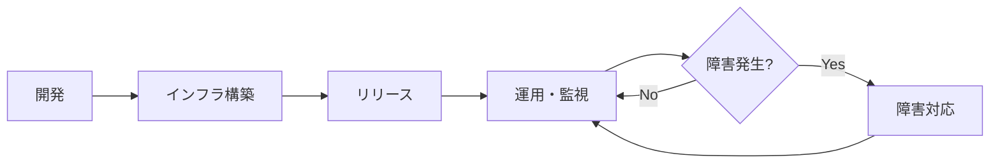
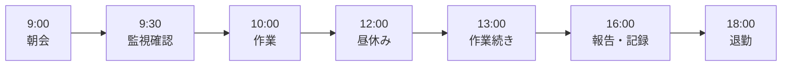
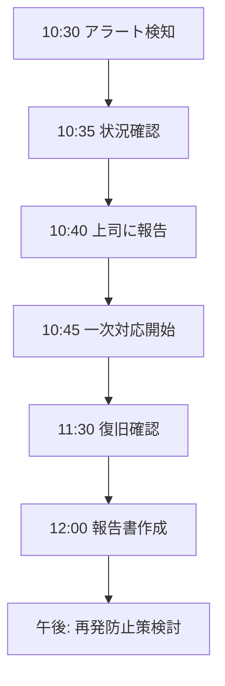
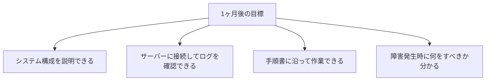
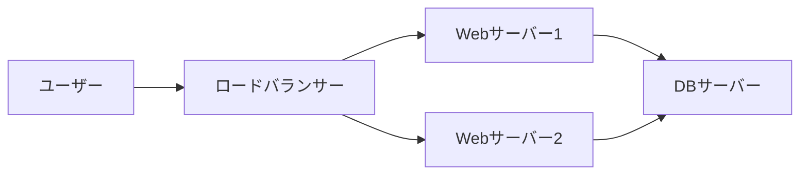
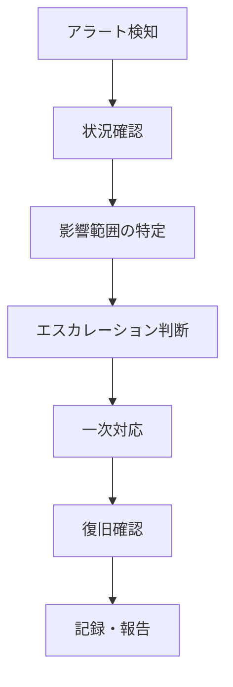
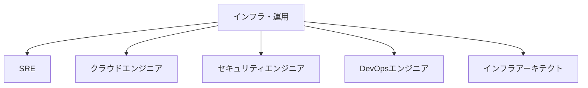

# インフラ・運用の場合

インフラ構築や運用保守をメインで担当する場合のガイドです。

## インフラ・運用とは

### 役割の概要

開発者が作ったアプリケーションを、**安定して動かし続ける**ための仕事です。



### 主な業務

| 業務 | 内容 |
|------|------|
| インフラ構築 | サーバー、ネットワーク、DB等の環境構築 |
| リリース作業 | 新しいバージョンのデプロイ |
| 監視 | システムの稼働状況を監視 |
| 障害対応 | 問題発生時の対応と復旧 |
| 手順書作成 | 作業手順のドキュメント化 |
| キャパシティ管理 | リソース使用状況の把握と計画 |

## よくある1日の流れ



### タイムスケジュール例（運用チーム）

| 時間 | 活動 | 詳細 |
|------|------|------|
| 9:00 | 朝会 | 昨日の障害、今日の作業予定を共有 |
| 9:30 | 監視確認 | アラート状況、システム稼働状況の確認 |
| 10:00 | 定常作業 | リリース作業、手順書作成、構築作業など |
| 12:00 | 昼休み | - |
| 13:00 | 作業続き | 午前の続き、または障害対応 |
| 15:00 | 確認・テスト | 作業結果の確認、動作テスト |
| 16:00 | 報告・記録 | 作業報告、ドキュメント更新 |
| 17:00 | 引き継ぎ | 次のシフトへの引き継ぎ（シフト制の場合） |
| 18:00 | 退勤 | - |

> **ポイント**：インフラ・運用は**予期せぬ障害**で予定が変わることがあります。「優先順位をつけて動く」「記録を残す」習慣が大切です。

### 障害発生時の1日（例）



## 最初の1ヶ月で覚えること

### 第1週：環境と業務を理解

| やること | 完了の目安 |
|----------|-----------|
| システム構成の把握 | 構成図を見て主要なサーバーが分かる |
| 監視ツールの確認 | 監視画面にログインして見方を理解 |
| 手順書の場所把握 | 必要な手順書がどこにあるか分かる |
| 連絡体制の確認 | 誰に何を報告するか把握 |

### 第2週：Linuxとツールの基礎

| やること | 完了の目安 |
|----------|-----------|
| サーバーへの接続 | SSHでサーバーに接続できる |
| 基本コマンドの習得 | ls、cd、cat、grep、tailが使える |
| ログの確認 | アプリケーションログを見つけて確認できる |
| 監視の意味理解 | 各監視項目が何を意味するか分かる |

### 第3〜4週：実務を経験

| やること | 完了の目安 |
|----------|-----------|
| 簡単な作業を実施 | 先輩の監督のもと、手順書に沿って作業完了 |
| 作業記録を書く | 作業内容を正確に記録できる |
| 障害対応を見学 | 障害発生時の動きを観察 |

### 1ヶ月後の目標状態



## この経験で身につくスキル

### 技術スキル

| スキル | 説明 |
|--------|------|
| システム全体の理解 | アプリ、DB、ネットワークがどう連携するか |
| トラブルシューティング | 問題の原因を特定する力 |
| 安定稼働の設計思想 | 「壊れない」「壊れても復旧できる」設計 |
| 自動化の発想 | 手作業を減らし、ミスを防ぐ |
| ドキュメント力 | 誰でも作業できる手順書を書く力 |
| Linux/ネットワークスキル | サーバー操作、ネットワーク構成の理解 |

### ビジネススキル

| スキル | 説明 |
|--------|------|
| 冷静さ | 障害時でも落ち着いて対応する力 |
| 報告力 | 状況を正確に伝える力 |
| 責任感 | システムを「止めない」という使命感 |
| 計画性 | 作業を確実に遂行する力 |

## 目指せる人材像

| 人材像 | 説明 | 目安期間 |
|--------|------|----------|
| 一人前の運用エンジニア | 定常作業を一人で実施できる | 1〜2年 |
| インフラエンジニア | 構築から運用まで担当 | 2〜4年 |
| SRE/クラウドエンジニア | 自動化・クラウド基盤の設計 | 4年〜 |

> **インフラ・運用は「縁の下の力持ち」**：普段は目立たないですが、システムが安定して動いているのはインフラ・運用のおかげです。この経験があると、開発者になっても「運用しやすいコード」が書けるようになります。

## 成長を感じられるポイント

### 3ヶ月後

- [ ] システム構成図を見て、主要なサーバーを説明できる
- [ ] 手順書に沿って一人で作業できる
- [ ] 障害発生時に「何を確認すべきか」が分かる

### 6ヶ月後

- [ ] ログを見て問題の原因を推測できる
- [ ] 簡単な手順書を自分で書ける
- [ ] 障害対応の一次切り分けができる

### 1年後

- [ ] 複雑な作業も任せてもらえる
- [ ] 監視アラートの意味と対処法が分かる
- [ ] 障害対応で後輩にアドバイスできる

> **成長のサイン**：「以前は意味不明だったログが読めるようになった」「障害発生時に慌てなくなった」と感じたら成長の証です。

## 「開発じゃないから成長できない」は誤解

### 開発者が知らないこと

インフラ・運用の経験者は、開発者が見落としがちな視点を持っています。

- 本番環境の厳しさ（テスト環境と違う）
- 障害対応のリアル（深夜対応、プレッシャー）
- 運用を考えた設計の重要性
- 「動けばOK」ではなく「安定して動き続ける」

## 最初に学ぶべきこと

### 1. Linuxの基本操作

ほとんどのサーバーはLinuxです。

**最低限覚えるコマンド**

| コマンド | 用途 |
|----------|------|
| `ls` | ファイル一覧 |
| `cd` | ディレクトリ移動 |
| `cat` / `less` | ファイル内容表示 |
| `grep` | 文字列検索 |
| `tail -f` | ログをリアルタイム表示 |
| `ps` | プロセス一覧 |
| `top` / `htop` | リソース使用状況 |
| `df` | ディスク使用量 |
| `free` | メモリ使用量 |

**ログの確認方法**

```bash
# 最新のログを表示
tail -100 /var/log/application.log

# リアルタイムで追跡
tail -f /var/log/application.log

# 特定のキーワードを検索
grep "ERROR" /var/log/application.log

# 組み合わせ
tail -f /var/log/application.log | grep "ERROR"
```

### 2. ネットワークの基礎



**覚えておくべき用語**

| 用語 | 説明 |
|------|------|
| IPアドレス | 機器の住所 |
| ポート番号 | サービスの入り口（80=HTTP, 443=HTTPS） |
| DNS | ドメイン名をIPアドレスに変換 |
| ファイアウォール | 通信の許可/拒否を制御 |
| ロードバランサー | 負荷を分散する |

### 3. 監視の基本

**何を監視するか**

| 対象 | 監視内容 | 例 |
|------|----------|-----|
| サーバー | CPU、メモリ、ディスク | CPU使用率80%超え |
| アプリ | 応答時間、エラー率 | 応答時間3秒超え |
| プロセス | 起動状態 | Webサーバー停止 |
| ログ | エラーメッセージ | Exception発生 |

**アラートが来たら**

1. まず状況を確認
2. 影響範囲を把握
3. 一次対応（できる範囲で）
4. 上位者に報告
5. 記録を残す

## 障害対応の進め方

### 障害発生時のフロー



### 1年目にできること

| やるべきこと | やらないこと |
|-------------|-------------|
| 状況を正確に把握 | 勝手に判断して操作 |
| 影響範囲を確認 | 慌てて誤操作 |
| 先輩・上司に報告 | 情報を隠す |
| 記録を取る | 記憶だけに頼る |

### 報告のポイント

```markdown
## 障害報告

### いつ
2024/01/15 10:30 検知

### 何が
Webサーバー1号機のCPU使用率が100%

### 影響
サイトの応答が遅い状態

### 現在の状況
- Webサーバー2号機は正常
- 原因調査中

### 対応状況
- 10:35 〇〇さんに報告済み
- 10:40 ログ確認中
```

## 手順書の読み方・書き方

### 手順書の重要性

インフラ・運用では**手順書通りに作業する**ことが基本です。

- ミスを防ぐ
- 誰がやっても同じ結果になる
- 問題があれば手順書を改善

### 手順書を読むときの注意

1. **作業前に全体を読む**（途中で「あれ？」とならないように）
2. **前提条件を確認**（環境、権限、事前準備）
3. **確認ポイントを把握**（どこで何を確認するか）
4. **ロールバック手順を確認**（失敗したときの戻し方）

### 手順書を書くときのコツ

**良い手順書の特徴**

```markdown
## 手順1：サービス停止

### 目的
アップデート作業のためサービスを停止する

### 実行コマンド
```bash
sudo systemctl stop application
```

### 確認方法
```bash
sudo systemctl status application
# 「Active: inactive」と表示されればOK
```

### 期待結果
- サービスが停止していること
- 「inactive」と表示されること

### 注意事項
- 停止前に利用者への告知が完了していること
```

## よくある失敗と対策

| 失敗 | 対策 |
|------|------|
| 本番と検証環境を間違える | 作業前に環境を必ず確認 |
| 手順書を読まずに作業 | 必ず事前に全体を読む |
| 障害時にパニック | 手順に従い、一人で抱え込まない |
| 記録を残さない | 作業ログを必ず残す |
| 「動いているからOK」 | 監視・確認まで完了させる |

## 学習のステップ

### ステップ1：今の環境を理解する

- 自社のシステム構成を把握
- どこに何のサーバーがあるか
- どんな監視をしているか

### ステップ2：基礎スキルを身につける

- Linuxコマンド
- ネットワークの基礎
- シェルスクリプトの基礎

### ステップ3：自動化を学ぶ

- シェルスクリプトで定型作業を自動化
- 構成管理ツール（Ansible等）
- CI/CDの基礎

### ステップ4：クラウドを学ぶ

- AWS / Azure / GCPの基礎
- Infrastructure as Code（IaC）
- コンテナ（Docker、Kubernetes）

## キャリアパス

インフラ・運用からのキャリアは多様です。



| キャリア | 説明 |
|----------|------|
| SRE | 信頼性を工学的に追求 |
| クラウドエンジニア | クラウド環境の設計・構築 |
| セキュリティエンジニア | セキュリティ専門 |
| DevOpsエンジニア | 開発と運用の橋渡し |
| インフラアーキテクト | インフラ全体の設計 |

## まとめ

インフラ・運用で大切なこと：

1. **手順書を守る**（勝手な判断をしない）
2. **記録を残す**（作業ログ、障害記録）
3. **報告・相談を早く**（特に障害時）
4. **システム全体を理解する**（開発者より広い視野を持てる）
5. **「安定して動き続ける」ことの価値**を理解する

インフラ・運用の経験は、エンジニアとしての土台になります。「開発じゃないから」と卑下せず、自信を持って取り組んでください。
