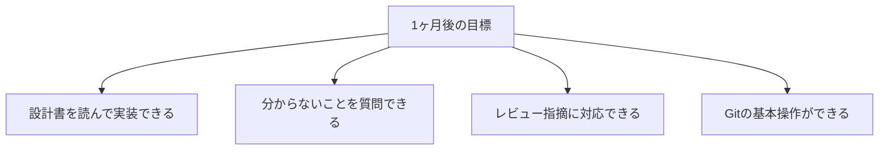
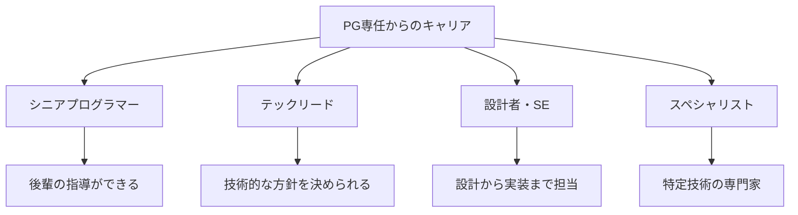

# PG専任の場合

プログラミング（コーディング）が主な業務の場合のガイドです。

## この役割の特徴

- 設計書を読んで実装する
- コーディングと単体テストが主な業務
- コードレビューを受ける機会が多い

## よくある1日の流れ

### タイムスケジュール例

| 時間 | 活動 | 詳細 |
|------|------|------|
| 9:00 | 朝会 | 今日の予定を共有、困っていることがあれば相談 |
| 9:30 | 実装作業 | 設計書を確認しながらコーディング |
| 10:30 | 動作確認 | 作った機能の動作確認、単体テスト |
| 12:00 | 昼休み | - |
| 13:00 | 実装作業 | 午前の続き、または別タスク |
| 15:00 | レビュー対応 | PRへの指摘対応、または他の人のPRを読む |
| 16:00 | 質問・相談 | 詰まったことを先輩に確認 |
| 17:00 | 進捗報告 | 今日の成果と明日の予定を報告 |
| 17:30 | 翌日の準備 | 明日やることを整理、メモを残す |
| 18:00 | 退勤 | - |

> **ポイント**：「実装→動作確認→実装→動作確認」のサイクルを細かく回すことで、問題を早期発見できます。

## 最初の1ヶ月で覚えること

### 第1週：環境に慣れる

| やること | 完了の目安 |
|----------|-----------|
| 開発環境構築 | ローカルでアプリが動く |
| Gitの基本操作 | clone、commit、push、PRが作れる |
| コーディング規約の確認 | 規約ドキュメントを一読 |
| 既存コードを読む | 主要なクラスの役割を把握 |

### 第2週：小さなタスクをこなす

| やること | 完了の目安 |
|----------|-----------|
| 簡単なバグ修正 | 1件完了してレビュー通過 |
| 単体テストを書く | テストコードを1つ書いてみる |
| レビュー指摘の対応 | 指摘内容を理解して修正 |

### 第3〜4週：実装力をつける

| やること | 完了の目安 |
|----------|-----------|
| 小さな機能追加 | 設計書を読んで実装完了 |
| デバッグの実践 | デバッガを使ってバグを特定できる |
| コードレビューへの慣れ | 指摘を「学び」として受け止められる |

### 1ヶ月後の目標状態

## この経験で身につくスキル

### 技術スキル

| スキル | 説明 |
|--------|------|
| コーディング力 | 設計を読み解き、動くコードに落とし込む力 |
| デバッグ力 | 問題の原因を特定し、修正する力 |
| テスト力 | 自分のコードが正しく動くことを確認する力 |
| コードリーディング力 | 既存コードを読んで理解する力 |
| ツール活用力 | IDE、Git、デバッガなど開発ツールを使いこなす力 |

### ビジネススキル

| スキル | 説明 |
|--------|------|
| 正確性 | 仕様通りに実装する力 |
| 報告力 | 進捗や課題を適切に伝える力 |
| 受容力 | フィードバックを素直に受け止める力 |

## 目指せる人材像

| 人材像 | 説明 | 目安期間 |
|--------|------|----------|
| 一人前のPG | 一人で機能を実装できる | 1〜2年 |
| シニアPG | 後輩指導、難しい実装を担当 | 3〜5年 |
| テックリード | 技術選定やアーキテクチャ判断 | 5年〜 |

## 成長を感じられるポイント

### 3ヶ月後

- [ ] 簡単なタスクを一人で完了できるようになる
- [ ] レビュー指摘が減ってくる
- [ ] デバッグで原因を見つけられるようになる

### 6ヶ月後

- [ ] 設計書を読んでスムーズに実装できる
- [ ] 他の人のPRをレビューして意見を言える
- [ ] 「この実装ならこう書く」という自分のスタイルができる

### 1年後

- [ ] 機能単位で任せてもらえる
- [ ] 新人に教えられることがある
- [ ] 技術的な議論に参加できる

> **成長のサイン**：「以前は分からなかったコードが読めるようになった」「レビュー指摘の意図が分かるようになった」と感じたら、確実に成長しています。

## 本編で特に重要な章

| 章 | 重要度 | 理由 |
|----|--------|------|
| [[22_コードを読む・書く基礎]] | ★★★ | 日常業務で必須 |
| [[23_デバッグの基本]] | ★★★ | 問題解決に必須 |
| [[42_実装の進め方]] | ★★★ | 効率的な実装のために |
| [[45_コードレビューの受け方]] | ★★★ | 品質向上と成長のために |
| [[30_設計書・仕様書の読み方]] | ★★☆ | 正しく実装するために |

## 追加で学ぶと良いこと

### 優先度：高

| 内容 | 説明 | 学習方法 |
|------|------|---------|
| リーダブルコード | 読みやすいコードの書き方 | 書籍「リーダブルコード」 |
| ユニットテスト | 自動テストの書き方 | 言語別のテストフレームワーク |
| デザインパターン入門 | よく使うパターン | ステップアップガイド |

### 優先度：中

| 内容 | 説明 | 学習方法 |
|------|------|---------|
| リファクタリング | コードの改善方法 | 書籍「リファクタリング」 |
| SOLID原則 | 設計の基本原則 | ステップアップガイド |
| コードレビューの仕方 | レビューする側の観点 | 実践で学ぶ |

## よくある悩みと対処法

### 「設計書の意図が分からない」

- まず自分なりに解釈してみる
- 「〇〇という理解で合っていますか？」と確認
- 遠慮せず質問する

### 「コードレビューが怖い」

- 指摘は「コード」へのフィードバック
- 学びの機会と捉える
- 同じ指摘を繰り返さないようメモする

### 「自分のコードに自信がない」

- 最初は当然のこと
- 先輩のコードを参考にする
- レビューを通じて改善する

## 成長のためのアドバイス

### コードを読む時間を作る

- 先輩のコードを読んで学ぶ
- オープンソースのコードを読む
- 良いコードのパターンを吸収する

### 小さな改善を積み重ねる

- 「前より良くなった」を意識する
- 一度に完璧を目指さない
- フィードバックを活かす

### 技術的な興味を持つ

- 「なぜこう書くのか」を考える
- 新しい技術に触れてみる
- 勉強会や技術記事を読む
