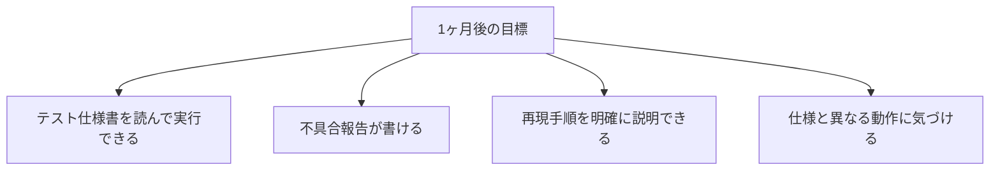
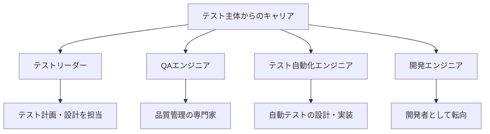

# テスト主体の場合

テスト業務が主な業務の場合のガイドです。

## この役割の特徴

- テスト仕様書に基づいてテストを実施
- 不具合を発見して報告する
- 品質を守る重要な役割

## よくある1日の流れ


### タイムスケジュール例

| 時間 | 活動 | 詳細 |
|------|------|------|
| 9:00 | 朝会 | 今日のテスト範囲を確認、優先度の共有 |
| 9:30 | テスト準備 | テスト仕様書の確認、テストデータの準備 |
| 10:00 | テスト実施 | 仕様書に沿ってテストを実行 |
| 12:00 | 昼休み | - |
| 13:00 | テスト実施 | 午前の続き、不具合があれば詳細を調査 |
| 15:00 | 不具合報告 | 発見した不具合をチケットに起票 |
| 16:00 | 再テスト | 修正された不具合の確認テスト |
| 17:00 | 進捗報告 | テスト消化率、発見不具合数を報告 |
| 17:30 | 翌日の準備 | 明日のテスト範囲を確認 |
| 18:00 | 退勤 | - |

> **ポイント**：不具合を発見したら「再現手順」を明確にしてから報告しましょう。「何となく動かない」ではなく、「この操作をすると必ず発生する」と伝えることが大切です。

## 最初の1ヶ月で覚えること

### 第1週：テスト業務の基本を理解

| やること | 完了の目安 |
|----------|-----------|
| テスト環境の操作 | ログインして基本操作ができる |
| テスト仕様書の読み方 | 手順と期待結果が理解できる |
| 不具合報告ツールの使い方 | チケットを起票できる |
| 仕様書・設計書の場所把握 | 必要なドキュメントを見つけられる |

### 第2週：テストを実施する

| やること | 完了の目安 |
|----------|-----------|
| 簡単な機能のテスト | 先輩の指導のもと完了 |
| 不具合報告の作成 | 再現手順を含めた報告ができる |
| エビデンス（証跡）の取得 | スクリーンショットを残せる |

### 第3〜4週：品質への意識を高める

| やること | 完了の目安 |
|----------|-----------|
| 一人でテストを消化 | 割り当て分を完了できる |
| 不具合の傾向把握 | 「この機能でバグが出やすい」が分かる |
| テスト観点の理解 | 正常系・異常系・境界値を意識できる |

### 1ヶ月後の目標状態



## 不具合報告のテンプレート

不具合を報告するときは、以下の情報を含めましょう。

```markdown
## 不具合概要
ユーザー登録画面で、メールアドレス重複時にエラーメッセージが表示されない

## 再現手順
1. ユーザー登録画面を開く
2. 既に登録済みのメールアドレスを入力
3. 「登録」ボタンをクリック

## 期待結果
「このメールアドレスは既に登録されています」とエラーメッセージが表示される

## 実際の結果
何も表示されず、画面が更新されるだけ

## 発生環境
- OS：Windows 11
- ブラウザ：Chrome 120
- テスト環境：開発環境（dev.example.com）

## 再現率
5回中5回（100%）

## 備考
- スクリーンショット添付
- ログで「Duplicate email」のエラーは出ている
```

## この経験で身につくスキル

### 技術スキル

| スキル | 説明 |
|--------|------|
| テスト設計力 | 効果的なテストケースを考える力 |
| 不具合発見力 | 問題を見つけ出す観察眼 |
| 分析力 | 「なぜ起きたか」を追求する力 |
| ドキュメント力 | 分かりやすい報告を書く力 |
| システム理解力 | 機能間の関連を理解する力 |

### ビジネススキル

| スキル | 説明 |
|--------|------|
| 品質意識 | 「ユーザーにとって正しい動作か」を考える力 |
| 報告力 | 問題を正確に伝える力 |
| 客観性 | 事実に基づいて判断する力 |
| 粘り強さ | 再現手順を突き止めるまで諦めない力 |

## 目指せる人材像



| 人材像 | 説明 | 目安期間 |
|--------|------|----------|
| 一人前のテスター | テスト設計から実施まで一人で担当 | 1〜2年 |
| テストリーダー | テスト計画、メンバー管理 | 2〜4年 |
| QAエンジニア | 品質保証の専門家 | 3〜5年 |

> **テストの経験は開発にも活きる**：「どこにバグが出やすいか」を知っている人は、バグを出しにくいコードを書けます。テスト経験者が開発に転向するケースも多いです。

## 成長を感じられるポイント

### 3ヶ月後

- [ ] テスト仕様書を一人で消化できる
- [ ] 不具合報告が「分かりやすい」と言われる
- [ ] 「怪しい」と思う観点が増える

### 6ヶ月後

- [ ] 仕様書を読んでテストケースを追加提案できる
- [ ] 「この機能はここが壊れやすい」と予測できる
- [ ] 開発者との不具合に関する会話がスムーズになる

### 1年後

- [ ] テスト計画や設計に関わる
- [ ] 後輩にテスト観点を教えられる
- [ ] 品質改善の提案ができる

> **成長のサイン**：「以前は見逃していた不具合を見つけられるようになった」「開発者に『良い指摘』と言われた」と感じたら成長の証です。

## 本編で特に重要な章

| 章 | 重要度 | 理由 |
|----|--------|------|
| [[43_テストの進め方]] | ★★★ | 日常業務で必須 |
| [[30_設計書・仕様書の読み方]] | ★★★ | 仕様を理解するため |
| [[32_ドキュメントの書き方]] | ★★★ | 不具合報告に必要 |
| [[44_不具合対応の進め方]] | ★★☆ | 不具合の理解のため |
| [[23_デバッグの基本]] | ★★☆ | 問題の切り分けに役立つ |

## 追加で学ぶと良いこと

### 優先度：高

| 内容 | 説明 | 学習方法 |
|------|------|---------|
| テスト技法 | 境界値分析、同値分割など | ステップアップガイド |
| テストの種類 | 単体、結合、システムテストの違い | ステップアップガイド |
| 不具合報告の書き方 | 再現手順の書き方 | 本編 + 実践 |

### 優先度：中

| 内容 | 説明 | 学習方法 |
|------|------|---------|
| テスト自動化 | 自動テストの概念 | ツールを触ってみる |
| SQL基礎 | テストデータの確認 | 本編 [[24_データベースの基礎]] |
| 品質管理の基礎 | 品質とは何か | 書籍・研修 |

## よくある悩みと対処法

### 「テストが単調でつまらない」

- 「バグハンター」としての視点を持つ
- ユーザー視点で「壊れるところ」を探す
- テスト設計に関わる機会を増やす

### 「不具合かどうか判断できない」

- 仕様書を確認する
- 「仕様通りか」「意図した動作か」で判断
- 迷ったら報告して確認してもらう

### 「再現手順をうまく書けない」

- 他の人が同じ操作で再現できるように
- 1ステップ1操作で書く
- スクリーンショットを活用する

## 成長のためのアドバイス

### テスト観点を増やす

- 正常系だけでなく異常系も
- 「ユーザーならこう使うかも」を考える
- 境界値を意識する

### 仕様を深く理解する

- なぜその仕様なのかを考える
- 関連する機能との関係を把握する
- 疑問があれば質問する

### 開発者の視点も学ぶ

- コードがどう動いているか興味を持つ
- 不具合の原因を知ることで、発見力が上がる
- プログラミングの基礎を学ぶ
