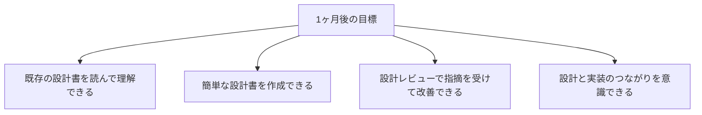
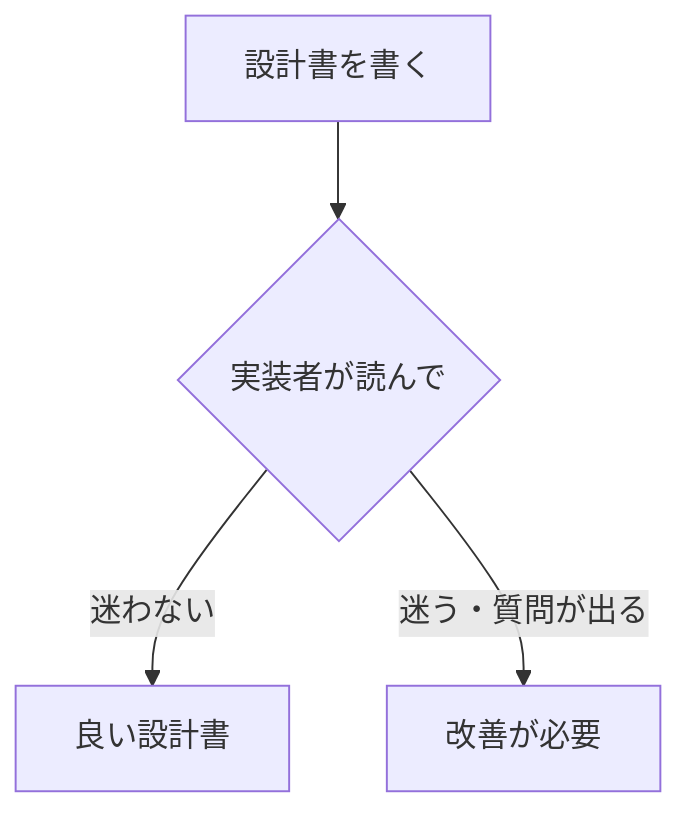
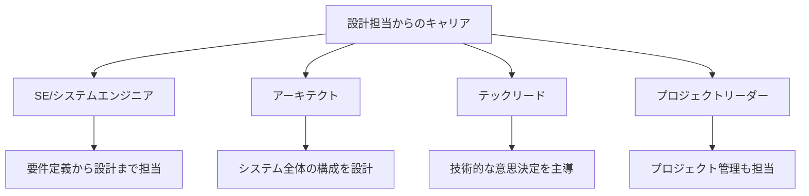

# 設計も担当する場合

設計書の作成も担当する場合のガイドです。

## この役割の特徴

- 詳細設計書の作成に関わる
- 設計内容を理解して実装する
- 設計レビューに参加する

## よくある1日の流れ

### タイムスケジュール例

| 時間 | 活動 | 詳細 |
|------|------|------|
| 9:00 | 朝会 | 今日の予定を共有、設計の相談事項を確認 |
| 9:30 | 設計作業 | 設計書の作成、図の作成 |
| 11:00 | 仕様確認 | 不明点を設計リーダーやお客様に確認 |
| 12:00 | 昼休み | - |
| 13:00 | 設計レビュー | 作成した設計書のレビューを受ける |
| 14:00 | 設計修正 | レビュー指摘を反映 |
| 16:00 | 実装作業 | 設計書に基づいて実装（設計と並行する場合） |
| 17:30 | 進捗報告 | 設計進捗、課題を報告 |
| 18:00 | 退勤 | - |

> **ポイント**：設計は「実装者が迷わない」ことが目標です。自分で実装することを想像しながら設計書を書くと、抜け漏れに気づきやすくなります。

## 最初の1ヶ月で覚えること

### 第1週：設計書の読み方を学ぶ

| やること | 完了の目安 |
|----------|-----------|
| 既存の設計書を読む | 画面設計書、処理設計書を各1件以上読む |
| 設計書のフォーマット把握 | プロジェクトのテンプレートを理解 |
| UML記法の基礎 | クラス図、シーケンス図が読める |

### 第2週：簡単な設計を書いてみる

| やること | 完了の目安 |
|----------|-----------|
| 既存設計書の修正 | 小さな変更を設計書に反映 |
| 設計レビューを受ける | レビュー指摘を理解して修正 |
| 設計の意図を説明 | 「なぜこの設計にしたか」を説明できる |

### 第3〜4週：設計と実装をつなげる

| やること | 完了の目安 |
|----------|-----------|
| 自分の設計を実装 | 設計通りに実装できるか確認 |
| 設計の過不足を把握 | 「ここが足りなかった」に気づける |
| 設計書の改善 | 実装で気づいた点を設計書に反映 |

### 1ヶ月後の目標状態

## 設計で意識すること

### 実装者の視点で書く

**良い設計書のポイント**
- 入出力が明確
- 処理の条件分岐が網羅されている
- 例外ケースの扱いが書かれている
- 関連する他の機能との関係が分かる

### 設計書チェックリスト

設計書を書いたら、以下を確認しましょう。

- [ ] 機能の目的・概要が書かれているか
- [ ] 入力データと出力データが明確か
- [ ] 正常系の処理フローが書かれているか
- [ ] 異常系（エラー時）の処理が書かれているか
- [ ] 他機能との関連が分かるか
- [ ] 実装者が迷うポイントはないか

## この経験で身につくスキル

### 技術スキル

| スキル | 説明 |
|--------|------|
| 設計力 | 要件を構造化して設計に落とし込む力 |
| 抽象化力 | 本質を見極めて整理する力 |
| 可視化力 | 複雑なものを図や文章で表現する力 |
| 先読み力 | 実装時の問題を事前に予測する力 |
| 俯瞰力 | システム全体を見渡す力 |

### ビジネススキル

| スキル | 説明 |
|--------|------|
| 説明力 | 設計意図を他者に伝える力 |
| 調整力 | 関係者と認識を合わせる力 |
| 判断力 | トレードオフを考慮して決断する力 |

## 目指せる人材像

| 人材像 | 説明 | 目安期間 |
|--------|------|----------|
| 一人前の設計者 | 機能単位の詳細設計を担当 | 2〜3年 |
| SE | 要件定義から設計、レビューまで | 3〜5年 |
| アーキテクト | システム全体の設計・方針決定 | 5年〜 |

> **設計経験は上流工程への登竜門**：1年目から設計に関わる機会があるのは恵まれた環境です。この経験を活かして、早い段階でSEやアーキテクトを目指せます。

## 成長を感じられるポイント

### 3ヶ月後

- [ ] 設計書のフォーマットに慣れる
- [ ] レビュー指摘が「分かりやすくなった」と言われる
- [ ] 実装者から「設計書通りに実装できた」と言われる

### 6ヶ月後

- [ ] 機能単位で設計を任せてもらえる
- [ ] 「なぜこの設計にしたか」を説明できる
- [ ] 他の人の設計をレビューできる

### 1年後

- [ ] 複数機能をまたぐ設計ができる
- [ ] 設計の選択肢を複数提示できる
- [ ] 後輩に設計のアドバイスができる

> **成長のサイン**：「設計段階で問題を見つけられるようになった」「実装で困らない設計が書けるようになった」と感じたら成長の証です。

## 本編で特に重要な章

| 章 | 重要度 | 理由 |
|----|--------|------|
| [[20_開発工程の全体像]] | ★★★ | 設計の位置づけを理解 |
| [[30_設計書・仕様書の読み方]] | ★★★ | 設計書を読み書きするため |
| [[32_ドキュメントの書き方]] | ★★★ | 設計書を書くため |
| [[42_実装の進め方]] | ★★☆ | 実装しやすい設計のため |
| [[22_コードを読む・書く基礎]] | ★★☆ | 設計を実装につなげるため |

## 追加で学ぶと良いこと

### 優先度：高

| 内容 | 説明 | 学習方法 |
|------|------|---------|
| UML基礎 | クラス図、シーケンス図の読み書き | 書籍、実践 |
| 設計書の書き方 | 分かりやすい設計書 | 先輩の設計書を参考に |
| テーブル設計 | データベース設計の基礎 | 本編 + ステップアップ |

### 優先度：中

| 内容 | 説明 | 学習方法 |
|------|------|---------|
| SOLID原則 | 良い設計の原則 | ステップアップガイド |
| デザインパターン | よく使う設計パターン | ステップアップガイド |
| アーキテクチャ基礎 | システム構成の考え方 | ステップアップガイド |

## よくある悩みと対処法

### 「設計書の書き方が分からない」

- 既存の設計書をテンプレートにする
- 先輩にレビューしてもらう
- 「実装者が迷わないように」を意識

### 「どこまで詳細に書けばいいか分からない」

- 実装者が迷わない程度に
- プロジェクトの慣例に合わせる
- 曖昧な部分は明確にする

### 「自分の設計が正しいか不安」

- レビューで確認してもらう
- 実装してみて問題がないか確認
- フィードバックを活かして改善

## 成長のためのアドバイス

### 実装者の視点を持つ

- 「この設計で実装できるか」を考える
- 自分で実装してみて確認
- 実装者からのフィードバックを活かす

### 既存の設計を学ぶ

- プロジェクトの既存設計書を読む
- なぜその設計になっているか考える
- 良いパターンを吸収する

### 設計の引き出しを増やす

- デザインパターンを学ぶ
- 他のシステムの設計を参考にする
- 「こういう場合はこうする」を蓄積
