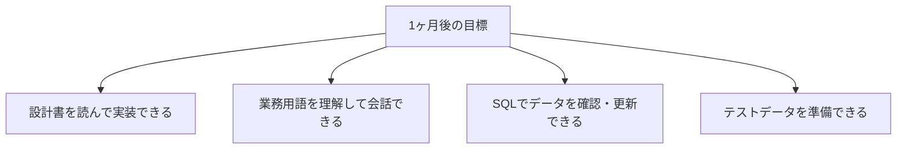
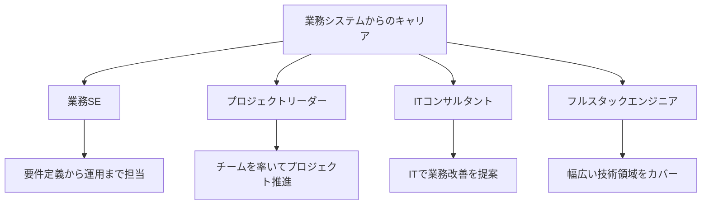

# 業務システムの場合

業務システム開発（Java、C#など）の場合のガイドです。

## この領域の特徴

- Java、C#が主な言語
- データベースとの連携が多い
- 業務ロジックの理解が重要
- 長期運用されるシステムが多い

## よくある1日の流れ


### タイムスケジュール例（SIer/受託開発）

| 時間 | 活動 | 詳細 |
|------|------|------|
| 9:00 | 朝会 | 今日の予定を共有、課題の確認 |
| 9:30 | 仕様確認 | 設計書を読んで不明点を洗い出す |
| 10:00 | 実装作業 | 設計書に基づいてコーディング |
| 12:00 | 昼休み | - |
| 13:00 | 実装・単体テスト | コーディングとテスト作成 |
| 15:00 | コードレビュー | レビュー対応、または他のコードをレビュー |
| 16:00 | ドキュメント更新 | 設計書・テスト仕様書の更新 |
| 17:00 | 進捗報告 | 今日の成果、明日の予定、課題を報告 |
| 18:00 | 退勤 | - |

> **ポイント**：業務システムは**設計書と仕様の理解**が非常に重要です。「なぜこの処理が必要か」を理解してから実装すると、手戻りが減ります。

## 最初の1ヶ月で覚えること

### 第1週：システムと業務を理解

| やること | 完了の目安 |
|----------|-----------|
| 開発環境構築 | ローカルでアプリが動く、DBに接続できる |
| 業務フローの把握 | 担当する業務の流れが説明できる |
| 用語の理解 | プロジェクト固有の業務用語を覚える |
| 設計書の場所把握 | 必要なドキュメントを見つけられる |

### 第2週：コードとDBを理解

| やること | 完了の目安 |
|----------|-----------|
| 既存コードの読解 | 担当機能のコードが追える |
| テーブル構成の把握 | 主要なテーブルの役割が分かる |
| SQLの実行 | SELECTでデータを確認できる |
| テストデータの準備 | テスト用のデータを作成できる |

### 第3〜4週：実装を経験

| やること | 完了の目安 |
|----------|-----------|
| 小さな機能修正 | 1件完了してレビュー通過 |
| 単体テストの作成 | テストコードを書いてテスト実行 |
| SQLの作成 | INSERT、UPDATE文を作成して実行 |

### 1ヶ月後の目標状態



## 業務システムでよく使うSQL

開発中によく使うSQLパターンを覚えておきましょう。

```sql
-- データの確認
SELECT * FROM users WHERE user_id = '123';

-- 関連テーブルの結合
SELECT u.name, o.order_date
FROM users u
JOIN orders o ON u.user_id = o.user_id
WHERE o.status = 'pending';

-- データの件数確認
SELECT COUNT(*) FROM orders WHERE order_date = '2024-01-15';

-- テストデータの投入
INSERT INTO users (user_id, name, email)
VALUES ('TEST001', 'テスト太郎', 'test@example.com');

-- テストデータの削除
DELETE FROM users WHERE user_id LIKE 'TEST%';
```

> **注意**：本番環境では絶対にDELETE/UPDATEを実行しないこと。必ずテスト環境で作業しましょう。

## この経験で身につくスキル

### 技術スキル

| スキル | 説明 |
|--------|------|
| データベーススキル | SQL、テーブル設計、トランザクション管理 |
| 業務ロジック実装力 | 複雑なビジネスルールをコードに落とし込む力 |
| ドキュメント力 | 設計書の読み書き、仕様のまとめ方 |
| テストスキル | 業務要件を満たすテストケースの作成 |
| フレームワーク活用力 | Spring、.NETなどの活用 |

### ビジネススキル

| スキル | 説明 |
|--------|------|
| 業務理解力 | お客様の業務プロセスを理解する力 |
| コミュニケーション力 | お客様や関係者と仕様を調整する力 |
| 品質意識 | 「正確に動くこと」を重視する姿勢 |
| 長期的視点 | 保守・運用を考えた設計・実装 |

## 目指せる人材像



| 人材像 | 説明 | 目安期間 |
|--------|------|----------|
| 一人前のPG | 機能単位の設計・実装を担当 | 1〜2年 |
| 業務SE | 要件定義から設計、顧客折衝まで | 3〜5年 |
| PL/PM | プロジェクトのリード・管理 | 5年〜 |

> **業務システムの経験は「ITと業務の両方が分かる」強み**：技術だけでなく、業務知識も身につくため、お客様との折衝やコンサルティングにも活かせます。

## 成長を感じられるポイント

### 3ヶ月後

- [ ] 業務用語を使って会話できる
- [ ] SQLでデータ確認や更新ができる
- [ ] 設計書を読んで実装できる

### 6ヶ月後

- [ ] 「この業務だからこの処理が必要」と説明できる
- [ ] お客様の要望の意図を理解できる
- [ ] 複数テーブルをまたぐ処理が実装できる

### 1年後

- [ ] 機能単位で設計から実装まで任せてもらえる
- [ ] お客様との打ち合わせに参加できる
- [ ] 後輩に業務やシステムの説明ができる

> **成長のサイン**：「以前は意味不明だった業務用語が分かるようになった」「お客様の要望の背景が理解できるようになった」と感じたら成長の証です。

## 本編で特に重要な章

| 章 | 重要度 | 理由 |
|----|--------|------|
| [[24_データベースの基礎]] | ★★★ | DBを使う業務が多い |
| [[30_設計書・仕様書の読み方]] | ★★★ | 業務仕様の理解が重要 |
| [[42_実装の進め方]] | ★★★ | 品質重視の開発 |
| [[43_テストの進め方]] | ★★★ | テストが重視される |

## 追加で学ぶと良いこと

### 優先度：高

| 内容 | 説明 | 学習方法 |
|------|------|---------|
| SQL応用 | JOINやサブクエリ | 本編 + 実践 |
| トランザクション | データの整合性 | ステップアップガイド |
| 例外処理 | エラーハンドリング | ステップアップガイド |
| ログ出力 | 運用時の調査に必要 | ステップアップガイド |

### 優先度：中

| 内容 | 説明 | 学習方法 |
|------|------|---------|
| フレームワーク | Spring、.NETなど | プロジェクトで使うもの |
| テーブル設計 | 正規化、インデックス | ステップアップガイド |
| バッチ処理 | 大量データの処理 | 実践で学ぶ |

## 業務システム特有の注意点

### 業務理解が重要

- 「なぜその機能が必要か」を理解する
- 業務用語を覚える
- 業務フローを把握する

### データの整合性

- トランザクションを正しく使う
- データの不整合は致命的
- 排他制御を意識する

### 長期運用を意識

- 保守しやすいコードを書く
- コメントやドキュメントを残す
- 影響範囲を考えて修正する

## よくある悩みと対処法

### 「業務が複雑で理解できない」

- 業務フロー図を確認する
- 先輩に業務の流れを教えてもらう
- 実際のシステムを触って理解する

### 「SQLが複雑で分からない」

- 小さいクエリから理解する
- 結果を1つずつ確認しながら組み立てる
- 実行計画を見て動きを理解する

### 「既存コードが大量で読めない」

- 全部読もうとしない
- 自分の担当範囲から読む
- デバッガで動きを追う

## 成長のためのアドバイス

### 業務知識を身につける

- 業務用語を覚える
- 「なぜ」を考える
- お客様の視点を持つ

### データベーススキルを磨く

- SQLを使いこなす
- パフォーマンスを意識する
- データモデリングを学ぶ

### 品質を意識する

- テストをしっかり行う
- コードレビューを活用する
- 運用時のことを考える
