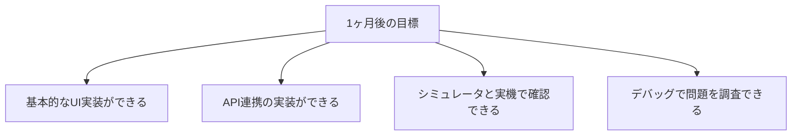
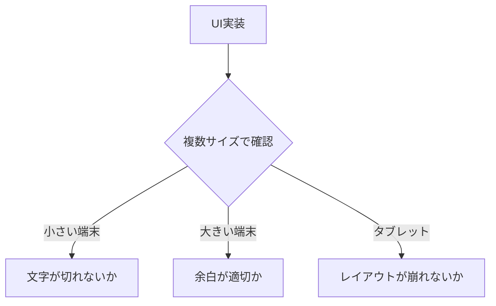
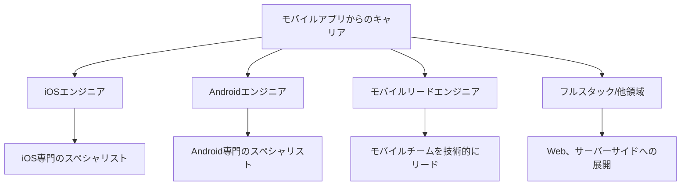

# モバイルアプリの場合

モバイルアプリ開発（Swift、Kotlin、Flutterなど）の場合のガイドです。

## この領域の特徴

- iOS（Swift）とAndroid（Kotlin）がある
- クロスプラットフォーム（Flutter、React Native）もある
- UI/UXが非常に重視される
- プラットフォーム固有の知識が必要

## よくある1日の流れ


### タイムスケジュール例

| 時間 | 活動 | 詳細 |
|------|------|------|
| 10:00 | デイリースタンドアップ | 昨日やったこと、今日やること、困っていることを共有 |
| 10:30 | 開発作業 | UI実装、ロジック実装 |
| 12:00 | 昼休み | - |
| 13:00 | 開発作業 | 午前の続き、API連携 |
| 15:00 | 実機テスト | 実機での動作確認、端末サイズの確認 |
| 16:00 | デザインレビュー | デザイナーと画面の確認、調整 |
| 17:00 | コードレビュー | PRのレビュー対応 |
| 18:00 | 翌日の準備 | 次のタスクの確認 |
| 19:00 | 退勤 | - |

> **ポイント**：モバイルアプリは**実機での確認**が非常に重要です。シミュレータでは分からない問題（タッチ操作の感触、パフォーマンス、バッテリー消費など）があります。

## 最初の1ヶ月で覚えること

### 第1週：開発環境とプラットフォームの基礎

| やること | 完了の目安 |
|----------|-----------|
| 開発環境構築 | Xcode/Android Studioで新規プロジェクトが作れる |
| シミュレータ操作 | アプリをシミュレータで実行できる |
| 実機への転送 | 実機でアプリを動かせる |
| プロジェクト構成の理解 | ファイル構成、ビルド設定を把握 |

### 第2週：UIの基礎を学ぶ

| やること | 完了の目安 |
|----------|-----------|
| 基本的なUI部品 | ボタン、テキスト、画像を配置できる |
| 画面遷移 | 画面間の遷移を実装できる |
| デバッグ方法 | ログ出力、ブレークポイントが使える |
| 既存コードの読解 | 担当画面のコードが追える |

### 第3〜4週：機能実装を経験

| やること | 完了の目安 |
|----------|-----------|
| 簡単なUI修正 | デザイン調整を1件完了 |
| API連携 | データの取得・表示ができる |
| 実機テストの習慣化 | 変更後は実機で確認する習慣 |

### 1ヶ月後の目標状態



## モバイル開発で意識すること

### シミュレータ vs 実機

| 確認項目 | シミュレータ | 実機 |
|---------|-------------|------|
| UIの表示 | ○ | ◎ |
| タッチ操作の感触 | △ | ◎ |
| パフォーマンス | △（参考程度） | ◎ |
| カメラ・GPS | × | ◎ |
| プッシュ通知 | △ | ◎ |
| バッテリー消費 | × | ◎ |

### よくあるデバッグ方法

**iOSの場合**
```swift
// ログ出力
print("ユーザー情報: \(user)")

// ブレークポイント：Xcodeでコード行をクリック
```

**Androidの場合**
```kotlin
// ログ出力
Log.d("MainActivity", "ユーザー情報: $user")

// Logcatでフィルタして確認
```

### 端末サイズ対応



## この経験で身につくスキル

### 技術スキル

| スキル | 説明 |
|--------|------|
| モバイルUI実装力 | プラットフォーム固有のUI実装スキル |
| 非同期処理力 | ネットワーク通信、バックグラウンド処理 |
| パフォーマンス意識 | 限られたリソースで快適に動かす |
| デバッグ力 | 実機での問題調査スキル |
| プラットフォーム知識 | iOS/Androidの仕組みの理解 |

### ビジネススキル

| スキル | 説明 |
|--------|------|
| ユーザー視点 | 使いやすさ、操作感を重視する姿勢 |
| デザイン感覚 | UI/UXへの理解と配慮 |
| 品質意識 | ストア審査に通る品質への意識 |

## 目指せる人材像



| 人材像 | 説明 | 目安期間 |
|--------|------|----------|
| 一人前のモバイルエンジニア | 画面単位で実装できる | 1〜2年 |
| プラットフォーム専門 | iOS/Androidどちらかの深い知識 | 2〜4年 |
| モバイルリード | 設計・技術選定・チーム牽引 | 4年〜 |

> **モバイル開発は「ユーザーに一番近い」開発**：毎日使われるアプリを作る実感が得られます。「自分が作ったアプリを友人が使っている」という経験ができるのはモバイルならではです。

## 成長を感じられるポイント

### 3ヶ月後

- [ ] 基本的なUI部品を使って画面を作れる
- [ ] シミュレータと実機で動作確認できる
- [ ] API連携でデータを表示できる

### 6ヶ月後

- [ ] 画面遷移や状態管理を意識した実装ができる
- [ ] 「このUIならこう実装する」とパターンが分かる
- [ ] デザイナーと協力して画面を作れる

### 1年後

- [ ] 機能単位で設計から実装まで担当できる
- [ ] アプリのパフォーマンスを意識した実装ができる
- [ ] ストアへのリリースプロセスを理解している

> **成長のサイン**：「以前は実装に時間がかかったUIが、今はスムーズに作れる」「ユーザーの使いやすさを考えて実装できるようになった」と感じたら成長の証です。

## 本編で特に重要な章

| 章 | 重要度 | 理由 |
|----|--------|------|
| [[46_よく使う技術知識]] | ★★★ | API連携が多い |
| [[23_デバッグの基本]] | ★★★ | 実機デバッグが必要 |
| [[21_開発環境の基礎]] | ★★★ | IDE固有の知識が必要 |
| [[43_テストの進め方]] | ★★☆ | 実機テストが重要 |

## 追加で学ぶと良いこと

### 優先度：高

| 内容 | 説明 | 学習方法 |
|------|------|---------|
| プラットフォームの基礎 | iOS/Androidの仕組み | 公式ドキュメント |
| UI/UXの基礎 | 使いやすいアプリ設計 | ガイドライン |
| API連携 | サーバーとの通信 | 本編 + 実践 |
| 非同期処理 | ネットワーク通信など | 言語のドキュメント |

### 優先度：中

| 内容 | 説明 | 学習方法 |
|------|------|---------|
| 状態管理 | アプリの状態を管理 | フレームワークのドキュメント |
| ローカルストレージ | データの保存 | 実践で学ぶ |
| プッシュ通知 | 通知機能の実装 | 実践で学ぶ |

## モバイル特有の注意点

### プラットフォームごとの違い

- iOS/Androidで作法が異なる
- デザインガイドラインが異なる
- 審査基準が異なる

### ユーザー体験

- レスポンスの速さが重要
- オフライン対応も考慮
- バッテリー消費に配慮

### テストの重要性

- 実機テストが必須
- 多様な端末サイズ
- OSバージョンの違い

## よくある悩みと対処法

### 「iOS/Android両方覚えるのは大変」

- まず一方を深く学ぶ
- 片方が分かればもう片方も理解しやすい
- クロスプラットフォームという選択肢もある

### 「実機でしか分からない問題がある」

- シミュレータと実機の違いを理解
- 実機テストを習慣化
- デバッグツールを使いこなす

### 「UI実装が難しい」

- 公式のUIコンポーネントを活用
- デザインガイドラインを参照
- 先輩のコードを参考にする

## 成長のためのアドバイス

### プラットフォームを深く理解する

- 公式ドキュメントを読む
- ガイドラインに従う
- OSのアップデートに追従する

### UIに触れる機会を増やす

- いろいろなアプリを触る
- 「使いやすい」「使いにくい」を分析
- デザインの基礎を学ぶ

### 実機を触る

- 開発中も実機で確認
- 様々な端末で試す
- ユーザーの視点を持つ
