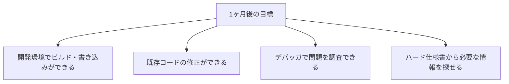
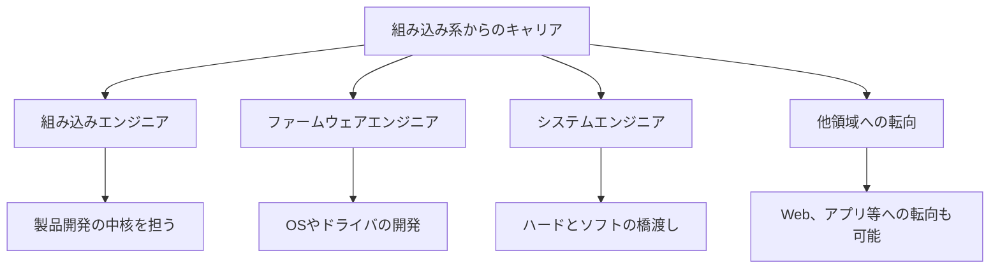

# 組み込み系の場合

組み込みシステム開発（C/C++など）の場合のガイドです。

## この領域の特徴

- C/C++が主な言語
- メモリやCPUリソースの制約がある
- ハードウェアとの連携が必要
- リアルタイム性が求められることが多い

## よくある1日の流れ


### タイムスケジュール例

| 時間 | 活動 | 詳細 |
|------|------|------|
| 9:00 | 朝会 | 今日の予定、ハードウェアの使用予定を確認 |
| 9:30 | 実装作業 | コーディング（シミュレータ環境で動作確認しながら） |
| 11:00 | 実機確認 | 実際のハードウェアで動作確認 |
| 12:00 | 昼休み | - |
| 13:00 | 実装作業 | 午前の続き、または別タスク |
| 15:00 | デバッグ | 問題発生時はログ解析、デバッガで調査 |
| 16:00 | ドキュメント | 設計書更新、テスト結果の記録 |
| 17:00 | 進捗報告 | 今日の成果と問題点を報告 |
| 18:00 | 退勤 | - |

> **ポイント**：組み込み系は「実機でしか再現しない問題」が多いです。**ログを残す習慣**と**問題を切り分けるスキル**が重要です。

## 最初の1ヶ月で覚えること

### 第1週：開発環境とハードウェアを理解

| やること | 完了の目安 |
|----------|-----------|
| 開発環境構築 | クロスコンパイラ、IDE、デバッガのセットアップ完了 |
| ビルド方法の理解 | コードをコンパイルして実機に書き込める |
| ハードウェア構成の把握 | CPU、メモリ、周辺機器の構成を理解 |
| 基本動作の確認 | 「Hello World」レベルのプログラムが動く |

### 第2週：コードを読んで理解

| やること | 完了の目安 |
|----------|-----------|
| 既存コードの読解 | メイン処理の流れが追える |
| ハード仕様書の読み方 | 必要な情報を見つけられる |
| デバッガの基本操作 | ブレークポイント設定、変数確認ができる |

### 第3〜4週：小さな修正を経験

| やること | 完了の目安 |
|----------|-----------|
| 簡単なバグ修正 | 1件完了 |
| 小さな機能追加 | 既存機能の改修を1件完了 |
| 実機テストの経験 | 自分のコードを実機で動かして確認 |

### 1ヶ月後の目標状態



## 組み込み系でよく使う確認方法

### ログの埋め込み

デバッガが使えない場面では、ログが唯一の手がかりになります。

```c
// 処理の入口・出口でログ
printf("[DEBUG] funcA: start\n");
// 処理...
printf("[DEBUG] funcA: end\n");

// 変数の値を確認
printf("[DEBUG] value=%d\n", value);

// 条件分岐の通過確認
if (condition) {
    printf("[DEBUG] 条件1を通過\n");
} else {
    printf("[DEBUG] 条件2を通過\n");
}
```

### 実機でしか再現しない問題への対処

| 問題の種類 | 疑うべきポイント |
|-----------|------------------|
| タイミング依存 | 割り込み処理、排他制御、ウェイト処理 |
| 環境依存 | ハードウェアの個体差、温度、電源 |
| 初期化漏れ | グローバル変数、ハードウェアレジスタ |
| メモリ破壊 | バッファオーバーフロー、スタックオーバーフロー |

## この経験で身につくスキル

### 技術スキル

| スキル | 説明 |
|--------|------|
| 低レイヤー理解 | メモリ、CPU、ハードウェアの動作を理解する力 |
| デバッグ力 | 限られた情報から問題を特定する力 |
| 効率化思考 | 限られたリソースで最大の効果を出す力 |
| 仕様書読解力 | ハードウェア仕様書から必要な情報を読み取る力 |
| 品質意識 | 一度出荷したら修正が難しいという緊張感 |

### ビジネススキル

| スキル | 説明 |
|--------|------|
| 粘り強さ | 再現しにくいバグを追い続ける力 |
| 記録力 | 問題と解決策を正確に残す力 |
| 安全意識 | 製品の安全性を意識する力 |

## 目指せる人材像



| 人材像 | 説明 | 目安期間 |
|--------|------|----------|
| 一人前の組み込みエンジニア | 機能単位の開発を担当 | 2〜3年 |
| ファームウェアエンジニア | OS層やドライバ開発 | 3〜5年 |
| 組み込みアーキテクト | システム全体の設計 | 5年〜 |

> **組み込みの経験は希少価値が高い**：組み込み系のスキルは専門性が高く、他の領域に比べてエンジニアが少ないため、市場価値が高いです。「ハードウェアが分かるエンジニア」は重宝されます。

## 成長を感じられるポイント

### 3ヶ月後

- [ ] ハード仕様書を見て必要な情報を探せる
- [ ] 簡単な修正を実機で動かせる
- [ ] ログを見て問題の切り分けができる

### 6ヶ月後

- [ ] 実機でしか再現しない問題を調査できる
- [ ] ポインタやメモリ管理のミスを減らせる
- [ ] 「この問題はタイミングが原因かも」と推測できる

### 1年後

- [ ] 機能単位で設計から実装まで担当できる
- [ ] 難しいバグの調査を任せてもらえる
- [ ] 後輩にデバッグ方法を教えられる

> **成長のサイン**：「以前は意味不明だったハード仕様書が読めるようになった」「実機でしか出ないバグの原因を突き止められた」と感じたら成長の証です。

## 本編で特に重要な章

| 章 | 重要度 | 理由 |
|----|--------|------|
| [[第2部_基礎知識/第3章_コーディング/002_デバッグの基本]] | ★★★ | 実機デバッグに応用 |
| [[第2部_基礎知識/第3章_コーディング/000_コードを読む基礎]] | ★★★ | 可読性の高いコードが重要 |
| [[第4部_実務スキル/第2章_実装作業/000_実装の進め方]] | ★★★ | 効率的な実装のため |
| [[第3部_ドキュメントスキル/第1章_読み書きの基本/000_設計書・仕様書の読み方]] | ★★☆ | ハード仕様書も読む |

## 追加で学ぶと良いこと

### 優先度：高

| 内容 | 説明 | 学習方法 |
|------|------|---------|
| ポインタとメモリ管理 | C/C++の基本かつ最重要 | 書籍、実践 |
| プロセスとスレッド | 並行処理の基礎 | ステップアップガイド |
| 排他制御 | データ競合の防止 | ステップアップガイド |
| メモリリーク対策 | メモリ管理の問題防止 | ステップアップガイド |

### 優先度：中

| 内容 | 説明 | 学習方法 |
|------|------|---------|
| ビット演算 | ハードウェア制御で必須 | 実践で学ぶ |
| 割り込み処理 | リアルタイム処理の基礎 | 実践で学ぶ |
| デバッガの使い方 | 実機デバッグ | 開発環境に依存 |

## 組み込み系特有の注意点

### メモリ管理

- 動的メモリ確保を避ける場合がある
- スタックサイズに注意
- メモリリークは致命的

### リソース制約

- CPU使用率を意識
- メモリ使用量を意識
- 処理時間を意識（リアルタイム性）

### ハードウェア連携

- ハードウェア仕様書を読めるようになる
- レジスタ操作の理解
- タイミングの理解

## よくある悩みと対処法

### 「ポインタが分からない」

- 紙に図を書いて理解する
- メモリアドレスとは何かを理解する
- 小さなプログラムで練習する

### 「実機でしか再現しないバグ」

- ログを活用する
- デバッガを使いこなす
- タイミングの問題を疑う

### 「ハード仕様書が読めない」

- 分からない用語を調べる
- 先輩に聞く
- 少しずつ慣れる

## 成長のためのアドバイス

### C/C++をしっかり学ぶ

- ポインタ、メモリ管理は必須
- 言語仕様を正しく理解する
- 未定義動作に注意

### ハードウェアに興味を持つ

- どう動いているか理解する
- 回路図やデータシートを読む機会を作る
- 実際のハードウェアを触る

### デバッグスキルを磨く

- 実機デバッグの方法を覚える
- ログの活用方法を学ぶ
- 問題の切り分け方を身につける
