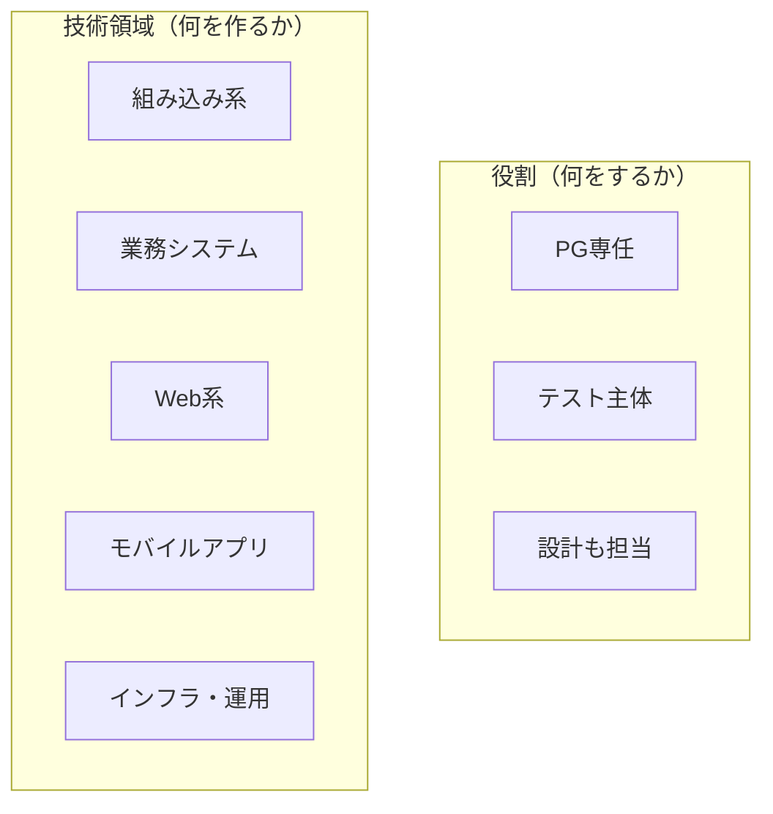

# 第5部：現場別ガイド

あなたの役割や技術領域に応じた、追加で学ぶべき内容を確認できます。

第1部〜第4部は「どの現場でも共通して必要な内容」でしたが、この部では**あなたの現場に特化した内容**を扱います。

## この部の活用の仕方

### まず自分の現場タイプを確認する

最初に [[第0部_この教科書の使い方/001_あなたの現場タイプを確認しよう|あなたの現場タイプを確認しよう]] で、自分がどのタイプに該当するかを確認してください。

現場タイプは大きく2つの軸で分類されます：



### 該当するページだけ読めばよい

すべてのページを読む必要はありません。**自分に該当するページだけ**読めばOKです。

```
❌ 全ページを読もうとする
⭕ 自分の役割・技術領域に該当するページだけ読む
```

例えば、「Web系の現場でPG専任」であれば、以下の2ページを読みます：
- [[第1章_役割別ガイド/000_PG専任の場合|PG専任の場合]]
- [[第2章_技術領域別ガイド/002_Web系の場合|Web系の場合]]

### 現場が変わったら読み直す

エンジニアのキャリアでは、役割や技術領域が変わることがあります。

- 案件が変わってWeb系から業務システムになった
- PG専任から設計も担当するようになった
- 開発からインフラ・運用にシフトした

そのときは、**新しい現場タイプに該当するページを読み直してください**。

> [!tip] 他のタイプを読んでおくメリット
> 自分に該当しないページも、余裕があれば目を通しておくと視野が広がります。他のチームメンバーが何を重視しているか、別の技術領域ではどんなスキルが求められるかを知ることで、チーム内でのコミュニケーションがスムーズになります。

### 各ガイドの概要

#### 役割別ガイド

| ガイド | 対象となる人 |
|---|---|
| PG専任 | 実装（コーディング）がメインの業務 |
| テスト主体 | テスト実施・テスト設計がメインの業務 |
| 設計も担当 | 設計書の作成や設計レビューも担当する |

#### 技術領域別ガイド

| ガイド | 対象となる人 |
|---|---|
| 組み込み系 | 家電、自動車、産業機器などのソフトウェア開発 |
| 業務システム | 企業の基幹システム、業務アプリケーション開発 |
| Web系 | Webサービス、Webアプリケーション開発 |
| モバイルアプリ | iOS/Androidアプリ開発 |
| インフラ・運用 | サーバー構築、ネットワーク、運用保守 |

### よくある疑問

> [!question] Q. 自分がどのタイプかわからないのですが？
> **A. まずは先輩や上司に聞いてみてください。**
>
> 「自分の担当業務はどういう役割ですか？」「この案件はどういう種類のシステムですか？」と聞けば教えてもらえます。入社直後や案件参加直後は、わからなくて当然です。

> [!question] Q. 複数のタイプに該当する場合は？
> **A. 該当するものをすべて読んでください。**
>
> 例えば「設計も担当するWeb系エンジニア」なら、「設計も担当する場合」と「Web系の場合」の両方を読みます。実際の現場では複数の役割を兼ねることは珍しくありません。

> [!question] Q. ここにないタイプの場合は？
> **A. 第1部〜第4部の内容で十分対応できます。**
>
> ここで紹介しているのは代表的な現場タイプです。該当するものがなくても、第1部〜第4部の内容はどの現場でも共通して役立ちます。

---

## 第1章：役割別ガイド

あなたの担当業務（役割）に応じた追加知識を学びます。

- [[第1章_役割別ガイド/000_PG専任の場合|PG専任の場合]]
- [[第1章_役割別ガイド/001_テスト主体の場合|テスト主体の場合]]
- [[第1章_役割別ガイド/002_設計も担当する場合|設計も担当する場合]]

## 第2章：技術領域別ガイド

あなたが携わるシステムの種類に応じた追加知識を学びます。

- [[第2章_技術領域別ガイド/000_組み込み系の場合|組み込み系の場合]]
- [[第2章_技術領域別ガイド/001_業務システムの場合|業務システムの場合]]
- [[第2章_技術領域別ガイド/002_Web系の場合|Web系の場合]]
- [[第2章_技術領域別ガイド/003_モバイルアプリの場合|モバイルアプリの場合]]
- [[第2章_技術領域別ガイド/004_インフラ・運用の場合|インフラ・運用の場合]]
